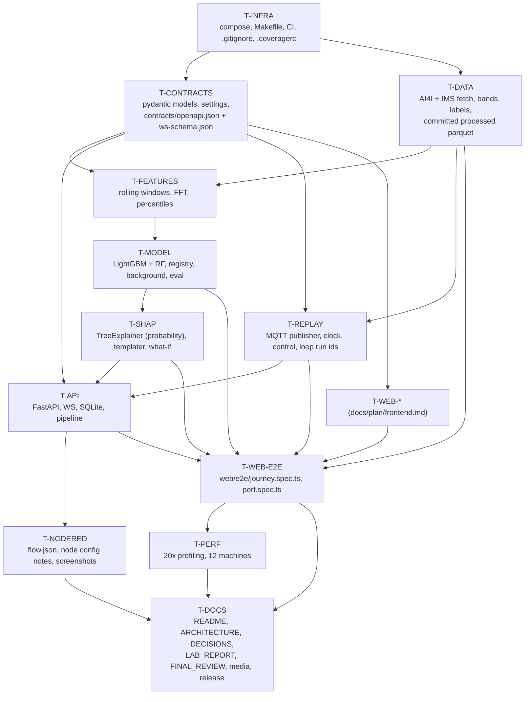

# Backend / ML / Infra Build Plan

Scope: everything server-side for "Why Did the Model Flag This Machine?" —
infrastructure, datasets, contracts, feature engine, models, SHAP + explanation
service, FastAPI + WebSocket, replay publisher, Node-RED flow, and the graded
documentation set.

The frontend plan (`docs/plan/frontend.md`) is written in parallel. **Section 3
(Interface Contracts) of this document is the binding contract.** Everything in
it is generated from one set of Pydantic v2 models owned by task `T-CONTRACTS`,
exported to `contracts/openapi.json` and `contracts/ws-schema.json`, and
compiled to TypeScript in `web/src/contracts/` by `make contracts`. The frontend
never hand-writes a type that appears here (R7, R15).

This revision closes every blocking item in `docs/plan/reviews/plan-review-1.md`,
`docs/plan/reviews/plan-review-2.md` and `docs/plan/reviews/plan-review-3.md`
that names BE, and records rulings
**R1–R20** from `docs/plan/orchestrator-rulings.md` as decisions. R16 (one
probability on screen — no post-hoc calibrator in the serving path), R17
(roll-up label source), R18 (`tsx` pre-declared by T-WEB-SHELL), R19 (ADR
numbering) and R20 (frontend perf numbers go to README + FINAL_REVIEW) are the
rulings that post-date revision 1 and are applied throughout. Nothing in this
document is awaiting reviewer confirmation. See §7 (review 1), §8 (review 2)
and §9 (review 3) for the item-by-item changelogs.

---

## 0. Decisions taken up front (no options left open)

| Question | Decision | Rationale |
|---|---|---|
| GBM library (ADR-026) | **LightGBM 4.x** is the served model. RandomForest (scikit-learn) is the comparison model. XGBoost is not used. | LightGBM ships arm64 macOS + linux/arm64 wheels, trains 10k rows in <2 s, and `shap.TreeExplainer` supports it natively with exact interventional values. XGBoost adds nothing here and doubles the dependency surface. |
| Model discriminator | **`"lgbm"`** and **`"rf"`**. The string `"gbm"` appears nowhere in code, contracts, testids or docs. | One spelling, everywhere (review item 2). |
| MQTT client (ADR-028) | **`aiomqtt` 2.x** (async wrapper over paho-mqtt 2.x) everywhere — publisher, API consumer, tests. | One library, async-native so it lives inside the FastAPI event loop without a bridge thread. Node-RED uses its own built-in MQTT nodes. |
| Broker | **Eclipse Mosquitto 2.0** in Docker, anonymous listener on 1883 + websockets listener on 9001 (Node-RED and debugging). | |
| Database | **SQLite** via **SQLAlchemy 2.0 async + aiosqlite**, one file at `data/xpm.db`, WAL mode. TimescaleDB is explicitly rejected. | The whole dataset is ~10k AI4I rows + ~1k IMS windows. SQLite in WAL handles the write rate (24 rows/s worst case at 20x) with room to spare and keeps `make dev` at one command with no extra container. Recorded as ADR-021. |
| Docker images | **Built locally by default** (`docker compose up --build`). CI additionally publishes `api`, `replay`, `web` and `nodered` images to GHCR on `main`; `make dev PULL=1` pulls them instead of building. (R1) | A grader with no registry access must still get a working system from a bare clone. The 3-minute target in the README is stated against a warm base-image cache; the cold number is measured and reported honestly by the fresh reader. Recorded as ADR-001. |
| Raw datasets in git | **Never committed.** `make data` (AI4I) and `make data-ims` (IMS) fetch and process. (R2) | The IMS archive is 1,075,597,174 bytes. Recorded as ADR-002. |
| Processed datasets in git | **Committed.** `data/processed/ai4i/*.parquet` and `data/processed/ims/*.parquet` (plus their `manifest.json`) are checked in and must stay **< 5 MB in total**, enforced by `tests/data/test_processed_size.py`. `T-INFRA` amends `.gitignore` to allow `data/processed/**/*.parquet` and `data/processed/**/*.json` while still ignoring `data/raw/**`. (R2) | A fresh clone streams **both** plants immediately with zero downloads, so `make dev` needs no network beyond Docker. This is the only way the 3-minute definition-of-done survives the IMS download. Recorded as ADR-002. |
| Model artefacts in git | **Not committed.** `make train` reproduces them deterministically; the compose bootstrap trains automatically if `models/registry/current` is absent. | Model artefacts are a pure function of the committed processed parquet + seed + code; committing them would duplicate state that CI already reproduces on every push. AI4I training end-to-end is ~35 s on M-series. Recorded as ADR-022. |
| Python packaging | Single root `pyproject.toml`, `uv` for resolution and locking (`uv.lock` committed), src layout `backend/xpm/`. | |
| Feature naming | `<channel>_<stat>_<window>`, e.g. `vibration_3khz_p95_4h`, `torque_slope_1h`. Channel names carry no unit suffix because they are user-visible in explanation sentences. | Matches the sentence in the assignment text verbatim. |
| SHAP space | **Probability space**, `feature_perturbation="interventional"`, 256-row seeded background, for serving, what-if, model comparison and the faithfulness check alike. (R3) | Waterfall bars must sum from the base value to the probability printed on screen. Recorded as ADR-003. |
| Number of probabilities on screen | **One.** The served LightGBM probability is the only probability in the system. There is **no** isotonic/Platt calibrator anywhere in the serving path. (R16) | Alerting, `RiskMessage.probability`, `Alert.probability`, `Explanation.probability`, `Explanation.output_value` and every SHAP bar are the same number, so the waterfall provably closes on the figure the user reads. Calibration quality is a *diagnostic* in `docs/EVALUATION.md`, and a poorly calibrated model is fixed in training. Recorded as ADR-016. |
| Explanation storage (ADR-027) | Explanations are **stored, never recomputed**. Scrubbing reads rows; it does not re-run SHAP. | Definition of done: "Scrubbing the timeline reproduces historical explanations exactly." |
| Caveat | The SHAP-vs-causation caveat is a **required** field on every `Explanation` and `WhatIfResponse` and is **required** to be rendered by the dashboard under the sentence (testid `explanation-caveat`). (R13) | It is a graded artefact in GOAL (`docs/DECISIONS.md` "include the SHAP-vs-causation caveat explicitly") and an honesty requirement, not a nicety. |

---

## 1. Module list

**`xpm.config`** — Loads `config/settings.yaml` into a frozen Pydantic Settings
tree (`Settings`), with `XPM_` env-var override for any leaf via nested
delimiter `__`. Exposes `get_settings()` cached singleton and
`reload_settings()` used by the config PUT endpoint. Every threshold,
percentile, window, top-k and speed multiplier in the system resolves through
this module; no business module may contain a numeric literal that a user could
plausibly want to change.

**`xpm.contracts`** — The single source of truth for every serialised shape:
MQTT payloads, WebSocket frames, REST request/response bodies, the settings
schema itself. Pure Pydantic v2 models with `model_config =
ConfigDict(frozen=True, extra="forbid")`. No imports from any other `xpm`
module (so it cannot acquire a runtime dependency and can be imported by the
OpenAPI and WS-schema exporters in isolation).

**`xpm.data`** — Dataset acquisition and normalisation. `ai4i.py` fetches UCI id
601 via `ucimlrepo`, renames columns to canonical channel names, derives
`temp_diff` and `power`, writes `data/raw/ai4i2020.parquet` and the committed
`data/processed/ai4i/ai4i.parquet`. `ims.py` downloads the verified NASA IMS
mirror (§3.2), verifies its SHA-256, extracts test set 2 with `unar`, computes
per-file Welch band energies + RMS/kurtosis/crest, applies the failure-imminent
label, and writes the committed `data/processed/ims/test2.parquet`. `download.py`
owns the resumable HTTP fetch, checksum verification and `XPM_DATA_CACHE`
short-circuit. `loader.py` returns typed `pandas` frames with a validated
schema. Nothing downstream ever touches a raw file path directly.

**`xpm.features`** — The rolling-window engine. Given a per-machine
dataset-time-indexed frame of channels, produces the feature vector at any row:
`mean`, `std`, `min`, `max`, `p95`, `slope`, `ewma` over 1 h / 4 h / 24 h of
dataset time. Also maintains, per `(plant, machine_id, feature)`, an online
percentile tracker (t-digest) so the explanation templater can say "above its
95th percentile" with a real number, and a consecutive-exceedance counter so it
can say "for 4 consecutive hours". Offline (training) and online (streaming)
paths share one implementation; a golden fixture proves they agree bit-for-bit.

**`xpm.model`** — Training, evaluation, and the versioned registry. `train.py`
builds the windowed training matrix, fits LightGBM and RandomForest with fixed
seeds, samples and freezes the 256-row SHAP background, and writes a versioned
artefact directory. It fits **no post-hoc calibrator**: class imbalance is
handled inside the fit (`class_weight` / `scale_pos_weight`) so the model's own
probability is the served probability (R16, ADR-016). `evaluate.py` produces
PR-AUC, recall at fixed precision, a **calibration diagnostic** (reliability
curve over `model.evaluation.calibration_bins`, Brier score, ECE) and the
raw-vs-windowed ablation **reported per plant** (R4), emitting
`docs/EVALUATION.md` and `reports/metrics.json`.
`registry.py` loads a version by id or `current`.

**`xpm.explain`** — `shap.TreeExplainer` wrapped for both models in probability
space, plus the explanation templater and what-if recompute. The templater picks
a template family per feature from its declared *framing* (percentile /
threshold / trend / consecutive), renders a per-feature clause **and** the
composed sentence, and returns the character spans the frontend needs to
hyperlink each feature name to its waterfall bar.

**`xpm.store`** — Async SQLAlchemy models, migrations (plain SQL in
`backend/xpm/store/migrations/`, applied in order at startup — Alembic is
overkill for one schema), and repository functions. Owns the point-in-time query
`state_at(plant, t)` that makes scrubbing exact.

**`xpm.pipeline`** — The live path: subscribe to telemetry topics, push each row
through the feature engine, score with the served model, decide alert/no-alert,
generate + persist the explanation, persist telemetry/risk/alert, and fan out to
WebSocket clients. This is the only module that mutates live state.

**`xpm.api`** — FastAPI app: routers, dependency wiring, WebSocket hub, server
heartbeat, lifespan that starts the pipeline consumer and the store. Thin — all
logic lives in the modules above.

**`xpm.replay`** — The deterministic MQTT publisher. Holds the run clock, maps
dataset rows to virtual machines, publishes at the configured rate, honours
pause/resume/seek/speed commands from `xpm/control/replay/cmd`, and mints a new
`run_id` on every loop (R12). Runs as its own container, entered via
`python -m xpm.replay`.

**`nodered`** — `flow.json` consuming the same MQTT topics, calling
`GET /api/alerts/{alert_id}/explanation` over HTTP, and rendering a minimal
node-red-dashboard view. Its import screenshot and node configuration notes are
inputs to `docs/LAB_REPORT.md`, which T-DOCS assembles.

**`docs` (T-DOCS)** — The graded prose artefacts: `README.md`,
`docs/ARCHITECTURE.md`, `docs/DECISIONS.md` (transcribed from the ADR table in
§2: ADR-001…ADR-020 are rulings R1–R20, ADR-021 upward are this plan's
non-ruling decisions — R19), `docs/LAB_REPORT.md`, `docs/FINAL_REVIEW.md`, the Playwright media
capture script that produces the README screenshots/GIF, and the release/tag
step.

---

## 2. File ownership map

No file appears twice, in this plan or across this plan and
`docs/plan/frontend.md`. A task may **read** any file; it may **write** only its
own. Dependency additions to `pyproject.toml` are requested from `T-INFRA`,
which pre-declares the full dependency set listed in §2.1 so no mid-build edit
is needed.

### T-INFRA
```
pyproject.toml
uv.lock
.gitignore
Makefile
docker-compose.yml
docker-compose.e2e.yml
.dockerignore
.coveragerc
.pre-commit-config.yaml
.github/workflows/ci.yml
docker/api.Dockerfile
docker/replay.Dockerfile
docker/data.Dockerfile
docker/nodered.Dockerfile
docker/mosquitto/mosquitto.conf
scripts/wait_for_port.sh
scripts/dev_bootstrap.sh
backend/xpm/__init__.py
backend/xpm/py.typed
tests/conftest.py
tests/test_smoke_imports.py
```
Notes:
- `.gitignore` ignores `data/raw/**`, `data/*.db*`, `models/registry/**`,
  `reports/**`, and **allows** `data/processed/**/*.parquet`,
  `data/processed/**/*.json` and `!reports/.gitkeep` (R2, review item 29;
  review-2 non-blocking 2 — without the negation the `reports/.gitkeep` that
  T-SHAP owns can never be committed and `reports/` does not exist on a fresh
  clone). The root `.gitignore` is the **only** place the
  `models/registry/**` rule is written; `models/.gitignore` does not exist
  (review-2 non-blocking 4 — one rule, one file).
- `.coveragerc` contains exactly the omit list in §4 (R6, review item 28).
- `docker/web.Dockerfile` **does not exist**; the web image is built from
  `web/Dockerfile`, owned by the frontend plan, and `docker-compose.yml`
  references it (review item 33).
- `docker/data.Dockerfile` is the data-tooling image used by `make data-ims`
  in a container; it `apt-get install -y unar p7zip-full` so the IMS archive can
  be unpacked (§3.2).
- `.github/workflows/ci.yml` contains a `publish-images` job, gated on
  `github.ref == 'refs/heads/main'` and on the test job passing, pushing
  `ghcr.io/<owner>/xpm-{api,replay,web,nodered}:{sha,latest}` (R1, item 30).
- `docker-compose.e2e.yml` is the overlay used by `make e2e`; it sets
  `XPM_REPLAY__LOOP=false` and `XPM_REPLAY__AUTOSTART=true` (R12, item 40).

### T-CONTRACTS
```
config/settings.yaml
config/settings.example.yaml
backend/xpm/config.py
backend/xpm/contracts/__init__.py
backend/xpm/contracts/common.py
backend/xpm/contracts/mqtt.py
backend/xpm/contracts/ws.py
backend/xpm/contracts/rest.py
backend/xpm/contracts/settings.py
backend/xpm/contracts/channels.py
scripts/export_openapi.py
scripts/export_ws_schema.py
contracts/openapi.json
contracts/ws-schema.json
tests/contracts/test_settings.py
tests/contracts/test_payload_roundtrip.py
tests/contracts/test_openapi_is_current.py
tests/contracts/test_ws_schema_is_current.py
tests/contracts/test_channel_specs.py
```
`backend/xpm/contracts/channels.py` is the **only** place the 16 `ChannelSpec`
rows of §3.1 are written down — one frozen tuple per plant, in canonical order.
`xpm.api` and `xpm.data` import it; neither re-declares a unit, a display name
or a nominal band.
T-CONTRACTS also owns the **generated, never-committed** TypeScript outputs
`web/src/contracts/api.ts` and `web/src/contracts/ws.ts` in the sense that its
exporter scripts + the Makefile recipe produce them; no human writes them and
they are git-ignored by `web/src/contracts/.gitignore`, which **T-WEB-SHELL**
owns along with `web/src/contracts/index.ts` (R15, review item 32).
T-CONTRACTS **invokes** `openapi-typescript` and `json-schema-to-typescript`;
it does not declare them — **T-WEB-SHELL** pre-declares
`openapi-typescript@7` and `json-schema-to-typescript` in `web/package.json`
(review item 36). `web/openapi-ts.config.ts` does not exist; the CLI invocation
lives in the Makefile (T-INFRA's file, wording agreed in §2.2).

### T-DATA
```
backend/xpm/data/__init__.py
backend/xpm/data/ai4i.py
backend/xpm/data/ims.py
backend/xpm/data/bands.py
backend/xpm/data/loader.py
backend/xpm/data/schema.py
backend/xpm/data/download.py
backend/xpm/data/archive.py
scripts/fetch_data.py
data/processed/ai4i/ai4i.parquet
data/processed/ai4i/manifest.json
data/processed/ims/test2.parquet
data/processed/ims/manifest.json
tests/data/test_ai4i.py
tests/data/test_download.py
tests/data/test_ims_bands.py
tests/data/test_ims_labelling.py
tests/data/test_schema.py
tests/data/test_processed_size.py
tests/fixtures/data/ai4i_head_200.parquet
tests/fixtures/data/ims_raw_snippet_20480.npy
tests/fixtures/data/ims_bands_expected.json
```
The four `data/processed/**` files are **committed build outputs** (R2). They
are regenerated by `make data` / `make data-ims`; a CI job re-runs
`make data-ims` nightly is *not* in scope — drift is caught by the manifest
SHA-256 recorded in `manifest.json` and asserted by `test_processed_size.py`.

### T-FEATURES
```
backend/xpm/features/__init__.py
backend/xpm/features/windows.py
backend/xpm/features/stats.py
backend/xpm/features/spectral.py
backend/xpm/features/percentiles.py
backend/xpm/features/streak.py
backend/xpm/features/registry.py
backend/xpm/features/online.py
backend/xpm/features/offline.py
tests/features/test_stats.py
tests/features/test_windows.py
tests/features/test_spectral.py
tests/features/test_percentiles.py
tests/features/test_streak.py
tests/features/test_online_offline_parity.py
tests/fixtures/features/golden_ai4i_m03_features.json
tests/fixtures/features/golden_ims_b2_features.json
tests/fixtures/features/golden_spectral_bands.json
```

### T-MODEL
```
backend/xpm/model/__init__.py
backend/xpm/model/dataset.py
backend/xpm/model/train.py
backend/xpm/model/evaluate.py
backend/xpm/model/ablation.py
backend/xpm/model/registry.py
backend/xpm/model/background.py
backend/xpm/model/card.py
scripts/train.py
scripts/evaluate.py
models/README.md
docs/EVALUATION.md
tests/model/test_registry.py
tests/model/test_train_determinism.py
tests/model/test_evaluate_metrics.py
tests/model/test_background.py
tests/fixtures/model/tiny_training_matrix.parquet
tests/fixtures/model/expected_metrics_bounds.json
```
`docs/EVALUATION.md` is the one doc T-MODEL owns, because it is machine-written
by `scripts/evaluate.py`. T-DOCS links to it and does not edit it. It carries
the calibration **diagnostic** required by R16 — reliability curve over
`model.evaluation.calibration_bins`, Brier score and ECE per model per plant —
and states plainly that no calibrator is applied at serving time.
`models/.gitignore` is **not** owned here: the `models/registry/**` ignore rule
lives once, in T-INFRA's root `.gitignore` (review-2 non-blocking 4).
Frontend performance numbers never land in this file (R20).

### T-SHAP
```
backend/xpm/explain/__init__.py
backend/xpm/explain/explainer.py
backend/xpm/explain/templates.py
backend/xpm/explain/framing.py
backend/xpm/explain/narrative.py
backend/xpm/explain/whatif.py
backend/xpm/explain/compare.py
scripts/faithfulness.py
reports/.gitkeep
tests/explain/test_explainer.py
tests/explain/test_templates.py
tests/explain/test_narrative_spans.py
tests/explain/test_whatif_latency.py
tests/explain/test_compare.py
tests/fixtures/explain/golden_explanation_ai4i.json
tests/fixtures/explain/golden_explanation_ims.json
```

### T-API
```
backend/xpm/api/__init__.py
backend/xpm/api/__main__.py
backend/xpm/api/app.py
backend/xpm/api/deps.py
backend/xpm/api/errors.py
backend/xpm/api/routers/machines.py
backend/xpm/api/routers/plants.py
backend/xpm/api/routers/alerts.py
backend/xpm/api/routers/telemetry.py
backend/xpm/api/routers/config.py
backend/xpm/api/routers/replay.py
backend/xpm/api/routers/whatif.py
backend/xpm/api/routers/models.py
backend/xpm/api/routers/health.py
backend/xpm/api/ws/__init__.py
backend/xpm/api/ws/hub.py
backend/xpm/api/ws/heartbeat.py
backend/xpm/api/ws/endpoint.py
backend/xpm/store/__init__.py
backend/xpm/store/db.py
backend/xpm/store/tables.py
backend/xpm/store/repo.py
backend/xpm/store/pointintime.py
backend/xpm/store/downsample.py
backend/xpm/store/migrations/001_init.sql
backend/xpm/store/migrations/002_indexes.sql
backend/xpm/pipeline/__init__.py
backend/xpm/pipeline/consumer.py
backend/xpm/pipeline/scorer.py
backend/xpm/pipeline/alerting.py
backend/xpm/pipeline/importance.py
tests/api/test_health.py
tests/api/test_plants.py
tests/api/test_machines.py
tests/api/test_telemetry_series.py
tests/api/test_risk_series.py
tests/api/test_alerts.py
tests/api/test_importance.py
tests/api/test_explanation_endpoint.py
tests/api/test_config_endpoint.py
tests/api/test_whatif_endpoint.py
tests/api/test_replay_endpoint.py
tests/api/test_ws.py
tests/api/test_ws_heartbeat.py
tests/api/test_pointintime.py
tests/api/test_pipeline_alerting.py
tests/api/test_db_lifecycle.py
tests/fixtures/api/seed_alerts.sql
```

### T-REPLAY
```
backend/xpm/replay/__init__.py
backend/xpm/replay/__main__.py
backend/xpm/replay/clock.py
backend/xpm/replay/mapping.py
backend/xpm/replay/publisher.py
backend/xpm/replay/control.py
backend/xpm/replay/runner.py   # R21: covered serve()/reconnect loop; __main__.py is a shim
tests/replay/test_clock.py
tests/replay/test_mapping.py
tests/replay/test_determinism.py
tests/replay/test_control.py
tests/replay/test_loop_run_id.py
tests/replay/test_runner.py
tests/fixtures/replay/golden_run_seed42_1x.jsonl
```
`main.py` is renamed `__main__.py` so the container entrypoint is
`python -m xpm.replay` and the file is legitimately omit-listed under R6
(review item 28).

### T-NODERED
```
nodered/flow.json
nodered/settings.js
nodered/package.json
nodered/README.md
docs/media/nodered-import.png
docs/media/nodered-dashboard.png
tests/nodered/test_flow_json_valid.py
```
T-NODERED no longer owns `docs/LAB_REPORT.md`; it produces the flow, the two
screenshots and `nodered/README.md` (node-by-node configuration notes), and
T-DOCS assembles the lab report from them (review item 35).

### T-DOCS (Phase 5, owned by the docs-writer agent — R14)
```
README.md
docs/ARCHITECTURE.md
docs/DECISIONS.md
docs/LAB_REPORT.md
docs/FINAL_REVIEW.md
docs/media/README.md
docs/media/dashboard.gif
docs/media/plant-floor.png
docs/media/machine-detail.png
docs/media/shap-waterfall.png
docs/media/whatif.png
scripts/capture_media.ts
scripts/release.sh
```
Responsibilities:
- `README.md`: what it is, Mermaid architecture diagram, one-command run,
  `make dev PULL=1` fast path and the warm-cache caveat on the 3-minute number
  (R1), the captured screenshots/GIF, how the explanation is generated, dataset
  credits (UCI AI4I 2020 id 601; NASA IMS bearing dataset with the exact mirror
  URL and checksum from §3.2).
- `docs/ARCHITECTURE.md`: components, data flow, the MQTT topic table and WS
  union from §3, the full feature list with definitions, and the model card.
- `docs/DECISIONS.md`: **transcribed from the ADR table below, which is the
  single source of ADR numbers for the whole project (R19).** One section per
  row, in number order, each with the alternatives considered and why they
  were rejected. T-DOCS invents no ADR number and renumbers nothing. The
  SHAP-vs-causation caveat is stated explicitly here and is the same string as
  `explanation.caveat` in `config/settings.yaml`.
- `docs/LAB_REPORT.md`: JIIT format (Aim, Flow Design, Node Configuration, Code,
  Output, Result) built from `nodered/README.md` and the two T-NODERED
  screenshots.
- `docs/FINAL_REVIEW.md`: every GOAL definition-of-done criterion with
  PASS/FAIL and the evidence (command output, screenshot path, CI run URL).
- **Transcribing `T-PERF`'s measurements (R20).** `T-PERF` owns no files; its
  numbers live in its final report. T-DOCS copies them — verbatim, from a real
  run, never invented — into `README.md` (a one-line "measured performance"
  note) and into `docs/FINAL_REVIEW.md` (the row that evidences the smooth-at-20×
  criterion). The number transcribed is **p95 and p99 frame interval in ms at
  20× with 12 machines, from `web/e2e/perf.spec.ts`**, together with the
  machine it was measured on and whether the cache was warm. These numbers
  **never** go into `docs/EVALUATION.md`, which is machine-generated and owned
  by T-MODEL.
- Transcribing the cold- and warm-cache `make dev` wall-clock timings (R1) into
  the README next to the 3-minute claim, from the fresh reader's real run.
- `scripts/capture_media.ts`: a plain Node/TypeScript script run by `tsx`
  (`make media`) that *imports the Playwright library* to drive a browser — it
  is **not** a Playwright-test-runner spec, and `playwright test` must never be
  pointed at it (R18). It runs against a live
  `make dev` stack that captures the five images and the GIF into `docs/media/`.
  It deep-links `plants.<plant>.demo_machine_id` (R13) so the GIF always opens
  on a machine that alerts.
- `scripts/release.sh`: verifies `main` is green, merges feature branches
  `--no-ff`, tags `v1.0.0`, pushes tag. "Tagged v1.0.0" and "merged --no-ff" in
  the definition of done map to T-DOCS (review item 35).


#### ADR register (the single source of ADR numbers — R19)

`ADR-001` … `ADR-020` map one-to-one to rulings `R1` … `R20` in
`docs/plan/orchestrator-rulings.md`. Non-ruling decisions taken by this plan are
numbered from `ADR-021` upward. No number is ever reused, and no `a`/`b` suffix
exists. Every ADR citation anywhere in this document points at this table.

| ADR | Source | Decision | Stated in |
|---|---|---|---|
| ADR-001 | R1 | Docker images built locally by default; CI publishes to GHCR on `main`; `make dev PULL=1` is the fast path; the 3-minute number is a warm-cache number | §0, §2, §6 |
| ADR-002 | R2 | Raw datasets never committed; processed parquet + manifests committed and kept < 5 MB | §0, §2, §6 |
| ADR-003 | R3 | SHAP in probability space, `feature_perturbation="interventional"`, 256-row seeded background, same config for serving / what-if / compare / faithfulness | §0, §3.4.3, §6 |
| ADR-004 | R4 | Raw-vs-windowed ablation reported **per plant**, honestly; no fabricated AI4I lift | §4, §6 |
| ADR-005 | R5 | Reproducibility scope: same seed + speed + unmodified config ⇒ identical alert ids, timestamps, explanations; a config PUT mints a new `run_id` | §3.1, §6 |
| ADR-006 | R6 | Coverage omit list is exactly three patterns; everything else counts toward the 85 % gate | §4, §6 |
| ADR-007 | R7 | Frontend contract requirements accepted in full (`sentence_spans`, `/api/state_at`, `ChannelSpec.nominal_min/max`, positional `values[]`, `gradients`, WS-schema codegen) | §3, §6 |
| ADR-008 | R8 | Dataset time is the displayed time; one plant at a time; alert rail becomes a drawer below 1440 px | §3.1, §6 |
| ADR-009 | R9 | Canonical task ids: backend `T-*`, frontend `T-WEB-*` | §2, §5, §6 |
| ADR-010 | R10 | No WebSocket resume; `hello` + `snapshot` on every connect | §3.5, §6 |
| ADR-011 | R11 | Server-emitted `ping` / client `pong`; no client `subscribe`; `POST /api/replay/command` is the sole transport control | §3.5, §6 |
| ADR-012 | R12 | `replay.loop` defaults true; each loop mints a new `run_id`; e2e overlay sets `loop=false`; `replay.speed` is not patchable | §3.3, §3.4.2, §6 |
| ADR-013 | R13 | SHAP-vs-causation caveat and `demo_machine_id` are required, not optional | §0, §3.4.1, §3.4.3, §6 |
| ADR-014 | R14 | Phase 5 tasks `T-DOCS` (here), `T-WEB-E2E` and `T-PERF` (frontend plan) | §2, §5, §6 |
| ADR-015 | R15 | Contract artefact filenames and the committed/generated split | §2, §6 |
| ADR-016 | R16 | **One probability on screen: no post-hoc calibrator in the serving path.** Calibration is an evaluation diagnostic only | §0, §1, §3.4.3, §3.6, §3.7, §6 |
| ADR-017 | R17 | Roll-up label source is `Explanation.other_contributions_count`; `ModelInfo.n_features` exists but is not the label source | §3.4.3, §6 |
| ADR-018 | R18 | Media-capture tooling (`tsx`, `@playwright/test`) is pre-declared by T-WEB-SHELL; `make media` runs `pnpm -C web exec tsx` | §2.1, §2.2, §6 |
| ADR-019 | R19 | This ADR numbering scheme itself | §2, §6 |
| ADR-020 | R20 | `T-PERF`'s numbers are transcribed by T-DOCS into `README.md` and `docs/FINAL_REVIEW.md`, never into `docs/EVALUATION.md` | §2, §6 |
| ADR-021 | this plan | SQLite + SQLAlchemy 2.0 async + aiosqlite in WAL mode; TimescaleDB rejected | §0, §3.8 |
| ADR-022 | this plan | Model artefacts are not committed; `make train` reproduces them; compose bootstraps if `models/registry/current` is absent | §0, §3.7 |
| ADR-023 | this plan | IMS labelling horizon **N = 24 h** before end-of-record, failing bearings only (alternatives 6 h / 72 h rejected) | §3.2.3 |
| ADR-024 | this plan | AI4I's 10 000 i.i.d. rows are dealt round-robin into 12 simulated machines and streamed as a 5-minute series; this is a simulation convenience, stated as such | §3.2.1, §6 |
| ADR-025 | this plan | Deliberate MQTT/WebSocket shape divergence: MQTT is per-machine object-mapped, WS telemetry/risk are batched and positional | §3.3, §3.5 |
| ADR-026 | this plan | LightGBM 4.x is the served model, RandomForest the comparison model, XGBoost is not used | §0 |
| ADR-027 | this plan | Explanations are stored and never recomputed; scrubbing reads rows | §0, §3.8 |
| ADR-028 | this plan | `aiomqtt` 2.x is the single MQTT client for publisher, API and tests | §0 |

`ADR-028` is the highest number this plan allocates. The test in §4 asserts that
`docs/DECISIONS.md` contains exactly `ADR-001` … `ADR-028` and that every ADR
number cited in this register exists there; it does not walk `docs/plan/**` or
`docs/plan/reviews/**`, which quote withdrawn identifiers.

### Not owned by backend tasks
`web/**` is owned by `docs/plan/frontend.md`, including `web/Dockerfile`,
`web/nginx.conf`, `web/.dockerignore` (review item 33) and
`web/src/contracts/index.ts` + `web/src/contracts/.gitignore` (R15).
`web/src/contracts/api.ts` and `web/src/contracts/ws.ts` are generated by
`make contracts`, are git-ignored, and are never hand-edited by anyone.

### 2.1 Dependency set T-INFRA declares up front

Runtime: `fastapi`, `uvicorn[standard]`, `pydantic>=2.7`, `pydantic-settings`,
`aiomqtt`, `sqlalchemy[asyncio]>=2.0`, `aiosqlite`, `numpy`, `pandas`,
`pyarrow`, `scipy`, `scikit-learn`, `lightgbm`, `shap`, `ucimlrepo`,
`httpx`, `pyyaml`, `tdigest`, `orjson`, `structlog`, `typer`.

Dev: `pytest`, `pytest-asyncio`, `pytest-cov`, `pytest-benchmark`, `ruff`,
`mypy`, `types-PyYAML`, `pandas-stubs`, `pre-commit`.

System (data tooling image only, `docker/data.Dockerfile`): `unar`,
`p7zip-full`. On a developer macOS host: `brew install unar p7zip`.

Node tooling is **not** declared here. `openapi-typescript@^7`,
`json-schema-to-typescript@^15`, **`tsx@^4`** and `@playwright/test` are
declared in `web/package.json` by T-WEB-SHELL (review item 36; R18), and
T-WEB-SHELL pre-declares them in Phase 3 precisely so that no Phase 5 task has
to edit a file it does not own. In particular `make media`
(`pnpm -C web exec tsx ../scripts/capture_media.ts`, run by T-DOCS) depends on
`tsx` being present already: **T-DOCS must not add a devDependency.** The
Makefile only invokes these binaries via `pnpm -C web exec`.

### 2.2 Makefile targets (T-INFRA writes the file; the named script is the owner's)

```
make setup      # uv sync --all-extras + pnpm -C web install + pre-commit install
make data       # uv run python scripts/fetch_data.py --plant ai4i
make data-ims   # uv run python scripts/fetch_data.py --plant ims   (downloads 1.0 GB, needs `unar`)
make contracts  # uv run python scripts/export_openapi.py
                # && pnpm -C web exec openapi-typescript ../contracts/openapi.json -o src/contracts/api.ts
                # && uv run python scripts/export_ws_schema.py
                # && pnpm -C web exec json2ts -i ../contracts/ws-schema.json -o src/contracts/ws.ts --additionalProperties false
make train      # uv run python scripts/train.py --plant all
make evaluate   # uv run python scripts/evaluate.py
make lint       # ruff check . && ruff format --check . && pnpm -C web lint
make typecheck  # mypy --strict backend && pnpm -C web exec tsc --noEmit
make test       # pytest --cov=backend/xpm --cov-branch --cov-fail-under=85 && pnpm -C web test
make e2e        # docker compose -f docker-compose.yml -f docker-compose.e2e.yml up -d && pnpm -C web exec playwright test
make dev        # docker compose up --build      (PULL=1 -> docker compose pull && docker compose up)
make down       # docker compose down -v
make check      # lint typecheck test contracts-check
make media      # pnpm -C web exec tsx ../scripts/capture_media.ts   (T-DOCS; tsx pre-declared by T-WEB-SHELL, R18)
```

**`make media` is confirmed, once, here, and this line is the authority**
(review-3 non-blocking 2): the recipe is exactly
`pnpm -C web exec tsx ../scripts/capture_media.ts`. `-C web` makes `web/` the
working directory, and the script lives at the repo root, so the argument must
be the parent-relative `../scripts/capture_media.ts`, not
`scripts/capture_media.ts`. Any other spelling of this argument in any plan or
ruling is superseded by this line.

`make dev` means exactly `docker compose up --build` (review item 34). There is
no Make target for the Vite dev server; that is `pnpm -C web dev`.
`make dev PULL=1` pulls the GHCR images published by CI instead of building
(R1). `make contracts-check` re-exports both schemas into a temp dir and diffs
against the committed `contracts/openapi.json` and `contracts/ws-schema.json`;
CI fails if they drift.

`make dev` requires **no** dataset download: the processed parquet for both
plants is committed (R2). `make data-ims` exists to regenerate it, and is run
by a human, not by the bootstrap.

---

## 3. Interface contracts

### 3.1 Identifiers, units, time, channel order

- `plant_id`: `"ai4i"` | `"ims"`. Closed enum. Slugs like `ai4i-line-a` are not
  used anywhere (review item 1).
- `machine_id`: `"{plant_id}-{nn}"`, zero-padded, 1-based, regex
  `^(ai4i|ims)-\d{2}$`. AI4I: `ai4i-01` … `ai4i-12`. IMS: `ims-01` … `ims-04`.
- `alert_id`: `"alt_" + blake2b(f"{run_id}|{machine_id}|{dataset_ts_ms}|{model_id}", digest_size=8).hexdigest()`
  → e.g. `alt_9f2c71ab40d3e155`, regex `^alt_[0-9a-f]{16}$`. Deterministic: same
  seed + same speed + unmodified config ⇒ same ids (R5).
- `explanation_id`: `"exp_" + blake2b(f"{alert_id}|{model_id}", digest_size=8).hexdigest()`,
  regex `^exp_[0-9a-f]{16}$`.
- `run_id`: `"run_" + blake2b(f"{seed}|{plant_id}|{loop_index}|{dataset_start_ms}", digest_size=6).hexdigest()`,
  regex `^run_[0-9a-f]{12}$`. `speed` is **not** an input, so ids are
  speed-independent. `loop_index` increments on every replay loop (R12) and a
  successful `PUT /api/config` also starts a new run (R5); both are visible to
  the dashboard via `hello.run_id`, `ReplayState.run_id` and
  `ConfigResponse.run_id`.
- **Two clocks, always both present on the wire, on MQTT *and* on the
  WebSocket.** `ts` is *wall-clock* UTC ISO-8601 with milliseconds
  (`2026-09-14T10:22:31.500Z`) — when the message was emitted. `dataset_ts` is
  *dataset-time* UTC ISO-8601 — the simulated instant the row represents. Both
  are **ISO-8601 strings** on every transport; the backend never serialises
  epoch-ms on the wire, including the hot telemetry path (review item 5). The
  frontend parses `dataset_ts` once at decode time into its Float64Array ring
  buffer. **Every query, window, percentile, streak and scrub uses
  `dataset_ts`.** Charts plot `dataset_ts`; wall clock appears only in tooltips
  (R8).
- All floats are `float64` on the wire, JSON numbers, never strings. `null` is
  used for "not yet computable" (e.g. a 24 h feature in the first 24 h);
  consumers must render a designed empty state, not 0.
- **Channel order is canonical and fixed.** `Plant.channels` is the single
  ordered list for a plant; `MachineDetail.channels` is byte-identical to it;
  every positional `values[]` array on the WebSocket is indexed by that order.
  The order is a property of the *contract*, not of runtime state: it can only
  change with a `protocol_version` bump in `hello` and a regenerated
  `contracts/ws-schema.json`. There is therefore no `channels_version` field and
  no runtime refetch path (review item 24).
- **The complete `ChannelSpec` table is below and is binding** (review-3
  blocking 2). The frontend renders `unit` verbatim, never re-maps it, and
  derives its chart-grouping and the group `data-testid` from `unit` +
  `vibration_like`, so these are contract values, not implementation detail.
  Table row order **is** the canonical channel order.

**AI4I (`plant_id = "ai4i"`), 7 channels, canonical order:**

| `name` | `display_name` | `unit` (exact characters) | `vibration_like` | `nominal_min` | `nominal_max` |
|---|---|---|---|---|---|
| `air_temp` | Air Temperature | `K` | `false` | 294.0 | 306.0 |
| `process_temp` | Process Temperature | `K` | `false` | 304.0 | 315.0 |
| `temp_diff` | Temperature Difference | `K` | `false` | 6.0 | 14.0 |
| `rot_speed` | Rotational Speed | `rpm` | `false` | 1100.0 | 2900.0 |
| `torque` | Torque | `N·m` | `false` | 0.0 | 80.0 |
| `power` | Mechanical Power | `W` | `false` | 2000.0 | 14000.0 |
| `tool_wear` | Tool Wear | `min` | `false` | 0.0 | 260.0 |

**IMS (`plant_id = "ims"`), 9 channels, canonical order:**

| `name` | `display_name` | `unit` (exact characters) | `vibration_like` | `nominal_min` | `nominal_max` |
|---|---|---|---|---|---|
| `vibration_0k5khz` | Vibration @ 0.5 kHz | `g²/Hz` | `true` | 0.0 | 0.05 |
| `vibration_1khz` | Vibration @ 1 kHz | `g²/Hz` | `true` | 0.0 | 0.05 |
| `vibration_2khz` | Vibration @ 2 kHz | `g²/Hz` | `true` | 0.0 | 0.02 |
| `vibration_3khz` | Vibration @ 3 kHz | `g²/Hz` | `true` | 0.0 | 0.02 |
| `vibration_5khz` | Vibration @ 5 kHz | `g²/Hz` | `true` | 0.0 | 0.01 |
| `vibration_8khz` | Vibration @ 8 kHz | `g²/Hz` | `true` | 0.0 | 0.01 |
| `vibration_rms` | Vibration RMS | `g` | `true` | 0.0 | 2.0 |
| `vibration_kurtosis` | Vibration Kurtosis | `""` (empty string) | `false` | 1.5 | 12.0 |
| `vibration_crest` | Vibration Crest Factor | `""` (empty string) | `false` | 2.0 | 12.0 |

Exact-character notes, because the frontend slugs these strings:
`N·m` uses U+00B7 MIDDLE DOT, not `*` and not `.`; `g²/Hz` uses U+00B2
SUPERSCRIPT TWO and an ASCII solidus, with **no** space and **no** trailing
`·Hz` — `"g\u00b2/Hz"` is the one and only spelling in this system, and
§3.2.3 uses it too. `vibration_kurtosis` and `vibration_crest` are
dimensionless and carry `unit: ""` (the empty string, never `null`, never
`"-"`, never `"dimensionless"`); FE §1.1's `formatUnit` prints a bare number
for an empty unit exactly as it does for `null`, and an empty unit never
reaches `unitSlug` because both channels are `vibration_like: false`.

**Chart counts this table produces under FE §1.2's grouping rule**
(`vibration_like === true` **and** identical `unit` ⇒ one shared chart; a group
of one renders as an ordinary per-channel chart):

- `ai4i` → **7 charts**, all per-channel (`telemetry-chart-{name}`); every
  channel is `vibration_like: false`, and the three `K` channels are *not*
  grouped precisely because of the `vibration_like` conjunct.
- `ims` → **4 charts**: one group of the six `g²/Hz` band energies, plus
  `vibration_rms` (a `vibration_like` group of size one, so ungrouped),
  `vibration_kurtosis` and `vibration_crest`. The group's testid slug, computed
  by FE's rule (lowercase; every run of non-`[a-z0-9]` characters → a single
  `-`; leading/trailing `-` trimmed) from `g²/Hz` → `g` + `²/` → `-` + `hz`, is
  **`telemetry-chart-group-g-hz`**. Its shared y-domain is
  `min(nominal_min) … max(nominal_max)` over the six = `0.0 … 0.05`.

These two counts (7 and 4) and the `g-hz` slug are asserted from the
`ChannelSpec` list by a contract test — see §4, **contracts**. Changing any
`unit` string or `vibration_like` flag in this table is a **frontend contract
change**: it moves testids and chart counts, so it requires regenerating
`contracts/openapi.json` and updating FE §1.2/§4.2/§4.3 in the same change.
- Two enums, never conflated (review item 3): machine
  `status ∈ {"healthy","watch","alert","offline"}`; alert
  `severity ∈ {"medium","high","critical"}`.

### 3.2 Datasets: acquisition, mapping, dataset-time advance

#### 3.2.1 AI4I 2020 (primary, 12 machines)

Fetched via `ucimlrepo` id 601 (10 000 rows). Columns renamed to the canonical
channel names above; `temp_diff = process_temp - air_temp`;
`power = torque * rot_speed * 2π / 60` (W). Labels are native:
`machine_failure` plus `twf`/`hdf`/`pwf`/`osf`/`rnf`.

The 10 000 rows are ordered by `UDI` and dealt round-robin into 12 machines:
row *i* → machine `ai4i-{(i mod 12)+1:02d}`. Each machine receives 833 or 834
rows. Round-robin (not contiguous blocks) is chosen because AI4I's failure rows
are not uniformly distributed by index; round-robin gives every machine a
similar failure prevalence (~3.4 %), so all 12 tiles are live and several alert
during a demo. Treating these i.i.d. product records as a 5-minute per-machine
time series is a **simulation convenience**, recorded as **ADR-024** and stated
as such in `docs/ARCHITECTURE.md` and in the per-plant ablation (R4, ADR-004). Product quality variant (`L`/`M`/`H`) travels with the row and is
exposed as `MachineDetail.variant_mix`.

**Dataset-time advance:** one row = **5 minutes** of dataset time, per machine.
834 rows × 5 min = **69.5 h ≈ 2.9 days**, which comfortably exceeds the 24 h
window so the longest features are populated for ~97 % of the run. Dataset start
is fixed at `2026-01-01T00:00:00Z` so timestamps are reproducible. All 12
machines advance in lockstep: publish tick *k* emits one row for each of the 12
machines at `dataset_start + k * 5 min`.

Processed output: `data/processed/ai4i/ai4i.parquet` (10 000 rows × 7 channels +
labels + `machine_id` + `dataset_ts`), committed, ~0.4 MB.

#### 3.2.2 NASA IMS bearings (secondary, 4 machines) — verified acquisition

The historical links are **dead**: `data.nasa.gov` and `ti.arc.nasa.gov` both
fail (this was checked, not assumed). The one verified working mirror is:

```
url     https://phm-datasets.s3.amazonaws.com/NASA/4.+Bearings.zip
bytes   1075597174
sha256  21001ac266c465f5d345ec42d7b508c6a6328487fd9d4d7774422dd5ea10ad83
```

Archive layout and the extraction trap:

1. `4.+Bearings.zip` contains a single member, `4. Bearings/IMS.7z`.
2. `IMS.7z` contains `1st_test.rar`, `2nd_test.rar`, `3rd_test.rar`.
3. **7-Zip cannot extract those `.rar` files** — they use an old RAR
   compression method and `7z x` fails with `Unsupported Method`. `unar`
   extracts them correctly. This is the single most likely way this step breaks
   on someone else's machine, so it is pinned in the plan, in
   `docker/data.Dockerfile` (`apt-get install -y unar`), in the README
   prerequisites (`brew install unar`), and in a clear error message from
   `xpm.data.archive` when `unar` is absent on `PATH`.

`2nd_test` is the test set used: **984 files**, named `YYYY.MM.DD.HH.MM.SS`, at
a 10-minute cadence from `2004-02-12 10:32:39` to `2004-02-19 06:22:39`. Each
file is **20 480 rows × 4 tab-separated float columns**, one column per bearing
(bearings 1–4), sampled at **20 kHz** (so each file is 1.024 s of vibration).

`scripts/fetch_data.py --plant ims` therefore:

1. If `XPM_DATA_CACHE` is set and `$XPM_DATA_CACHE/bearings.zip` exists, use it
   and **skip the download entirely**. This is how CI and a developer with a
   local copy avoid a 1 GB fetch. (A pre-extracted tree at
   `$XPM_DATA_CACHE/IMS/2nd_test/` is also accepted and short-circuits steps
   2–4.)
2. Otherwise download the URL above to `data/raw/bearings.zip` **resumably**:
   `httpx` streaming with a `Range:` header continuing from the current partial
   size, 5 attempts with exponential backoff (1 s, 2 s, 4 s, 8 s, 16 s), writing
   to `bearings.zip.part` and renaming on completion.
3. Verify SHA-256 against the constant above. A mismatch deletes the file and
   fails loudly; it never proceeds with a corrupt archive.
4. Extract `4. Bearings/IMS.7z` from the zip (stdlib `zipfile`), then
   `2nd_test.rar` from the 7z (`7z x`, which handles 7z fine), then the 984
   member files with `unar -q -o <dir> 2nd_test.rar`.
5. For each file, compute Welch band energies + RMS + kurtosis + crest per
   bearing column (§3.2.3), assign `dataset_ts` from the filename, and write
   `data/processed/ims/test2.parquet` (984 × 4 = 3 936 rows × 9 channels),
   ~0.6 MB, committed.

Every step is idempotent and re-entrant: an existing verified zip is not
re-downloaded, an existing extracted tree is not re-extracted, an existing
up-to-date `test2.parquet` (matched by `manifest.json`'s input SHA) is a no-op.

Bearing *b* → `ims-{b:02d}`. Real recording cadence is preserved: one file =
**10 minutes** of dataset time; 984 files = **164 h ≈ 6.8 days**. Bearing 1 is
the one that fails in test 2 and is the plant's `demo_machine_id` (R13).
The dashboard grid is 12 tiles for `ai4i` and 4 tiles for `ims`; the frontend
lays out `plant.machine_count` tiles, it never assumes 12 (review item 41).

If the mirror is unreachable at build time, `make data-ims` fails — but that is
**not** a `make dev` failure, because the processed parquet is committed (R2).
The `Plant.available` / `unavailable_reason` degradation path still exists and
is still tested, because a user who deletes `data/processed/ims/` must get an
honest disabled plant rather than a crash.

#### 3.2.3 IMS band energies and labelling

Welch PSD, `nperseg=4096`, Hann window, 50 % overlap, `fs=20000`. Each band
channel carries the **band-mean PSD**: `∫PSD dHz` over the band divided by that
band's width in Hz. Dividing by the width is what makes the six bands directly
comparable on one shared y-axis despite their differing widths (500 Hz to
4 000 Hz), and it makes the unit `g²/Hz` — the same unit as the PSD itself.
**The user-visible `ChannelSpec.unit` is therefore exactly `g²/Hz` for all six
band channels** (§3.1's table is the single source; this section carried a
`g²/Hz·Hz` spelling in an earlier draft and that spelling is withdrawn —
review-3 blocking 2). Bands and channel names (exact, user-visible):

| channel | band (Hz) |
|---|---|
| `vibration_0k5khz` | 0 – 500 |
| `vibration_1khz` | 500 – 1 500 |
| `vibration_2khz` | 1 500 – 2 500 |
| `vibration_3khz` | **2 500 – 3 500** |
| `vibration_5khz` | 3 500 – 6 000 |
| `vibration_8khz` | 6 000 – 10 000 |

`vibration_3khz` is the band the assignment sentence names; it is deliberately
centred on 3 kHz. Plus scalar channels `vibration_rms`, `vibration_kurtosis`,
`vibration_crest`.

**IMS labelling.** `failure_imminent = 1` for every window whose `dataset_ts`
falls in the **last N = 24 h** before end-of-record for that bearing, and only
for bearings that actually fail (test 2: bearing 1). N = 24 h is chosen because
(a) 24 h is the longest feature window, so every positive row has a fully
populated feature vector; (b) 24 h is the shortest horizon that still yields
≥ 144 positive windows per failing bearing (10-min cadence), enough for a
stable PR curve; (c) it matches the maintenance-planning horizon the narrative
claims ("flag it a shift ahead"). Documented in `docs/DECISIONS.md` as **ADR-023**
with the alternatives (6 h — too few positives; 72 h — labels healthy data).

### 3.3 MQTT topic tree

Broker: `mqtt://mosquitto:1883` inside compose, `localhost:1883` on the host.
Client ids: `xpm-replay-{run_id}`, `xpm-api-{pid}`, `xpm-nodered`.

| Topic | Direction | QoS | Retain | Payload model |
|---|---|---|---|---|
| `xpm/{plant}/{machine_id}/telemetry` | replay → api, node-red | 0 | no | `TelemetryMessage` |
| `xpm/{plant}/{machine_id}/risk` | api → node-red, debug | 0 | no | `RiskMessage` |
| `xpm/{plant}/{machine_id}/alert` | api → node-red | 1 | no | `AlertMessage` |
| `xpm/control/replay/cmd` | api → replay | 1 | no | `ReplayCommand` |
| `xpm/control/replay/state` | replay → all | 1 | **yes** | `ReplayState` |
| `xpm/system/heartbeat` | all → all | 0 | no | `Heartbeat` |

Wildcard the API subscribes to: `xpm/+/+/telemetry`.

**Deliberate MQTT/WebSocket divergence (review item 23).** MQTT payloads are
*per machine, self-describing, object-mapped* — because a Node-RED debug node,
an `mosquitto_sub` session and a lab report screenshot all need a payload that
is readable without a channel-order lookup table. WebSocket telemetry/risk
frames are *batched and positional* — because at 20× with 12 machines that path
carries ~240 messages/s and key strings would dominate bandwidth and GC. Both
shapes are generated from the same `xpm.contracts` module and both are covered
by `test_payload_roundtrip.py`; the divergence is a decision, not drift, and is
recorded as **ADR-025**.

`TelemetryMessage`:
```json
{
  "schema_version": 1,
  "run_id": "run_1a2b3c4d5e6f",
  "plant_id": "ai4i",
  "machine_id": "ai4i-03",
  "seq": 417,
  "ts": "2026-09-14T10:22:31.500Z",
  "dataset_ts": "2026-01-02T10:45:00.000Z",
  "channels": {
    "air_temp": 298.9, "process_temp": 309.1, "temp_diff": 10.2,
    "rot_speed": 1502.0, "torque": 42.8, "power": 6730.4, "tool_wear": 108.0
  },
  "labels": {
    "machine_failure": 0,
    "failure_modes": {"twf": 0, "hdf": 0, "pwf": 0, "osf": 0, "rnf": 0}
  },
  "meta": {"variant": "M", "source_row": 4823}
}
```
For `plant_id == "ims"`, `channels` carries the nine vibration channels,
`labels` is `{"failure_imminent": 0}` and `failure_modes` is absent,
`meta` is `{"bearing": 1, "source_file": "2004.02.16.03.20.39"}`.

`RiskMessage`:
```json
{
  "schema_version": 1, "run_id": "run_1a2b3c4d5e6f",
  "plant_id": "ai4i", "machine_id": "ai4i-03", "seq": 417,
  "ts": "2026-09-14T10:22:31.560Z", "dataset_ts": "2026-01-02T10:45:00.000Z",
  "model_id": "lgbm@1.0.0",
  "probability": 0.7412,
  "status": "alert",
  "alert_id": "alt_9f2c71ab40d3e155",
  "top_features": [
    {"feature": "torque_p95_4h", "shap": 0.312},
    {"feature": "temp_diff_slope_1h", "shap": 0.188},
    {"feature": "tool_wear_max_24h", "shap": 0.121}
  ]
}
```
`status ∈ {"healthy","watch","alert","offline"}` (thresholds in config;
`offline` is set by the API when a machine has published nothing for
`api.offline_after_seconds`). `alert_id` is `null` unless `status == "alert"`.
`top_features` is present on every risk message (length
`explanation.top_k_preview`, default 3) so the tile sparkline tooltip needs no
extra call. **`top_features[].shap` is in probability space**, the same space as
`Explanation.contributions[].shap` (R3, review item 6).

`AlertMessage` — the full alert, published once when an alert opens. It is
field-for-field the REST `Alert` model (§3.4.2) plus `schema_version`:
```json
{
  "schema_version": 1, "alert_id": "alt_9f2c71ab40d3e155",
  "run_id": "run_1a2b3c4d5e6f", "plant_id": "ai4i", "machine_id": "ai4i-03",
  "machine_display_name": "Mill 03",
  "ts": "2026-09-14T10:22:31.580Z", "dataset_ts": "2026-01-02T10:45:00.000Z",
  "model_id": "lgbm@1.0.0",
  "probability": 0.7412, "severity": "high",
  "headline": "Torque stayed above its 95th percentile for 4 consecutive hours.",
  "top_feature": "torque_p95_4h",
  "explanation_id": "exp_5d4c3b2a1908f7e6",
  "closed_dataset_ts": null
}
```
`severity ∈ {"medium","high","critical"}`, from `alerting.severity_bands`.

`ReplayCommand` (published by the API; the only writer):
```json
{"schema_version": 1, "command": "set_speed", "speed": 5.0,
 "dataset_ts": null, "request_id": "req_7c1f"}
```
`command` ∈ `"play"` | `"pause"` | `"set_speed"` | `"seek"` | `"restart"`.
`speed` is a **closed literal union**, pinned in Pydantic as
`speed: Literal[0.5, 1.0, 5.0, 20.0] | None` (required for `set_speed`, else
`null`) — **not** `float | None` (review-2 item 11). This is deliberate: the
generated TypeScript must be `0.5 | 1 | 5 | 20 | null` so the frontend can
derive `type Speed = NonNullable<ReplayCommand["speed"]>` from the contract and
its speed-button testids (`playback-speed-0.5|-1|-5|-20`) are exhaustive by
construction rather than hand-written. `tests/contracts/test_settings.py`
asserts `set(get_args(ReplayCommand.model_fields["speed"].annotation)) minus
{None}` equals `set(settings.replay.allowed_speeds)` exactly, so the literal and
the config list can never drift; `tests/contracts/test_openapi_is_current.py`
additionally pins the enum into `contracts/openapi.json`. Changing
`replay.allowed_speeds` is therefore a **contract change**: it requires editing
the `Literal` and re-running `make contracts` (see §3.6).
`dataset_ts` is an ISO-8601 string, required for `seek`, else `null`.
`restart` additionally accepts optional `"seed": int` and `"plant_id"`.
All four fields (`command`, `speed`, `dataset_ts`, `request_id`) are always
present in the serialised payload (review item 14). Node-RED does **not**
publish commands; it is a read-only consumer.

`ReplayState` (retained, so a late subscriber gets it immediately):
```json
{
  "schema_version": 1, "run_id": "run_1a2b3c4d5e6f",
  "plant_id": "ai4i", "seed": 42, "speed": 1.0, "playing": true,
  "loop": true, "loop_index": 0,
  "dataset_ts": "2026-01-02T10:45:00.000Z",
  "dataset_start": "2026-01-01T00:00:00.000Z",
  "dataset_end": "2026-01-03T21:30:00.000Z",
  "rows_published": 5004, "rows_total": 10000,
  "machine_count": 12, "ts": "2026-09-14T10:22:31.500Z"
}
```
When `loop` is true and the dataset is exhausted, the publisher increments
`loop_index`, recomputes `run_id`, and emits a fresh `ReplayState` before
resuming from `dataset_start` (R12). The e2e compose overlay sets
`XPM_REPLAY__LOOP=false` so a test run has exactly one run id (review item 40).

`Heartbeat`: `{"schema_version": 1, "service": "api", "ts": "...", "healthy": true}`.

### 3.4 REST API

Base `http://localhost:8000`, prefix `/api`. All responses JSON, `orjson`
serialised. Errors use RFC-9457 `application/problem+json`:
```json
{"type": "https://xpm.local/errors/not-found", "title": "Alert not found",
 "status": 404, "detail": "alt_deadbeef", "instance": "/api/alerts/alt_deadbeef"}
```

| Method | Path | Request | Response |
|---|---|---|---|
| GET | `/api/health` | — | `HealthResponse` |
| GET | `/api/plants` | — | `list[Plant]` (bare list, no envelope) |
| GET | `/api/machines` | `?plant_id=` | `list[MachineSummary]` (bare list) |
| GET | `/api/machines/{machine_id}` | — | `MachineDetail` |
| GET | `/api/telemetry` | `?machine_id=&since=&until=&channels=a,b&max_points=2000` | `TelemetrySeries` |
| GET | `/api/risk` | `?machine_id=&since=&until=&max_points=2000` | `RiskSeries` |
| GET | `/api/alerts` | `?plant_id=&machine_id=&since=&until=&severity=&feature=&limit=50&cursor=` | `AlertPage` |
| GET | `/api/alerts/{alert_id}` | — | `Alert` |
| GET | `/api/alerts/{alert_id}/explanation` | `?model=lgbm\|rf` (default `lgbm`) | `Explanation` |
| GET | `/api/alerts/{alert_id}/compare` | — | `ModelComparison` |
| GET | `/api/machines/{machine_id}/importance` | `?since=&until=&limit=20` | `GlobalImportance` |
| GET | `/api/state_at` | `?plant_id=&dataset_ts=` | `PlantSnapshot` |
| POST | `/api/whatif` | `WhatIfRequest` | `WhatIfResponse` |
| GET | `/api/config` | — | `ConfigResponse` |
| PUT | `/api/config` | `ConfigPatch` | `ConfigResponse` |
| GET | `/api/replay` | — | `ReplayState` |
| POST | `/api/replay/command` | `ReplayCommand` | `ReplayState` |
| GET | `/api/models` | — | `list[ModelInfo]` (bare list) |

Paging envelopes appear **only** where the backend actually pages: `AlertPage`.
Everything else returns a bare list (review item 14).

`POST /api/replay/command` is the **only** authoritative transport control.
There is no WebSocket replay command and no `POST /api/playback` (review items
14, 26; R11).

#### 3.4.1 Plant, channel, machine models

```python
class Plant(BaseModel):
    plant_id: Literal["ai4i", "ims"]
    display_name: str                 # "AI4I 2020 Milling Plant"
    machine_count: int                # 12 | 4
    available: bool                   # false if data/processed/<plant> is missing
    unavailable_reason: str | None
    channels: list[ChannelSpec]       # CANONICAL ORDER, see §3.1
    dataset_start: datetime
    dataset_end: datetime
    row_interval_seconds: int         # 300 | 600
    demo_machine_id: str              # deep-link target for the README GIF (R13)

class ChannelSpec(BaseModel):
    name: str                         # "vibration_3khz"
    display_name: str                 # "Vibration @ 3 kHz"
    unit: str                         # "g²/Hz"; "" for dimensionless, never null
    vibration_like: bool              # drives the frontend's chart grouping
    nominal_min: float                # fixed chart y-domain lower bound (R7)
    nominal_max: float                # fixed chart y-domain upper bound (R7)

class MachineSummary(BaseModel):
    machine_id: str
    plant_id: Literal["ai4i", "ims"]
    display_name: str                 # "Mill 03" | "Bearing 1"
    status: Literal["healthy", "watch", "alert", "offline"]
    probability: float | None
    dataset_ts: datetime | None
    open_alert_id: str | None         # at most one open alert per machine
    risk_sparkline: list[float | None]   # last api.sparkline_points (60) probabilities, oldest first;
                                      # null entries = ticks the machine was not yet scored for
                                      # (warm-up or offline). The list is right-aligned to the
                                      # current dataset tick and may be shorter than 60 while warm;
                                      # it is never padded with 0.0 (review-2 non-blocking 8).

class MachineDetail(MachineSummary):
    channels: list[ChannelSpec]       # identical list and order to Plant.channels
    alert_count: int
    variant_mix: dict[str, int] | None   # ai4i only, e.g. {"L": 500, "M": 250, "H": 84}
    bearing: int | None                  # ims only
```

The **per-channel values** of `name`, `display_name`, `unit`, `vibration_like`,
`nominal_min` and `nominal_max` for all 7 AI4I and all 9 IMS channels are pinned
in §3.1's two tables. `backend/xpm/contracts/channels.py` builds `Plant.channels`
from that table and from nothing else; there is no runtime unit inference.

**At most one alert per machine is open at any dataset instant** (review item
19). `alerting.consecutive_rows_to_open` opens it; it closes when probability
falls below `alerting.watch_threshold` for `alerting.consecutive_rows_to_close`
rows, or when the run ends. `MachineSummary.open_alert_id` is therefore
unambiguous, and the frontend derives a machine→explanation map from
`PlantSnapshot.active_alerts[].machine_id → alert_id →
active_explanations[].alert_id` with no ambiguity.

#### 3.4.2 The previously-undefined request/response models (review item 15)

```python
class HealthResponse(BaseModel):
    status: Literal["ok", "degraded"]
    version: str                      # package version, e.g. "1.0.0"
    model_id: str                     # served model, e.g. "lgbm@1.0.0"
    run_id: str | None                # null before the first replay tick
    db_ok: bool
    mqtt_connected: bool
    plants_available: list[str]       # ["ai4i", "ims"]
    replay: ReplayState | None        # null until the publisher has announced itself
    uptime_seconds: float

class TelemetrySeries(BaseModel):
    machine_id: str
    plant_id: Literal["ai4i", "ims"]
    dataset_ts: list[datetime]                  # length N
    channels: dict[str, list[float | None]]     # each list length N, keys in canonical order
    n_points: int                               # == N
    max_points: int                             # echoed request cap
    downsampled: bool                           # true if server-side LTTB ran

class RiskSeries(BaseModel):
    machine_id: str
    plant_id: Literal["ai4i", "ims"]
    model_id: str
    dataset_ts: list[datetime]                  # length N
    probability: list[float]                    # length N, [0,1]
    status: list[Literal["healthy", "watch", "alert", "offline"]]   # length N
    alerts: list[AlertMarker]
    n_points: int
    downsampled: bool

class AlertMarker(BaseModel):
    alert_id: str
    dataset_ts: datetime
    severity: Literal["medium", "high", "critical"]
    probability: float

class Alert(BaseModel):
    alert_id: str
    run_id: str
    plant_id: Literal["ai4i", "ims"]
    machine_id: str
    machine_display_name: str
    dataset_ts: datetime
    ts: datetime
    model_id: str
    probability: float
    severity: Literal["medium", "high", "critical"]
    headline: str                     # one-liner the alert rail renders; no extra fetch
    top_feature: str                  # feature name of contributions[0]
    explanation_id: str
    closed_dataset_ts: datetime | None   # null while open (review suggestion 3)

class AlertPage(BaseModel):
    items: list[Alert]
    next_cursor: str | None           # opaque; encodes (dataset_ts_ms, alert_id)
    limit: int                        # echoed page size; the frontend's paging code
                                      # reads it rather than assuming 50 (review-2 non-blocking 9)

class GlobalImportance(BaseModel):
    machine_id: str
    n_alerts: int
    features: list[ImportanceFeature]     # sorted by mean_abs_shap desc, len <= limit

class ImportanceFeature(BaseModel):
    feature: str
    display_name: str
    mean_abs_shap: float
    points: list[ImportancePoint]         # one per alert, beeswarm-ready

class ImportancePoint(BaseModel):
    shap: float                           # probability space
    value_percentile: float               # 0-100
    alert_id: str

class ConfigResponse(BaseModel):
    schema_version: int
    run_id: str | None                # the run this config is in force for (R5)
    values: dict[str, float | int | bool | str | list[float] | list[str] | None]
                                      # THE FULL FLATTENED SETTINGS TREE (see below)
    mutable_keys: list[str]           # exactly the keys ConfigPatch will accept
    updated_at: datetime | None       # null if never patched

class ConfigPatch(BaseModel):
    values: dict[str, float | int | list[float]]

class ReplayCommand(BaseModel):
    schema_version: int = 1
    command: Literal["play", "pause", "set_speed", "seek", "restart"]
    speed: Literal[0.5, 1.0, 5.0, 20.0] | None = None   # required iff command == "set_speed"
    dataset_ts: datetime | None = None                  # required iff command == "seek"
    request_id: str                                     # "req_" + 4 hex, echoed in any error frame
    seed: int | None = None                             # restart only
    plant_id: Literal["ai4i", "ims"] | None = None      # restart only

class ModelInfo(BaseModel):
    model_id: str                     # "lgbm@1.0.0"
    family: Literal["lgbm", "rf"]
    version: str                      # "1.0.0"
    plant_id: Literal["ai4i", "ims"]
    trained_at: datetime
    seed: int
    n_features: int
    n_train_rows: int
    is_served: bool
    metrics: dict[str, float]         # pr_auc, recall_at_p80, brier, ece
    model_card_path: str              # "models/registry/lgbm/1.0.0/model_card.md"

class FeatureDisagreement(BaseModel):
    feature: str
    display_name: str
    lgbm_shap: float
    rf_shap: float
    delta: float                      # lgbm_shap - rf_shap
    lgbm_rank: int | None             # null if outside that model's top_k
    rf_rank: int | None
```

`TelemetrySeries` and `RiskSeries` are **columnar**, not row-of-objects, and are
downsampled server-side with LTTB to `max_points` (default
`api.max_series_points` = 2000) so the frontend never transposes on a scrub.
All lists in one response are guaranteed equal length; this is asserted in
`tests/api/test_telemetry_series.py`.

**`ConfigResponse.values` is the full flattened settings tree**, not just the
patchable subset (review-2 item 12). Every leaf of `config/settings.yaml` after
env-var overrides and persisted `config_overrides` have been applied is present,
keyed by its dotted path (`alerting.severity_bands.high`,
`plants.ai4i.row_interval_seconds`, …), serialised with its natural JSON type.
Read-only and mutable leaves are indistinguishable in `values`; `mutable_keys`
is the **only** marker of what `PUT /api/config` will accept, and the frontend
must drive its "editable" affordances from `mutable_keys`, never from a
hard-coded list. Secrets do not exist in this system, so nothing is redacted;
`paths.*` are included because the architecture doc quotes them.

The following keys are **guaranteed present** on every `ConfigResponse` and are
covered by an explicit assertion in `tests/api/test_config_endpoint.py`, because
the frontend reads each of them at runtime rather than hard-coding it:

| Key | Type | Default | Frontend use |
|---|---|---|---|
| `explanation.top_k` | int | 8 | waterfall bar budget |
| `explanation.top_k_whatif` | int | 5 | number of what-if sliders offered |
| `explanation.top_k_preview` | int | 3 | inline top-feature chips on the plant floor |
| `alerting.severity_bands.medium` | float | 0.60 | risk-gauge band boundaries |
| `alerting.severity_bands.high` | float | 0.75 | risk-gauge band boundaries |
| `alerting.severity_bands.critical` | float | 0.90 | risk-gauge band boundaries |
| `alerting.probability_threshold` | float | 0.60 | shown and edited in the config panel (a `mutable_keys` field) and quoted in the "why did this alert fire" tooltip; **not** drawn as a line on the risk chart |
| `alerting.watch_threshold` | float | 0.35 | shown and edited in the config panel (a `mutable_keys` field); **not** drawn as a line on the risk chart |
| `replay.allowed_speeds` | list[float] | `[0.5, 1.0, 5.0, 20.0]` | which speed buttons to render (must equal the `ReplayCommand.speed` literal set — see §3.3) |
| `api.sparkline_points` | int | 60 | sparkline ring-buffer length |
| `api.ws_ping_seconds` | int | 10 | the frontend's `WS_SILENCE_TIMEOUT_MS` is `2.5 * 1000 * api.ws_ping_seconds`; 2.5 is the only hard-coded constant |
| `api.ws_flush_ms` | int | 100 | render-throttle budget |
| `api.max_series_points` | int | 2000 | `max_points` query default for series fetches |
| `api.offline_after_seconds` | int | 30 | the definition of the `offline` status the UI explains in a tooltip |

FE §6.4's chart style rules draw **no** threshold rules on `RiskTimeline` — the
only overlay there is the alert-marker glyph — so neither threshold key is a
plotting input on the frontend. They are guaranteed present because they are
patchable through `ConfigPatch.values` and the config panel renders every
`mutable_keys` entry (review-3 non-blocking 6).

The frontend fetches `GET /api/config` once during bootstrap, before the first
WebSocket connect, and re-reads it from the `config` WS frame after any
successful `PUT /api/config`.

`ConfigPatch.values` accepts **only** these dotted keys:
`alerting.probability_threshold`, `alerting.watch_threshold`,
`alerting.consecutive_rows_to_open`, `alerting.consecutive_rows_to_close`,
`alerting.cooldown_minutes`, `alerting.severity_bands.medium`,
`alerting.severity_bands.high`, `alerting.severity_bands.critical`,
`explanation.top_k`, `features.percentile_levels`. Any other key is 409
`config-immutable`. **`replay.speed` is not patchable** — speed changes go
through `POST /api/replay/command` and nowhere else (R12, review suggestion 4).
A successful PUT persists to `config_overrides`, calls `reload_settings()`,
mints a new `run_id`, and broadcasts a `config` WS frame.

#### 3.4.3 SHAP, explanation and what-if models

**All SHAP quantities in this document are in probability space** (R3, review
item 6): `TreeExplainer(model, data=background, feature_perturbation=
"interventional", model_output="probability")` with a 256-row background
sampled with `model.shap.background_seed`. Consequently:

- `base_value` is the background mean predicted probability, in `[0, 1]`.
- Every `shap` value is a signed probability contribution.
- `output_value == probability`, exactly and by construction — the field is kept
  for waterfall arithmetic symmetry and the API asserts equality to `1e-9`
  before responding (review item 8).
- **There is exactly one probability in the system (R16, ADR-016.)** The served
  model's own predicted probability is what the pipeline thresholds against
  `alerting.probability_threshold`, what `RiskMessage.probability` /
  `RiskUpdate.probability` carry, what `Alert.probability` stores, what
  `Explanation.probability`, `Explanation.output_value` and
  `WhatIfResponse.probability` return, and what the SHAP values sum to. **No
  isotonic or Platt calibrator sits anywhere between the model and any of
  those.** Calibration is measured, not applied: `scripts/evaluate.py` writes a
  reliability curve over `model.evaluation.calibration_bins`, a Brier score and
  an ECE per model per plant into `docs/EVALUATION.md`. If the served model is
  poorly calibrated the fix is in **training** — `class_weight` /
  `scale_pos_weight`, the LightGBM hyperparameters, or moving
  `alerting.probability_threshold` — never a second number on the wire.
- The closing invariant, asserted in tests and by the frontend:
  `|base_value + Σ contributions[].shap + other_contributions_shap
  - output_value| < 1e-6`.

```python
class ShapContribution(BaseModel):
    feature: str                 # "vibration_3khz_p95_4h"
    display_name: str            # "Vibration @ 3 kHz — 95th pct over 4 h"
    shap: float                  # signed probability-space contribution
    value: float | None          # raw feature value; null = not yet computable
    unit: str | None             # null for dimensionless / derived features
    percentile: float | None     # 0-100, this value's percentile in the machine's own history
    window_hours: int | None     # 1 | 4 | 24 | null for a raw channel
    stat: str | None             # "p95" | "mean" | "slope" | ... | null for raw
    framing: Literal["percentile", "threshold", "trend", "consecutive"]
    consecutive_hours: float | None
    threshold: float | None
    direction: Literal["up", "down"]      # drives the ▲/▼ glyph
    sentence: str                # rendered per-feature clause, §3.9 (review item 11)

class SentenceSpan(BaseModel):
    start: int                   # char offset into `sentence`, UTF-16-safe ASCII slice
    end: int
    feature: str                 # links the span to a contribution / waterfall bar

class Explanation(BaseModel):
    explanation_id: str
    alert_id: str
    machine_id: str                         # review item 12
    model_id: str                           # "lgbm@1.0.0"
    model_kind: Literal["lgbm", "rf"]       # review item 12
    shap_space: Literal["probability"]      # review item 7; closed literal, not a union
    dataset_ts: datetime
    base_value: float                       # probability space
    output_value: float                     # probability space; == probability
    probability: float                      # [0,1], for display
    contributions: list[ShapContribution]   # top_k (default 8) by |shap| desc
    other_contributions_shap: float         # summed tail, so the waterfall closes exactly
    other_contributions_count: int          # e.g. 146 -> "146 other features" (suggestion 7)
    n_features: int                         # total features in the model vector (suggestion 7)
    sentence: str
    sentence_spans: list[SentenceSpan]
    caveat: str                  # SHAP-is-not-causation line, from config; REQUIRED (R13)

class ModelComparison(BaseModel):
    alert_id: str
    lgbm: Explanation
    rf: Explanation
    probability_delta: float     # lgbm.probability - rf.probability
    rank_correlation: float      # Spearman over the union of top_k features
    disagreements: list[FeatureDisagreement]
    commentary: str              # one backend-generated line; the frontend composes no prose

class WhatIfRequest(BaseModel):
    alert_id: str
    model: Literal["lgbm", "rf"] = "lgbm"
    overrides: dict[str, float]  # feature -> new value; must be a subset of explanation.top_k_whatif

class WhatIfResponse(BaseModel):
    alert_id: str
    model_id: str
    model_kind: Literal["lgbm", "rf"]
    shap_space: Literal["probability"]      # review item 7
    baseline_probability: float             # the stored alert's probability
    probability: float
    base_value: float
    output_value: float                     # == probability
    contributions: list[ShapContribution]
    other_contributions_shap: float
    other_contributions_count: int
    n_features: int
    sentence: str                # regenerated; provisional=True marks it as hypothetical
    sentence_spans: list[SentenceSpan]      # review item 18
    provisional: bool = True
    caveat: str                             # same string as Explanation.caveat (R13)
    gradients: dict[str, float]  # ∂p/∂x per overridable feature, for the client's optimistic
                                 # sub-frame approximation (R7, review item 18)
    compute_ms: float            # server-side compute only; NOT the DoD number
```

`gradients` is a central finite difference, `(p(x+h) - p(x-h)) / (2h)` with
`h = 0.01 * (nominal_max - nominal_min)` of the feature's source channel, one
extra pair of model evaluations per overridable feature (≤ 5 by
`explanation.top_k_whatif`).

`compute_ms` is server-side compute time and is displayed as a secondary
number. **The definition-of-done "< 150 ms" figure is the client-side round
trip measured around the `fetch`**, which the frontend stores as
`whatif.lastLatencyMs` (review item 18).

`GET /api/state_at` returns the exact historical state for scrubbing:
```python
class PlantSnapshot(BaseModel):
    plant_id: Literal["ai4i", "ims"]
    run_id: str
    dataset_ts: datetime          # the resolved row boundary, may differ from the request
    machines: list[MachineSummary]
    active_alerts: list[Alert]
    active_explanations: list[Explanation]   # read from storage, never recomputed
```
"Active" means `dataset_ts <= t` and
`(closed_dataset_ts IS NULL OR closed_dataset_ts > t)`. Because at most one
alert per machine is open, `active_alerts` has at most `machine_count` entries.

### 3.5 WebSocket

`ws://localhost:8000/ws?plant_id=ai4i`. The `plant_id` query parameter is the
**complete subscription**; there is no `subscribe` message (R11, review item
26). Switching plants means closing and reopening the socket. Discriminated
union on `"type"`. JSON text frames, one object per frame.

All timestamps on WS frames use the **same two-clock ISO-8601 representation as
MQTT** (§3.1): `dataset_ts` and `ts` are ISO-8601 UTC strings, never epoch
numbers, including on the batched telemetry hot path (review item 5).

**No resume, no per-plant frame sequence, no replay ring** (R10, review item
21). On every connect — first or reconnect — the server sends `hello` then
`snapshot`, and the dashboard is fully populated from those two frames alone.
The client tracks only `lastMessageAt` for liveness. The per-machine `seq` on
telemetry updates is the *publisher's* row counter, useful for gap diagnostics
and Node-RED, and is explicitly **not** a resume cursor.

Server → client:

| `type` | Payload |
|---|---|
| `hello` | `{type, protocol_version: 1, run_id, server_time, plant: Plant}` — always the first frame |
| `snapshot` | `{type, plant_id, run_id, dataset_ts, machines: MachineSnapshot[], active_alerts: Alert[], replay_state: ReplayState}` — always the second frame, and re-sent after any `seek` |
| `telemetry` | `{type, plant_id, dataset_ts, ts, updates: TelemetryUpdate[]}` |
| `risk` | `{type, plant_id, ts, updates: RiskUpdate[]}` |
| `alert` | `{type, ...Alert}` — the REST `Alert` model spread into the frame |
| `explanation` | `{type, ...Explanation}` — sent immediately after its `alert`, same second |
| `replay_state` | `{type, ...ReplayState}` |
| `config` | `{type, ...ConfigResponse}` — pushed after a successful `PUT /api/config` |
| `ping` | `{type, ts}` — server heartbeat, every `api.ws_ping_seconds` (default 10) **regardless of replay state**, so a paused replay never looks like a dead socket (R11, review item 22) |
| `error` | `{type, code: str, message: str, request_id: str \| null}` |

Client → server — exactly one message type:

| `type` | Payload |
|---|---|
| `pong` | `{type, ts}` — reply to the server `ping` |

Anything else received from a client is answered with an `error` frame,
`code="unsupported_client_message"`, and ignored. Clients must likewise ignore
unknown server frame types without erroring, so the union can be extended
additively.

Batched frame bodies (review item 23):

```python
class TelemetryUpdate(BaseModel):
    machine_id: str
    dataset_ts: datetime
    seq: int                          # publisher row counter, diagnostics only
    values: list[float | None]        # POSITIONAL, indexed by Plant.channels order

class RiskUpdate(BaseModel):
    machine_id: str
    dataset_ts: datetime
    probability: float
    status: Literal["healthy", "watch", "alert", "offline"]
    alert_id: str | None
    model_id: str
    top_features: list[TopFeature]    # TopFeature = {feature: str, shap: float}, probability space

class MachineSnapshot(MachineSummary):
    values: list[float | None]        # current positional channel values, same order
```

Batching: `telemetry` and `risk` updates are coalesced per plant tick and
flushed every `api.ws_flush_ms` (default 100 ms), so 12 machines at 20× produce
≤ 10 telemetry flushes/s rather than 240 frames/s. Backpressure: per-connection
queue of `api.ws_queue_max` (default 512); on overflow the oldest
`telemetry`/`risk` frames are dropped — **never** `alert`, `explanation`,
`replay_state`, `config` or `ping` — and one `error` with
`code="backpressure_dropped"` is sent at most once per second.

Transport control over the WebSocket does not exist. The authoritative control
channel is `POST /api/replay/command`; the WebSocket only *broadcasts*
`replay_state` (R11, review item 26).

The WS union is exported as JSON Schema to `contracts/ws-schema.json` by
`scripts/export_ws_schema.py` and compiled to `web/src/contracts/ws.ts` by
`make contracts` (R7, R15). There is no `GET /ws/schema` endpoint.

### 3.6 Config schema (`config/settings.yaml`) with defaults

Every value below is the shipped default and every one is documented in
`docs/ARCHITECTURE.md`. Env override: `XPM_ALERTING__PROBABILITY_THRESHOLD=0.7`.

```yaml
schema_version: 1

paths:
  data_dir: data                 # data/raw (ignored) + data/processed (committed)
  db_path: data/xpm.db
  models_dir: models/registry
  reports_dir: reports

mqtt:
  host: mosquitto                # "localhost" outside compose
  port: 1883
  keepalive_seconds: 30
  topic_root: xpm
  reconnect_min_seconds: 1.0
  reconnect_max_seconds: 30.0

plants:
  default: ai4i
  ai4i:
    enabled: true
    machine_count: 12            # round-robin over 10000 rows
    row_interval_seconds: 300    # one row = 5 min dataset time
    dataset_start: "2026-01-01T00:00:00Z"
    demo_machine_id: ai4i-03     # plant-floor deep link for the README GIF (R13)
  ims:
    enabled: true
    test_set: 2                  # NASA IMS test set 2, 4 bearings, 984 files
    machine_count: 4
    row_interval_seconds: 600    # one file = 10 min dataset time
    sample_rate_hz: 20000
    samples_per_file: 20480
    label_horizon_hours: 24      # last N hours = failure_imminent
    welch_nperseg: 4096
    welch_overlap: 0.5
    demo_machine_id: ims-01      # bearing 1, the one that fails (R13)
    source_url: "https://phm-datasets.s3.amazonaws.com/NASA/4.+Bearings.zip"
    source_sha256: "21001ac266c465f5d345ec42d7b508c6a6328487fd9d4d7774422dd5ea10ad83"
    source_bytes: 1075597174

features:
  windows_hours: [1, 4, 24]
  stats: [mean, std, min, max, p95, slope, ewma]
  ewma_halflife_hours: 1.0       # per-window halflife = window_hours/4, floored here
  slope_unit: per_hour           # slope reported in channel-units per hour
  slope_relative_when_mean_nonzero: true   # render as %/h when |mean| > slope_zero_eps
  slope_zero_eps: 1.0e-12
  min_window_coverage: 0.6       # <60% of expected samples in a window -> feature is null
  percentile_levels: [50, 75, 90, 95, 99]
  percentile_warmup_samples: 48  # below this, percentile is null (not 0)
  percentile_algorithm: tdigest
  percentile_compression: 200
  streak_percentile: 95          # "consecutive hours above its Nth percentile"
  streak_min_hours: 1.0          # below this, the consecutive framing is not used

model:
  served: lgbm
  seed: 42
  test_size: 0.2
  split: grouped_time            # group by machine, split by dataset_ts, no leakage
                                 # NOTE: there is no `calibration` key. No post-hoc calibrator
                                 # exists in this system; class imbalance is handled by
                                 # class_weight / scale_pos_weight inside the fit (R16, ADR-016).
  shap:
    background_rows: 256         # TreeExplainer interventional background (R3)
    background_seed: 1337
    feature_perturbation: interventional
    model_output: probability
  lgbm:
    n_estimators: 400
    learning_rate: 0.05
    num_leaves: 31
    min_child_samples: 20
    subsample: 0.9
    colsample_bytree: 0.8
    class_weight: balanced
  rf:
    n_estimators: 500
    max_depth: 12
    min_samples_leaf: 5
    class_weight: balanced_subsample
  evaluation:
    target_precision: 0.80       # report recall at this precision
    calibration_bins: 10         # reliability-curve bins for the EVALUATION.md calibration
                                 # DIAGNOSTIC (Brier + ECE). Diagnostic only — nothing in the
                                 # serving path consumes it (R16, ADR-016).

alerting:
  probability_threshold: 0.60    # >= this -> alert
  watch_threshold: 0.35          # >= this and < alert -> watch
  consecutive_rows_to_open: 2    # debounce: need 2 consecutive rows over threshold
  consecutive_rows_to_close: 3   # rows below watch_threshold before the alert closes
  cooldown_minutes: 60           # dataset-time; no second alert for the same machine within this
  severity_bands:                # lower bound -> severity
    medium: 0.60
    high: 0.75
    critical: 0.90

explanation:
  top_k: 8                       # contributions returned and drawn in the waterfall
  top_k_preview: 3               # features embedded in RiskMessage / RiskUpdate
  top_k_whatif: 5                # sliders offered in the what-if panel
  max_sentence_features: 2       # how many features the sentence names
  min_abs_shap: 0.001            # below this a contribution folds into `other`
  caveat: >
    SHAP attributions describe how this model arrived at this score. They are
    associations learned from historical data, not proof of physical cause.

replay:
  seed: 42
  base_rate_hz: 2.0              # ticks per second at 1x; one tick = one row per machine
  speed: 1.0
  allowed_speeds: [0.5, 1.0, 5.0, 20.0]
  autostart: true
  loop: true                     # restart from dataset_start on exhaustion; increments run_id (R12)
  publish_batch: 12              # machines per tick

api:
  host: 0.0.0.0
  port: 8000
  cors_origins: ["http://localhost:5173", "http://localhost:4173"]
  ws_flush_ms: 100
  ws_queue_max: 512
  ws_ping_seconds: 10            # server heartbeat interval (R11)
  offline_after_seconds: 30      # no telemetry for this long -> status "offline"
  sparkline_points: 60
  max_series_points: 2000        # server-side LTTB downsample above this
  history_retention_rows: 500000

logging:
  level: INFO
  json: true
```

`min_abs_shap` is 0.001 rather than 0.01 because contributions are now in
probability space, where a 0.01 floor would swallow meaningful bars.

**`replay.allowed_speeds` is not an ordinary config value.** It is mirrored by
the closed literal `ReplayCommand.speed: Literal[0.5, 1.0, 5.0, 20.0] | None`
(§3.3) and therefore appears in `contracts/openapi.json` as an enum and in the
frontend's generated `Speed` type. Changing it is a **contract change**: edit
the `Literal` in `backend/xpm/contracts/mqtt.py` and the list here together, run
`make contracts`, and commit the regenerated artefacts. `make contracts-check`
and `tests/contracts/test_settings.py` both fail if the two drift apart. It is
not patchable via `PUT /api/config` (only `replay.speed` was ever considered,
and that is forbidden by R12 as well).

### 3.7 Model registry layout

```
models/registry/
  current -> lgbm/1.0.0            # relative symlink written by train.py
  lgbm/
    1.0.0/
      model.txt                    # LightGBM native text booster (deterministic bytes)
      feature_names.json           # ordered; the serving contract
      feature_meta.json            # per feature: display_name, unit, framing, window_hours, stat, channel
      background.parquet           # 256-row TreeExplainer background sample, seeded
      metrics.json
      model_card.md
      manifest.json
  rf/
    1.0.0/  (same layout, model.joblib instead of model.txt)
```

**Neither family ships a `calibrator.joblib`, and `train.py` writes no
calibrator artefact.** The registry contains exactly one scorer per family; the
probability it returns is the probability the whole system uses (R16, ADR-016).
A reviewer finding a calibrator file under `models/registry/**` should treat it
as a bug, and `tests/model/test_registry.py` asserts the artefact set of a
freshly trained version is exactly the file list above.

`manifest.json`:
```json
{"model_id": "lgbm@1.0.0", "family": "lgbm", "version": "1.0.0",
 "plant_id": "ai4i", "trained_at": "2026-09-14T09:02:11Z",
 "seed": 42, "n_features": 154, "n_train_rows": 7832,
 "background_rows": 256, "background_seed": 1337,
 "data_sha256": "…", "code_sha": "…", "feature_names_sha256": "…"}
```
Versions are `MAJOR.MINOR.PATCH` bumped by `train.py --bump`; `current` is a
symlink so rollback is one `ln -sfn`. Serving refuses to load a model whose
`feature_names_sha256` disagrees with the feature registry — that mismatch is
the single most likely silent failure in the whole system.
`Explanation.n_features` comes from `manifest.n_features`, so the roll-up bar
label reads "146 other features" with a real number (review suggestion 7).

### 3.8 SQLite schema

`data/xpm.db`, `PRAGMA journal_mode=WAL; synchronous=NORMAL; foreign_keys=ON`.
Timestamps are stored as INTEGER epoch milliseconds UTC (both clocks), which
sorts and indexes correctly and avoids SQLite's textual-date traps. Milliseconds
are converted to ISO-8601 strings at the contract boundary (§3.1).

```sql
CREATE TABLE runs (
  run_id TEXT PRIMARY KEY, plant_id TEXT NOT NULL, seed INTEGER NOT NULL,
  speed REAL NOT NULL, loop_index INTEGER NOT NULL DEFAULT 0,
  dataset_start_ms INTEGER NOT NULL,
  dataset_end_ms INTEGER NOT NULL, started_at_ms INTEGER NOT NULL,
  code_sha TEXT NOT NULL);

CREATE TABLE machines (
  machine_id TEXT PRIMARY KEY, plant_id TEXT NOT NULL,
  display_name TEXT NOT NULL, bearing INTEGER, variant_mix_json TEXT);

CREATE TABLE telemetry (
  run_id TEXT NOT NULL REFERENCES runs(run_id),
  machine_id TEXT NOT NULL REFERENCES machines(machine_id),
  dataset_ts_ms INTEGER NOT NULL, ts_ms INTEGER NOT NULL,
  seq INTEGER NOT NULL, channels_json TEXT NOT NULL, labels_json TEXT NOT NULL,
  PRIMARY KEY (run_id, machine_id, dataset_ts_ms)) WITHOUT ROWID;

CREATE TABLE risk (
  run_id TEXT NOT NULL, machine_id TEXT NOT NULL,
  dataset_ts_ms INTEGER NOT NULL, ts_ms INTEGER NOT NULL,
  model_id TEXT NOT NULL, probability REAL NOT NULL, status TEXT NOT NULL,
  alert_id TEXT, top_features_json TEXT NOT NULL,
  PRIMARY KEY (run_id, machine_id, dataset_ts_ms)) WITHOUT ROWID;

CREATE TABLE alerts (
  alert_id TEXT PRIMARY KEY, run_id TEXT NOT NULL, plant_id TEXT NOT NULL,
  machine_id TEXT NOT NULL, dataset_ts_ms INTEGER NOT NULL, ts_ms INTEGER NOT NULL,
  model_id TEXT NOT NULL, probability REAL NOT NULL, severity TEXT NOT NULL,
  headline TEXT NOT NULL, top_feature TEXT NOT NULL, explanation_id TEXT NOT NULL,
  closed_dataset_ts_ms INTEGER);

CREATE TABLE explanations (
  explanation_id TEXT PRIMARY KEY, alert_id TEXT NOT NULL REFERENCES alerts(alert_id),
  model_id TEXT NOT NULL, model_kind TEXT NOT NULL, machine_id TEXT NOT NULL,
  shap_space TEXT NOT NULL DEFAULT 'probability',
  dataset_ts_ms INTEGER NOT NULL,
  base_value REAL NOT NULL, output_value REAL NOT NULL, probability REAL NOT NULL,
  other_contributions_shap REAL NOT NULL, other_contributions_count INTEGER NOT NULL,
  n_features INTEGER NOT NULL,
  sentence TEXT NOT NULL, sentence_spans_json TEXT NOT NULL,
  feature_vector_json TEXT NOT NULL,   -- full vector, so what-if can recompute
  UNIQUE (alert_id, model_id));

CREATE TABLE shap_values (
  explanation_id TEXT NOT NULL REFERENCES explanations(explanation_id),
  rank INTEGER NOT NULL, feature TEXT NOT NULL, display_name TEXT NOT NULL,
  shap REAL NOT NULL,
  value REAL, unit TEXT, percentile REAL, window_hours INTEGER, stat TEXT,
  consecutive_hours REAL, threshold REAL,
  framing TEXT NOT NULL, direction TEXT NOT NULL,
  sentence TEXT NOT NULL,              -- per-feature clause (review item 11)
  PRIMARY KEY (explanation_id, rank)) WITHOUT ROWID;

CREATE TABLE config_overrides (
  key TEXT PRIMARY KEY, value_json TEXT NOT NULL, updated_at_ms INTEGER NOT NULL,
  run_id TEXT NOT NULL);

CREATE INDEX ix_alerts_lookup   ON alerts(plant_id, dataset_ts_ms DESC);
CREATE INDEX ix_alerts_machine  ON alerts(machine_id, dataset_ts_ms DESC);
CREATE INDEX ix_alerts_open     ON alerts(machine_id, closed_dataset_ts_ms);
CREATE INDEX ix_risk_machine    ON risk(machine_id, dataset_ts_ms DESC);
CREATE INDEX ix_telemetry_mts   ON telemetry(machine_id, dataset_ts_ms DESC);
CREATE INDEX ix_shap_feature    ON shap_values(feature);
```

`shap_values` stores every field of `ShapContribution`, including the rendered
`sentence`, so a scrub reproduces the per-feature tooltip text byte-identically
without invoking the templater (review item 11).

`state_at(plant, t)` is one query per table with `dataset_ts_ms <= :t ORDER BY
dataset_ts_ms DESC LIMIT 1` per machine (a correlated `MAX` on the covering
index), plus the alerts whose `dataset_ts_ms <= t` and
`(closed_dataset_ts_ms IS NULL OR closed_dataset_ts_ms > t)`, and their stored
explanations. Nothing is recomputed.

Retention: a background task trims `telemetry` and `risk` to the newest
`api.history_retention_rows` per run. `alerts`, `explanations` and `shap_values`
are **never** trimmed — scrubbing must stay exact for the whole run.

`GlobalImportance` is served from `shap_values` with a `GROUP BY feature`
aggregate over the machine's alerts (`ix_shap_feature` plus a join on
`explanations.machine_id`), so the beeswarm is one query and the frontend never
fetches N explanations to aggregate.

### 3.9 Explanation template grammar

A feature's *framing* is declared once, in `feature_meta.json`, derived by
`xpm.explain.framing` from `(stat, channel)`:

| stat | framing | chosen because |
|---|---|---|
| `p95`, `max` | `consecutive` if the streak counter ≥ `streak_min_hours`, else `percentile` | the assignment sentence is a consecutive-exceedance sentence |
| `mean`, `ewma` | `percentile` | a level statement is only meaningful relative to the machine's own history |
| `slope` | `trend` | a rate wants a rate sentence |
| `std` | `threshold` | dispersion reads as "beyond normal spread" |
| `min` | `threshold` | |
| raw channel | `threshold` if the channel has nominal bounds, else `percentile` | |

Templates (Python `str.format`, one per framing × direction; `{display}` is the
channel display name, `{window}` a humanised window, `{value}` value+unit):

```
percentile.up    : "{display} over the last {window} sat at the {pct} percentile of this machine's own history ({value})"
percentile.down  : "{display} over the last {window} fell to the {pct} percentile of this machine's own history ({value})"
consecutive.up   : "{display} stayed above its {streak_pct}th percentile for {hours} consecutive hours (peaking at {value})"
consecutive.down : "{display} stayed below its {streak_pct}th percentile for {hours} consecutive hours (bottoming at {value})"
trend.up         : "{display} has been climbing at {rate} over the last {window}"
trend.down       : "{display} has been falling at {rate} over the last {window}"
threshold.up     : "{display} reached {value}, above the {threshold} normal ceiling"
threshold.down   : "{display} dropped to {value}, below the {threshold} normal floor"
```

Each rendered clause is stored on its own contribution as
`ShapContribution.sentence`, which is what the waterfall hover tooltip shows.

`{rate}` in the trend templates renders as **percent of the window mean per
hour** (`"+12% per hour"`) when `abs(window_mean) > features.slope_zero_eps`,
and falls back to **absolute channel units per hour** (`"+0.004 g²/Hz per
hour"`) when the window mean is zero or too close to it. This fallback is unit
tested (review suggestion 6): a hand-built series with a zero window mean and a
non-zero slope must render the absolute form and must not divide by zero or emit
`inf`/`nan`.

The final sentence composes the top `explanation.max_sentence_features` (2)
contributions:

```
"{machine_display} was flagged at {probability:.0%} risk because {clause_1}, and {clause_2}."
```
with `", and "` for two clauses and a full stop for one. Each clause's
`{display}…` prefix is recorded as a `SentenceSpan` keyed by the feature name,
so the frontend can hyperlink it to the matching waterfall bar without parsing
the string. `Alert.headline` is `clause_1` capitalised and terminated with a
full stop — short enough for the alert rail one-liner. The `caveat` string from
config is returned alongside and is **never** concatenated into `sentence`; the
dashboard renders it as a persistent footnote under the sentence with testid
`explanation-caveat` (R13).

Worked example matching the assignment text exactly:
> "Bearing 1 was flagged at 74% risk because Vibration @ 3 kHz stayed above its
> 95th percentile for 4 consecutive hours (peaking at 0.031 g²/Hz), and
> Vibration RMS over the last 4 hours sat at the 97th percentile of this
> machine's own history (0.21 g)."

---

## 4. Test strategy per module

Global: `pytest --cov=backend/xpm --cov-branch --cov-fail-under=85`.
`pytest-asyncio` in `asyncio_mode = auto`. No test touches the network: dataset
fetching is tested against `tests/fixtures/data/*`, with the real HTTP layer
tested via `httpx` `MockTransport`.

**Coverage omit list — this is the whole list** (R6, review item 28).
`.coveragerc`:

```ini
[run]
branch = True
source = backend/xpm
omit =
    backend/xpm/*/__main__.py
    scripts/entrypoint_*.py
    scripts/train.py
```

Nothing else is omitted. The two `scripts/` entries are **belt-and-braces**:
`source = backend/xpm` already excludes everything under `scripts/`, so they
measure nothing today. They are written down anyway so that the omit list reads
as the literal, complete statement of R6 and stays correct if `source` is ever
widened (review-2 non-blocking 5). The effective omit list is therefore the
single pattern `backend/xpm/*/__main__.py`.

In particular `backend/xpm/api/app.py` and
`backend/xpm/store/db.py` **are** covered: the app factory and lifespan are
exercised through `httpx.ASGITransport` in `tests/api/*`, and engine/session
construction, migration application and WAL pragma setting are exercised by
`tests/api/test_db_lifecycle.py` against a temp-file SQLite database.
`__init__.py` files are covered by import. `# pragma: no cover` is permitted
only on `if TYPE_CHECKING:` blocks and on `raise AssertionError("unreachable")`
guards, and CI greps for any other use.

**config / contracts** — Every default in `settings.yaml` has an assertion that
it loads and type-checks. `extra="forbid"` proves an unknown key is rejected.
`test_payload_roundtrip.py` round-trips one instance of every MQTT/WS/REST model
through `model_dump_json` → `model_validate_json` and asserts equality, and
asserts that both the MQTT object-map `TelemetryMessage` and the WS positional
`TelemetryUpdate` carry the same channel values for the same source row (this is
the guard on the deliberate divergence of review item 23).
`test_openapi_is_current.py` and `test_ws_schema_is_current.py` regenerate both
artefacts and diff them against `contracts/openapi.json` and
`contracts/ws-schema.json` — this is the frontend's drift alarm. A further
assertion pins the canonical channel order per plant, so reordering a channel
fails a test rather than silently shifting every positional `values[]` array.
`test_channel_specs.py` pins §3.1's two tables field by field — for each of the
16 channels the exact `name`, `display_name`, `unit`, `vibration_like`,
`nominal_min` and `nominal_max` — and then **re-implements the frontend's
grouping rule over `Plant.channels` and asserts the chart counts it yields**
(review-3 blocking 2):

```python
def _unit_slug(unit: str) -> str:
    return re.sub(r"[^a-z0-9]+", "-", unit.lower()).strip("-")

def _chart_ids(channels: list[ChannelSpec]) -> list[str]:
    """Mirror of frontend rule FE §1.2: vibration_like AND identical unit share
    one chart; a group of size 1 renders as an ordinary per-channel chart."""
    groups: dict[str, list[ChannelSpec]] = {}
    for c in channels:
        if c.vibration_like:
            groups.setdefault(c.unit, []).append(c)
    ids, seen = [], set()
    for c in channels:
        if c.vibration_like and len(groups[c.unit]) > 1:
            gid = f"telemetry-chart-group-{_unit_slug(c.unit)}"
            if gid not in seen:
                seen.add(gid)
                ids.append(gid)
        else:
            ids.append(f"telemetry-chart-{c.name}")
    return ids

def test_chart_grouping_counts() -> None:
    assert len(_chart_ids(plant("ai4i").channels)) == 7
    ims_ids = _chart_ids(plant("ims").channels)
    assert len(ims_ids) == 4
    assert ims_ids == [
        "telemetry-chart-group-g-hz",
        "telemetry-chart-vibration_rms",
        "telemetry-chart-vibration_kurtosis",
        "telemetry-chart-vibration_crest",
    ]
```

The literal `"telemetry-chart-group-g-hz"` in that assertion is the same string
FE §4.2 and §4.3 query, so a unit-string edit on either side fails a backend
test before it can break a frontend selector. A second assertion states that no
`vibration_like` channel carries `unit == ""`, which is what keeps the empty
unit out of `unitSlug`.
Two further assertions land in `test_settings.py` (review-2 items 11 and 12):
**(a)** the literal set of `ReplayCommand.speed` — `get_args` on its annotation,
minus `NoneType` — equals `set(settings.replay.allowed_speeds)`, so the closed
union the frontend generates its `Speed` type from can never drift from the
config list; **(b)** flattening the loaded `Settings` tree to dotted keys yields
a superset of the guaranteed-present key table in §3.4.2, and
`mutable_keys ⊆ values.keys()`. Target 95 %.

**data** — `test_ai4i.py`: canonical column names, 10 000 rows, `temp_diff` and
`power` derivations checked against 5 hand-computed rows, failure-mode columns
are 0/1. `test_download.py`: the resumable fetch is driven by a `MockTransport`
that (a) fails twice then succeeds, asserting the backoff delays with patched
`sleep`; (b) serves a partial body then a `Range` continuation, asserting the
assembled bytes and that the `.part` file is reused rather than restarted;
(c) serves a body whose SHA-256 does not match, asserting the file is deleted
and a `ChecksumMismatch` is raised; (d) with `XPM_DATA_CACHE` pointed at a temp
directory containing a `bearings.zip`, asserts the transport is never called at
all. `test_ims_bands.py`: Welch band energies for
`tests/fixtures/data/ims_raw_snippet_20480.npy` match
`ims_bands_expected.json` to `rtol=1e-9`; a synthetic 3 kHz sine puts ≥ 95 % of
its energy in `vibration_3khz` and a 1 kHz sine puts ≤ 1 % there.
`test_ims_labelling.py`: exactly the last 24 h of the failing bearing is
positive, boundary rows inclusive/exclusive are pinned, non-failing bearings are
all-negative. `test_schema.py`: loader rejects a frame with a missing channel,
a NaN in a required channel, or non-monotonic `dataset_ts`.
`test_processed_size.py`: the committed `data/processed/**` tree totals < 5 MB
and each parquet's SHA-256 matches its `manifest.json` (R2, review item 29).
The `unar`-missing path is tested by monkeypatching `shutil.which` to return
`None` and asserting the raised error names `unar` and the install commands.
Target 95 %.

**features** — `test_stats.py`: each of the 7 stats against NumPy references on
a fixed 100-point array, plus the null-on-insufficient-coverage rule.
`test_windows.py`: window boundaries in dataset time are half-open
`(t - W, t]`; a gap in the data shrinks the sample count and trips
`min_window_coverage`. `test_spectral.py`: shares the synthetic-sine assertions
and adds Parseval consistency. `test_percentiles.py`: t-digest percentile is
within 1 percentile point of the exact percentile on 10 000 samples, and is
`null` below warmup. `test_streak.py`: a hand-built series with a known 4 h
exceedance reports exactly 4.0 hours, and a one-sample dip resets it.
**`test_online_offline_parity.py` is the load-bearing test**: replay the AI4I
`ai4i-03` series through the streaming path and through the batch path and
assert every feature at every row is identical to `rtol=1e-12`. Goldens:
`golden_ai4i_m03_features.json` (features at 5 pinned rows),
`golden_ims_b2_features.json`, `golden_spectral_bands.json`. Target 95 %.

**model** — `test_train_determinism.py`: train twice with seed 42 on
`tiny_training_matrix.parquet`, assert byte-identical `model.txt` and identical
`feature_names_sha256`. `test_registry.py`: version resolution, `current`
symlink, the feature-hash mismatch refusal, and that a freshly written version
directory contains **exactly** the §3.7 artefact set — in particular **no
`calibrator.joblib` and no calibrator of any kind** (R16, ADR-016).
A companion assertion in the same file greps the
import graph of `backend/xpm/model/`, `backend/xpm/explain/` and
`backend/xpm/pipeline/` for `sklearn.calibration` and fails if it appears, which
is what keeps the serving path calibrator-free permanently. `test_background.py`: the
256-row background is a deterministic function of `background_seed`, has the
declared row count, and has no NaNs (a NaN in the interventional background
silently poisons every SHAP value). `test_evaluate_metrics.py`: metrics on the
tiny fixture fall inside `expected_metrics_bounds.json` (bounds, not point
values, so the test is not brittle), and the ablation is asserted **per plant**,
with no assertion that windowed ≥ raw on AI4I (R4, review item 30) — only that
both numbers are computed, finite, and written to `reports/metrics.json`. It
also asserts the **calibration diagnostic** is produced — `calibration_bins`
reliability-curve points, a finite `brier` and a finite `ece` per model per
plant, written to `reports/metrics.json` and inlined into `docs/EVALUATION.md` —
and that `ModelInfo.metrics` exposes exactly one `brier` and one `ece`, since
there is only one probability to score (R16). The
full-dataset training run is a `make train` concern, not a unit test.
Target 88 %.

**explain** — `test_explainer.py`: **additivity in probability space** —
`base_value + sum(all shap) == output_value` to `atol=5e-3` (R24: `shap`'s
interventional TreeSHAP residual on the AI4I booster; was 1e-6) for both models on
20 rows; `output_value == probability` to `atol=1e-9`; and
`base_value + Σ contributions[].shap + other_contributions_shap ==
output_value` to `atol=1e-6` so the truncated top-k waterfall closes exactly
(R3, review item 6). `shap_space` is asserted to be the literal
`"probability"` on every `Explanation` and `WhatIfResponse` (review item 7).
`test_templates.py`: every framing × direction renders, no template has an
unfilled placeholder (a test iterates the template table), numbers in the
sentence match the `ShapContribution` fields they came from (this is the
"sentence matches the numbers on screen" requirement, tested), and the
**zero-window-mean slope fallback** renders absolute units with no division by
zero (review suggestion 6). `test_narrative_spans.py`: every span slices out of
`sentence` and the sliced text contains that feature's `display_name`; the
`caveat` is non-empty and is not a substring of `sentence`.
`test_whatif_latency.py`: a `pytest-benchmark` assertion that a single what-if
recompute including `gradients` is < 40 ms locally (budget: 40 ms compute +
HTTP/serialisation headroom inside the 150 ms client-side round trip).
`test_compare.py`: comparison on a fixture alert produces a non-empty
`commentary`, a finite `rank_correlation`, and `FeatureDisagreement` entries
whose `delta == lgbm_shap - rf_shap`. Goldens:
`golden_explanation_ai4i.json`, `golden_explanation_ims.json` — full
`Explanation` objects, regenerated only by an explicit `pytest --update-goldens`
flag. `scripts/faithfulness.py` is run by `make evaluate`, not by pytest: it
ablates the top-SHAP feature to its median **using the same explainer
configuration as serving** (R3) and asserts the probability moves in the
expected direction for ≥ 90 % of alerts, writing `reports/faithfulness.json`
which `evaluate.py` inlines into `docs/EVALUATION.md`. Target 92 %.

**store / api / pipeline** — `httpx.ASGITransport` against the app, in-memory
`sqlite+aiosqlite:///:memory:` seeded from `tests/fixtures/api/seed_alerts.sql`.
Every REST path has a 200 test and its dominant error test (404 unknown alert,
422 bad query, 409 immutable config key). Each of the ten models in §3.4.2 has a
shape test: `test_telemetry_series.py` asserts columnar equal lengths and that
`max_points` actually truncates with `downsampled=true`;
`test_risk_series.py` asserts `alerts[]` markers line up with `dataset_ts`
entries; `test_alerts.py` asserts `headline` and `top_feature` are non-empty and
that `next_cursor` round-trips to the next page with no overlap and no gap;
`test_importance.py` asserts `limit` is honoured, `points` has exactly
`n_alerts` entries per feature, and features are sorted by `mean_abs_shap` desc;
`test_health.py` asserts `model_id` and the embedded `replay` state are present;
`test_config_endpoint.py` asserts `replay.speed` is rejected 409 (review
suggestion 4), that a successful patch changes `run_id`, that `values` contains
**every** key in the §3.4.2 guaranteed-present table with the right JSON type,
and that `mutable_keys` equals the `ConfigPatch` allow-list exactly
(review-2 item 12);
`test_replay_endpoint.py` asserts `POST /api/replay/command` publishes the MQTT
command and returns the updated `ReplayState`.
`test_ws.py` uses `fastapi.testclient.TestClient.websocket_connect`: asserts
`hello` is the first frame and `snapshot` the second on **every** connect
including a reconnect (R10, review item 21), that `snapshot` carries
`replay_state` and a positional `values[]` per machine whose length equals
`Plant.channels` (review items 24, 25), that an injected alert produces `alert`
then `explanation` in that order with the `alert` frame field-identical to
`GET /api/alerts/{id}`, that a client `subscribe` or client `ping` message is
answered with `error code="unsupported_client_message"` (review item 26), and
that backpressure drops `telemetry` but never `alert`. `test_ws_heartbeat.py`:
with `api.ws_ping_seconds` patched to 0.1 and the replay **paused**, the server
still emits `ping`, and the client's `pong` keeps the connection alive (R11,
review item 22). **`test_pointintime.py`**: seed three explanations for one
machine at t1<t2<t3, assert `state_at(t2)` returns the t2 explanation
byte-identically — including each contribution's stored `sentence` — and never
calls the explainer (asserted with a spy that raises if invoked); assert a
closed alert (`closed_dataset_ts` set) is absent from `active_alerts` after its
close time. `test_pipeline_alerting.py`: the debounce
(`consecutive_rows_to_open`), the close rule
(`consecutive_rows_to_close`), `cooldown_minutes`, the invariant that a machine
never has two open alerts at once (review item 19), and that `alert_id` is
stable across two runs with the same seed. MQTT is faked with an in-process
`aiomqtt` double, not a real broker. Target 85 %.

**replay** — `test_clock.py`: at speed *s*, *n* ticks advance dataset time by
`n * row_interval` regardless of *s* (speed changes wall-clock pacing only,
never dataset-time granularity) — this is what makes alert ids
speed-independent. `test_mapping.py`: round-robin assignment is exactly
`(i mod 12) + 1`, every machine gets 833 or 834 rows, and failure prevalence per
machine is within ±1.5 pp of the global rate. **`test_determinism.py`**: run the
publisher against a capturing fake broker twice with seed 42, once at 1x and
once at 20x, and assert the two emitted JSONL streams are identical after
dropping the wall-clock `ts` field; compare against
`golden_run_seed42_1x.jsonl`. `test_control.py`: pause stops emission, resume
continues from the same `seq`, seek jumps and re-emits a `ReplayState`, an
out-of-enum speed is rejected with an `error`. `test_loop_run_id.py`: with
`loop=true` and a 10-row fixture, exhaustion increments `loop_index`, mints a
**different** `run_id`, re-emits `ReplayState`, and resumes at `dataset_start`;
with `XPM_REPLAY__LOOP=false` the publisher stops and emits a final
`ReplayState` with `playing=false` and exactly one `run_id` for the whole run
(R12, review item 40). Target 90 %.

**nodered** — `test_flow_json_valid.py`: `flow.json` parses, every node has a
unique `id`, every wire target exists, the MQTT nodes' topics are literally in
the topic table above, the flow subscribes but never publishes to
`xpm/control/replay/cmd`, and the HTTP-request node's URL matches
`/api/alerts/{alert_id}/explanation`. Import-into-Node-RED-4.x is verified
manually once and captured as `docs/media/nodered-import.png`, which T-DOCS
embeds in `docs/LAB_REPORT.md`.

**docs (T-DOCS)** — `docs/FINAL_REVIEW.md` is itself the test: one row per GOAL
definition-of-done criterion with PASS/FAIL and the evidence artefact. A CI
link-check job (`lychee`) fails the build on a broken relative link or a missing
`docs/media/*` file referenced from a doc, so no doc can ship pointing at a
screenshot that was never captured.

**ADR-existence test, and its exact scope** (R19; review-3 non-blocking 1).
The test reads exactly two inputs: `docs/DECISIONS.md` and the §2 ADR register
in `docs/plan/backend.md` (parsed from the register table alone, by matching
the `| ADR-\d{3} |` row form). It asserts, in both directions, that the set of
ADR numbers in `docs/DECISIONS.md` equals the register's set,
**ADR-001 … ADR-028**; that `ADR-001`…`ADR-020` are titled after rulings
`R1`…`R20`; and that no suffixed ADR identifier (a trailing letter after the
three digits) appears in either of those two files. It does **not** walk
`docs/**`, `docs/plan/**` or `docs/plan/reviews/**`: the review files quote the
withdrawn suffixed identifiers verbatim as historical record, so a wider glob
would fail on a clean checkout while telling us nothing about the shipped
decision log.

**e2e (backend side)** — one compose-level smoke test in CI, using
`docker-compose.e2e.yml` (so `replay.loop=false`): `docker compose up -d`, wait
for `/api/health` to report `status="ok"` with a non-null `model_id`, wait
≤ 90 s for the first alert to appear in `GET /api/alerts`, assert it has a
non-empty `sentence`, ≥ 1 contribution, `shap_space == "probability"` and a
closing waterfall, then `docker compose down -v`.

---

## 5. Task dependency graph



There is **no** `API --> FE` edge (review item 37). The frontend depends on
`T-CONTRACTS` only — it builds against generated types plus a contract-faithful
mock server and never waits for a functional API. `T-API` feeds `T-WEB-E2E`,
which is where a live backend first becomes a hard requirement.

Parallelisability. **Phases** are the merge waves the orchestrator runs:
Phase 1 = T-INFRA; Phase 2 = T-CONTRACTS + T-DATA; Phase 3 = T-FEATURES,
T-REPLAY, T-WEB-SHELL; Phase 4 = T-MODEL, T-SHAP, T-API, T-NODERED and the
feature-level `T-WEB-*` tasks; Phase 5 = T-WEB-E2E → T-PERF → T-DOCS, in that
order (review-2 non-blocking 1).

| Task | Phase | Starts when | Runs in parallel with | Note |
|---|---|---|---|---|
| T-INFRA | 1 | immediately | — | Must land first; it creates `pyproject.toml`, `.gitignore` and `.coveragerc`, so every other task's imports and coverage gate depend on it. Keep it to one short session. |
| T-CONTRACTS | 2 | INFRA merged | DATA | Highest-leverage task. Everything downstream and the whole frontend blocks on it, so it is written before FEATURES/API and frozen by the plan-reviewer. |
| T-DATA | 2 | INFRA merged | CONTRACTS | Fully independent of contracts (it produces parquet, not wire types). Start both the moment INFRA lands. The 1 GB IMS download is the long pole; run it with `XPM_DATA_CACHE` pointed at an existing copy where one is available. |
| T-FEATURES | 3 | CONTRACTS + DATA | REPLAY | On the critical path (MODEL → SHAP → API all queue behind it). Give it the strongest builder. |
| T-MODEL | 4 | FEATURES | REPLAY | Critical path. |
| T-REPLAY | 3 | CONTRACTS + DATA | FEATURES, MODEL | The long parallel branch: replay needs no model at all. Start it in parallel with FEATURES to keep it off the critical path. |
| T-SHAP | 4 | MODEL | REPLAY, frontend | Critical path. |
| T-API | 4 | SHAP + REPLAY | frontend | Splittable into `T-API-a` (store + REST over seeded fixtures, parallel with FEATURES/MODEL as soon as CONTRACTS is frozen) and `T-API-b` (pipeline + WS, after SHAP) if builder capacity allows. |
| T-NODERED | 4 | API live | frontend polish | Small; can be done any time after `/api/alerts/{id}/explanation` responds. |
| T-WEB-* | 3 (SHELL) / 4 (features) | CONTRACTS merged **and `make contracts` has been run** | all backend work after CONTRACTS | Independent of the backend **runtime**, but **gated on `make contracts`** (review-2 item 14): `T-WEB-SHELL` owns `web/src/contracts/index.ts`, which re-exports the generated `api.ts` / `ws.ts`, so nothing in `web/src/` typechecks until the generator has run against a merged `contracts/openapi.json` + `contracts/ws-schema.json`. The frontend graph carries the matching `GEN --> SHELL` edge. After that, `T-WEB-*` builds against the generated types plus a contract-faithful mock server and never waits for a live API. |
| T-WEB-E2E | 5 | all Phase 4 merged | T-DOCS drafting | Needs a live stack: API + REPLAY + SHAP + MODEL + DATA + the built frontend. Phase 5. |
| T-PERF | 5 | WEB_E2E merged | — | Serialised after all Phase 4 merges by exception, because it may touch files across `web/src/features/*`. Phase 5, defined in frontend.md. |
| T-DOCS | 5 | NODERED + WEB_E2E + PERF | — | Phase 5, last. Owns the tag and the `--no-ff` merges. Cannot honestly write `FINAL_REVIEW.md` before the e2e and perf numbers exist. |

Critical path: `INFRA → CONTRACTS → FEATURES → MODEL → SHAP → API → WEB_E2E →
DOCS`.

---

## 6. Decisions carried from the rulings, and remaining risks

Every item that was previously an open question for the plan-reviewer is now a
closed decision. Each becomes an ADR in `docs/DECISIONS.md`, written by T-DOCS
**from the ADR register in §2** — the numbers below are that register's numbers,
not a parallel scheme (R19, ADR-019).

**R1 (ADR-001) — Docker images: build locally by default, publish to GHCR from
CI.** `docker compose up --build` is the default path and requires no registry
access, so a grader with a bare clone is never blocked. CI publishes
`ghcr.io/<owner>/xpm-{api,replay,web,nodered}` on `main`, and the README
documents `make dev PULL=1` as the fast path. The 3-minute definition-of-done
number is stated against a **warm base-image cache** (`python:3.12-slim`,
`node:22-alpine`, `eclipse-mosquitto`, `nodered/node-red`); the cold-cache
number is measured once by the fresh reader and printed in the README next to
it, unflattering or not. Budget on M-series/OrbStack with a warm cache: image
build ~40 s, bootstrap `make train` ~35 s (no `make data` needed — processed
parquet is committed), compose up + health ~15 s.

**R2 (ADR-002) — Raw data out of git, processed data in git.** The raw IMS
archive (1,075,597,174 bytes) is never part of `make dev` and never committed.
`make data-ims` regenerates `data/processed/ims/*.parquet`, which **is**
committed and must stay under 5 MB in total together with the AI4I processed
parquet; `tests/data/test_processed_size.py` enforces it. Model artefacts stay
out of git because they are reproducible from the committed processed data plus
a seed, and CI retrains on every push, which doubles as the reproducibility
test. `T-INFRA` owns the `.gitignore` that encodes all three rules.

**R3 (ADR-003) — SHAP in probability space, interventional, 256-row
background.** Closed: `shap.TreeExplainer(model, data=background,
feature_perturbation="interventional", model_output="probability")` for
LightGBM; `TreeExplainer` on the RandomForest classifier, whose probability
output is native. `model.shap.background_rows` (256) and
`model.shap.background_seed` (1337) live in `settings.yaml`. The **same**
explainer configuration is used for serving, what-if, model comparison and the
faithfulness check, so the waterfall the user sees is exactly the quantity the
faithfulness check validates. `tree_path_dependent` is rejected: it is faster
but its attributions would differ from the ones the evaluation reports, and a
dashboard that shows a different number from the evaluation document is worse
than a slightly slower dashboard. The explainer is a module-level singleton per
model, constructed in the FastAPI lifespan; `test_whatif_latency.py` enforces
< 40 ms per recompute.

**R4 (ADR-004) — Ablation reported per plant, honestly.** AI4I rows are i.i.d.
product records; treating them as a 5-minute per-machine time series is a
simulation convenience, so windowed features may not beat raw features there.
IMS is real run-to-failure vibration, where they are expected to. `EVALUATION.md`
reports both numbers and says exactly this. No test asserts a favourable AI4I
ablation, and fabricating one is forbidden.

**R5 (ADR-005) — Reproducibility scope.** Same seed + same speed +
unmodified config ⇒ identical alert ids, timestamps and explanations. Speed is
deliberately not an input to `run_id` or `alert_id`, and the replay clock
advances dataset time per tick independently of wall-clock pacing, which is what
makes that true. A config change via `PUT /api/config` starts a **new run id**;
`config_overrides` records the key, value, timestamp and run id, and the API
exposes `run_id` on `HealthResponse`, `ConfigResponse`, `ReplayState` and the
WS `hello` frame so the dashboard can display it.

**R6 (ADR-006) — Coverage omit list.** Exactly three patterns, listed verbatim
in §4. `api/app.py` and `store/db.py` are covered through `ASGITransport` and a
temp-file database rather than omitted.

**R7 (ADR-007) — Frontend contract requirements accepted in full.**
`sentence_spans` character offsets, `GET /api/state_at`, `ChannelSpec`
`nominal_min`/`nominal_max` for fixed chart y-domains, positional `values[]`
aligned to `Plant.channels`, `gradients` on the what-if response, and
`contracts/ws-schema.json` → `web/src/contracts/ws.ts` codegen are all in §3
above. The frontend hand-writes no network type; `make contracts-check` in CI is
the drift alarm for both artefacts.

**R8 (ADR-008) — Frontend presentation assumptions.** Dataset time is the
displayed time everywhere; wall clock appears only in tooltips. One plant is
live at a time and switching plants re-subscribes the WebSocket (a close and a
reopen, §3.5). Below 1440 px the alert rail becomes an overlay drawer with an
unread badge. The backend consequence is that every frame carries `dataset_ts`
(§3.1) and that `plant_id` is a query parameter rather than a message (§3.5).

**R9 (ADR-009) — Task ids.** The ids in §2 and §5 (`T-INFRA`, `T-CONTRACTS`,
`T-DATA`, `T-FEATURES`, `T-MODEL`, `T-SHAP`, `T-API`, `T-REPLAY`, `T-NODERED`,
`T-DOCS`) are canonical, as are the frontend's `T-WEB-SHELL`,
`T-WEB-PLANT-FLOOR`, `T-WEB-MACHINE-DETAIL`, `T-WEB-SHAP-VIZ`,
`T-WEB-ALERT-FEED`, `T-WEB-PLAYBACK`, `T-WEB-WHATIF`, `T-WEB-MODEL-COMPARE`,
`T-WEB-E2E` and `T-PERF`. Branch names, commit scopes and the §5 graph all use
them verbatim.

**R10/R11 (ADR-010, ADR-011) — WebSocket lifecycle.** No resume, no per-plant
sequence, no replay ring: `hello` + `snapshot` on every connect. Server-side
heartbeat only. No client `subscribe`. All transport control via
`POST /api/replay/command`.

**R12 (ADR-012) — Looping and run ids.** `replay.loop` defaults to true so a
demo never runs dry; each loop increments `loop_index` and therefore `run_id`.
The e2e overlay sets `loop=false`. `ConfigPatch` cannot touch `replay.speed`.

**R13 (ADR-013) — Caveat and demo machine are required.** `Explanation.caveat`
and `WhatIfResponse.caveat` are non-optional; `plants.<id>.demo_machine_id` is
in `settings.yaml` and surfaced on `Plant`.

**R14 (ADR-014) — Phase 5 tasks.** `T-DOCS` is defined in §2 of this plan.
`T-WEB-E2E` and `T-PERF` are defined in `docs/plan/frontend.md`.

**R15 (ADR-015) — Contract artefact filenames.** `contracts/openapi.json` and
`contracts/ws-schema.json` are committed and owned by T-CONTRACTS.
`web/src/contracts/api.ts` and `web/src/contracts/ws.ts` are generated and never
committed. `web/src/contracts/index.ts` and `web/src/contracts/.gitignore` are
committed and owned by T-WEB-SHELL.

**R16 (ADR-016) — One probability on screen; no post-hoc calibrator in the
serving path.** The served LightGBM model's own predicted probability is the
only probability in the system. It drives alerting against
`alerting.probability_threshold` and the severity bands, and it is the value of
`RiskMessage.probability`, `RiskUpdate.probability`, `Alert.probability`,
`Explanation.probability`, `Explanation.output_value`,
`WhatIfResponse.probability` and the quantity the SHAP contributions sum to
(`base_value + Σ shap + other_contributions_shap == output_value` to 1e-6).
There is no isotonic or Platt calibrator between the model and any of those, no
`model.calibration` config key, and no `calibrator.joblib` in the registry.
Calibration is reported, not applied: `docs/EVALUATION.md` carries a reliability
curve over `model.evaluation.calibration_bins`, a Brier score and an ECE per
model per plant, plainly labelled as a diagnostic. A poorly calibrated model is
fixed **in training** — `class_weight` / `scale_pos_weight`, the LightGBM
hyperparameters, or the `alerting.probability_threshold` default — never by
introducing a second number. Backend Risk 3 of revision 1 is closed by this
ruling and has been deleted.

**R17 (ADR-017) — Roll-up label source.** `Explanation.other_contributions_count`
and `ModelInfo.n_features` both exist and are both emitted (§3.4.2, §3.4.3). The
"N other features" roll-up bar label is rendered from
`other_contributions_count` alone; the frontend needs no `GET /api/models`
lookup for it, and the backend guarantees
`len(contributions) + other_contributions_count == n_features` on every
`Explanation` and `WhatIfResponse`.

**R18 (ADR-018) — Media capture tooling.** `tsx@^4` (and `@playwright/test`) are
pre-declared in `web/package.json` devDependencies by **T-WEB-SHELL** in
Phase 3, alongside `openapi-typescript@^7` and `json-schema-to-typescript@^15`.
`make media` runs `pnpm -C web exec tsx ../scripts/capture_media.ts`. T-DOCS
owns `scripts/capture_media.ts` and nothing under `web/`, so it never edits
`web/package.json` (§2.1, §2.2).

**R19 (ADR-019) — ADR numbering.** `ADR-001`…`ADR-020` are rulings `R1`…`R20`,
one-to-one. Non-ruling decisions start at `ADR-021`. The register in §2 is the
single source; `docs/DECISIONS.md` is a transcription of it. The two
`a`-suffixed numbers used in revision 1 for R6 and R7 are retired — suffixes are
not a numbering scheme — and the five collisions review 2 found (on ADR-004,
ADR-005, ADR-006, ADR-007 and ADR-010) are resolved by moving every non-ruling
decision to ADR-021…ADR-028.

**R20 (ADR-020) — Frontend perf numbers.** `T-PERF` owns no files. Its p95/p99
frame-interval measurements at 20× with 12 machines land in its final report and
are transcribed **by T-DOCS** into `README.md` and `docs/FINAL_REVIEW.md`, with
the measuring machine and cache state stated. They never enter
`docs/EVALUATION.md`, which is machine-generated by `scripts/evaluate.py` and
owned by T-MODEL.

### Remaining risks (genuine, with mitigations — no reviewer action required)

**Risk 1 — IMS extraction on an unfamiliar machine (medium).** The `.rar`
members use an old RAR method that 7-Zip rejects with `Unsupported Method`;
`unar` is mandatory. Mitigation: `docker/data.Dockerfile` installs it, the
README lists `brew install unar` / `apt-get install unar` as a prerequisite for
`make data-ims` only, `xpm.data.archive` fails with an actionable message naming
both commands, and — decisively — the processed parquet is committed, so no
grader ever has to run this step.

**Risk 2 — SQLite write throughput at 20× (low).** 12 machines × 2 Hz × 20 =
480 rows/s worst case across `telemetry` + `risk`. Mitigation: WAL mode,
`synchronous=NORMAL`, batched inserts per flush tick (one transaction per
`ws_flush_ms` window), and `WITHOUT ROWID` composite-PK tables. If a benchmark
shows this is tight, the fallback is to persist telemetry every *k*-th row while
keeping risk and alerts at full fidelity; that is a config value, not a
redesign.

**Risk 3 — closed by R16, not a risk.** Revision 1 carried a risk here about
probability-space SHAP explaining the booster's probability while a calibrated
probability drove alerting. R16 removes the premise: there is no calibrator.
`model_output="probability"` explains the served model's probability, which *is*
the alerting probability, `Alert.probability`, `Explanation.probability` and
`Explanation.output_value` — one number, provably the one on screen, with the
waterfall closing on it to 1e-6. Calibration survives only as an
`docs/EVALUATION.md` diagnostic (reliability curve over
`model.evaluation.calibration_bins`, Brier, ECE) and a badly calibrated model is
corrected in training (`class_weight` / `scale_pos_weight` / the threshold
default). `ModelInfo.metrics` reports **one** `brier` and one `ece`, for the
served model, because there is only one probability to score.

**Risk 4 — 85 % coverage with the narrowed omit list (medium).** Removing
`app.py` and `db.py` from the omit list costs real test-writing effort in
`tests/api/test_db_lifecycle.py` and the lifespan tests. This is budgeted into
T-API rather than negotiated later.

---

## 7. Changelog vs review 1

| Review item | Change | Section(s) |
|---|---|---|
| 1 | `machine_id` regex `^(ai4i\|ims)-\d{2}$`, `alert_id` / `explanation_id` / `run_id` regexes pinned; BE forms unchanged and restated as binding | §3.1 |
| 2 | `"lgbm"`/`"rf"` fixed as the only discriminator spellings | §0, §3.4.3 |
| 3 | `status` (4 values incl. `offline`) and `severity` (3 values) separated everywhere; `offline` defined via `api.offline_after_seconds` | §3.1, §3.3, §3.4.1, §3.6 |
| 5 | WS frames use the same two-clock ISO-8601 representation as MQTT, hot path included | §3.1, §3.5 |
| 6 | All SHAP quantities moved to probability space; additivity test restated; R3 recorded as closed | §0, §3.3, §3.4.3, §4, §6 |
| 7 | `shap_space: Literal["probability"]` added to `Explanation` and `WhatIfResponse` | §3.4.3 |
| 8 | `output_value == probability` stated explicitly and asserted to 1e-9 | §3.4.3, §4 |
| 10 | `ShapContribution.unit` is `str \| None` | §3.4.3 |
| 11 | `ShapContribution.sentence` added; `shap_values.sentence TEXT NOT NULL` (plus the other contribution columns) | §3.4.3, §3.8, §3.9 |
| 12 | `Explanation.machine_id` and `Explanation.model_kind` added | §3.4.3 |
| 13 | top-k truncation + `other_contributions_shap` restated as binding | §3.4.3 |
| 14 | REST paths confirmed; bare lists vs `AlertPage` envelope; `ReplayCommand` fields `{command, speed, dataset_ts, request_id}` always serialised; `POST /api/playback` does not exist | §3.3, §3.4 |
| 15 | All ten models defined with binding fields, plus `AlertMarker`, `ImportanceFeature`, `ImportancePoint`; `alerts.top_feature` column added | §3.4.2, §3.8 |
| 16 | `Plant` / `ChannelSpec` restated as canonical, `demo_machine_id` added | §3.4.1 |
| 17 | `MachineSummary` restated as canonical | §3.4.1 |
| 18 | `gradients` and `sentence_spans` added to `WhatIfResponse`; `compute_ms` scoped as server-side only, DoD number is client-side | §3.4.3 |
| 19 | "At most one open alert per machine" stated, with the close rule and a test | §3.4.1, §3.6, §4 |
| 22 | Server `ping` every `api.ws_ping_seconds` (default 10) regardless of replay state; client `pong`; unknown frame types ignored | §3.5, §3.6 |
| 23 | WS `telemetry`/`risk` batched and positional; MQTT keeps object-map; divergence documented and round-trip tested | §3.3, §3.5, §4 |
| 24 | `Plant.channels` declared canonical fixed order; `MachineDetail.channels` identical; no `channels_version`; order pinned by a test | §3.1, §3.4.1, §4 |
| 25 | WS `alert` frame is the REST `Alert`; `snapshot` gains `replay_state` and per-machine `values[]` via `MachineSnapshot` | §3.5 |
| 26 | Client `subscribe` and client-initiated `ping` deleted; `pong` is the only client message; REST is the authoritative transport control | §3.5 |
| 28 | `.coveragerc` narrowed to exactly R6's list; `replay/main.py` → `replay/__main__.py`; `app.py` and `db.py` covered by tests | §2 (T-REPLAY, T-INFRA), §4 |
| 29 | R2 rationale restated; `.gitignore` added to T-INFRA; `make data-ims` added; `tests/data/test_processed_size.py` added to T-DATA | §0, §2, §2.2, §4 |
| 30 | R1/R3/R4/R5 converted from open questions to stated decisions; `make dev PULL=1` and the GHCR publish job assigned to T-INFRA | §2, §2.2, §6 |
| 32 | `web/src/contracts/**` ownership split per R15; `web/openapi-ts.config.ts` dropped; filename is `api.ts` | §2 (T-CONTRACTS, Not owned) |
| 33 | `docker/web.Dockerfile` deleted from T-INFRA; compose references `web/Dockerfile` | §2 (T-INFRA, Not owned) |
| 34 | `make dev` = `docker compose up --build`; no Make target for Vite dev | §2.2 |
| 35 | `T-DOCS` defined with its full file list, including `docs/LAB_REPORT.md` moved off T-NODERED, media capture script and release/tag step | §1, §2 (T-DOCS, T-NODERED) |
| 36 | Node codegen deps removed from the BE dependency set; T-WEB-SHELL declares them, T-CONTRACTS only invokes | §2.1 |
| 37 | `API --> FE` edge removed; `CONTRACTS --> FE` kept; `API --> WEB_E2E` and the other Phase 5 edges added | §5 |
| 40 | Loop increments `run_id`; `docker-compose.e2e.yml` sets `replay.loop=false`; covered by `test_loop_run_id.py` | §2, §3.3, §4, §6 |
| 41 | Plant channel counts pinned (AI4I 7, IMS 9); grid is `machine_count`-driven | §3.1, §3.2.2 |
| NB-3 | `Alert.closed_dataset_ts` exposed | §3.4.2 |
| NB-4 | `replay.speed` removed from the `ConfigPatch` mutable set | §3.4.2 |
| NB-6 | Zero-window-mean slope fallback specified and unit tested | §3.6, §3.9, §4 |
| NB-7 | `n_features` and `other_contributions_count` wired through to the roll-up label | §3.4.3, §3.7 |
| NB-9 | Units come from `ChannelSpec.unit` at runtime; frontend re-maps nothing | §3.1 |
| NB-10 | `plants.<id>.demo_machine_id` added to settings and to `Plant` | §3.4.1, §3.6 |
| R13 caveat | `caveat` required on `Explanation` and `WhatIfResponse`, rendered with testid `explanation-caveat`, never concatenated into `sentence` | §0, §3.4.3, §3.9 |
| Dataset facts | Verified IMS mirror URL, byte count and SHA-256; dead links named; zip → 7z → rar → `unar` chain; `XPM_DATA_CACHE` short-circuit; resumable download; `unar` in the data Dockerfile | §3.2.2, §2, §2.1, §2.2, §3.6, §4, §6 |

---

## 8. Changelog vs review 2

Only items that name **BE** are listed; FE-only items (4, 5, 6, 7, 8, 9, 10, 13,
17 and non-blocking 3, 6, 7, 10) are `docs/plan/frontend.md`'s to close.

### Blocking

| Item | Change | Section(s) |
|---|---|---|
| 1 | Calibrator removed from the serving path entirely (R16). §6 Risk 3 deleted and replaced with a statement of R16; `model.calibration: isotonic` deleted from §3.6 (with an explicit "there is no `calibration` key" note); `calibrator.joblib` deleted from §3.7 for **both** `lgbm/` and `rf/`, plus a paragraph stating neither family ships one; "calibrates" struck from the §1 `xpm.model` paragraph; a new §0 row and a new §3.4.3 bullet state the one-probability invariant. The calibration **diagnostic** is kept and strengthened: `model.evaluation.calibration_bins`, reliability curve + Brier + ECE in `docs/EVALUATION.md`, asserted by `test_evaluate_metrics.py`. | §0, §1, §2 (T-MODEL), §3.4.3, §3.6, §3.7, §4, §6 |
| 2 | R16–R20 recorded. Header now says R1–R20 and names the five new rulings; §6 gains full entries for R16, R17, R18, R19, R20 (and the previously missing R8, R9); the T-DOCS responsibilities in §2 point at the ADR register instead of an "R1–R15" range; the §4 ADR-existence test range is now ADR-001 … ADR-028, asserted in both directions. | header, §2, §4, §6 |
| 3 | ADR numbering rebuilt per R19. §2 carries one **ADR register** table: ADR-001…ADR-020 = R1…R20 one-to-one, non-ruling decisions at ADR-021 (SQLite), ADR-022 (model artefacts not committed), ADR-023 (IMS labelling horizon), ADR-024 (AI4I as a simulated series), ADR-025 (MQTT/WS divergence), ADR-026 (LightGBM served), ADR-027 (explanations stored), ADR-028 (aiomqtt). Every citation repointed: §0 `ADR-004`→`ADR-021` and `ADR-007`→`ADR-022`; §3.2.3 `ADR-005`→`ADR-023`; §3.3 `ADR-010`→`ADR-025`; §6's R4 heading →`ADR-004`, R5's "ADR-005 scope" →`ADR-005`, and R6/R7's `a`-suffixed headings →`ADR-006`/`ADR-007`. No suffixed number remains; no number is claimed twice. | §0, §2, §3.2.3, §3.3, §4, §6 |
| 11 | `ReplayCommand` is now a Pydantic block in §3.4.2 with `speed: Literal[0.5, 1.0, 5.0, 20.0] \| None`, and §3.3 explains why the closed literal (not `float \| None`) is required for the frontend's generated `Speed` type. A contract test in `tests/contracts/test_settings.py` asserts the literal set equals `replay.allowed_speeds`; §3.6 states that changing `allowed_speeds` is a contract change requiring `make contracts`. | §3.3, §3.4.2, §3.6, §4 |
| 12 | `ConfigResponse.values` is defined as the **full flattened settings tree** (read-only leaves included), with `mutable_keys` as the sole marker of the patchable subset. A table names the 14 guaranteed-present keys — including all five the frontend reads plus `api.ws_ping_seconds` (from which the frontend derives `WS_SILENCE_TIMEOUT_MS = 2.5 × 1000 × ws_ping_seconds`, the 2.5 being its only constant) — and `test_config_endpoint.py` asserts every one of them with its JSON type. | §3.4.2, §4 |
| 14 | §5's parallelisability table `T-WEB-*` row now reads "CONTRACTS merged **and `make contracts` has been run**" and is worded "independent of the backend *runtime*, but gated on `make contracts`", naming the matching `GEN --> SHELL` edge in the frontend graph. | §5 |
| 15 | §2.1 records that T-WEB-SHELL pre-declares `tsx@^4` and `@playwright/test` alongside the two codegen packages, precisely so no Phase 5 task edits `web/package.json`; §2.2's `make media` line cites R18. (Option taken: keep `scripts/capture_media.ts` as a `tsx` script, per R18.) | §2.1, §2.2, §6 |
| 16 | Per R20, T-DOCS's responsibilities now include transcribing `T-PERF`'s p95/p99 frame interval at 20× with 12 machines (from `web/e2e/perf.spec.ts`) into `README.md` and `docs/FINAL_REVIEW.md`, with the measuring machine and cache state; the T-MODEL note restates that these never enter `docs/EVALUATION.md`. | §2 (T-DOCS, T-MODEL), §6 |

### Non-blocking (all adopted)

| Item | Change | Section(s) |
|---|---|---|
| 1 | §5 gains an explicit **Phase** column plus a sentence naming the five merge waves. | §5 |
| 2 | `!reports/.gitkeep` negation added to the T-INFRA `.gitignore` note, so T-SHAP's `reports/.gitkeep` is committable. | §2 (T-INFRA) |
| 4 | `models/.gitignore` removed from T-MODEL's file list; the `models/registry/**` rule lives once, in the root `.gitignore`. | §2 (T-INFRA, T-MODEL) |
| 5 | §4 states that the two `scripts/` entries in `.coveragerc` are belt-and-braces (`source = backend/xpm` already excludes them) and that the effective omit list is the single `__main__.py` pattern. | §4 |
| 8 | `MachineSummary.risk_sparkline` is now `list[float \| None]`, with the semantics of `null` (warm-up / offline), right-alignment to the current tick, and an explicit "never padded with 0.0". | §3.4.1 |
| 9 | `AlertPage.limit` (already present) is annotated as the echoed page size the frontend's paging code reads. | §3.4.2 |

### Not changed, and why

- Review 2's "Verification" section lists BE item 8 as only partially resolved
  *because of* Risk 3. With Risk 3 deleted, `output_value == probability` is
  now consistent everywhere in BE and is the same number FE §4.4 step 4 reads
  off the screen. No further edit to §3.4.3's item-8 text was needed.
- `model.evaluation.calibration_bins` is deliberately **kept** — review 2 item 1
  explicitly asks for it to stay, as the diagnostic.

---

## 9. Changelog vs review 3

Only items that name **BE** are listed; review-3 blocking 1 and non-blocking 4,
5, 7 are `docs/plan/frontend.md`'s to close, and non-blocking 2's FE half
(aligning FE §2's pre-declaration table) is FE's.

### Blocking

| Item | Change | Section(s) |
|---|---|---|
| 2 | §3.1's prose unit list is replaced by **two binding per-channel tables** giving `name`, `display_name`, `unit`, `vibration_like`, `nominal_min`, `nominal_max` for all 7 AI4I and all 9 IMS channels, in canonical order (the tables now *are* the canonical order statement). Units resolved to one spelling: the six band channels are `g²/Hz` (U+00B2, ASCII solidus, no space, no trailing `·Hz`), `vibration_rms` is `g`, `vibration_kurtosis` / `vibration_crest` are `""`. `vibration_like` is `true` for the six band channels **and** `vibration_rms`, `false` everywhere else — which yields exactly **7** charts for `ai4i` and **4** for `ims` (`vibration_rms` is a group of one, so it renders ungrouped), with group testid **`telemetry-chart-group-g-hz`** and group y-domain `0.0 … 0.05`; all three facts are stated under the tables. §3.2.3's `g²/Hz·Hz` is withdrawn and replaced by a physical definition that makes `g²/Hz` correct: each band channel carries the **band-mean PSD** (`∫PSD dHz` ÷ band width), which is also what makes the six bands comparable on one shared axis. §3.4.1 gains a pointer to the tables and a new owned module, `backend/xpm/contracts/channels.py` (T-CONTRACTS), as their single home. §4 gains `tests/contracts/test_channel_specs.py`, which pins every field of all 16 rows and re-implements the FE grouping rule to assert `len(charts) == 7` for `ai4i`, `== 4` for `ims`, the exact ordered id list including the literal `telemetry-chart-group-g-hz`, and that no `vibration_like` channel has an empty `unit`. No FE edit is required. | §2 (T-CONTRACTS), §3.1, §3.2.3, §3.4.1, §4 |

### Non-blocking

| Item | Change | Section(s) |
|---|---|---|
| 1 | The ADR-existence test is re-scoped to exactly two inputs — `docs/DECISIONS.md` and the §2 ADR register table — and explicitly does **not** walk `docs/**`, `docs/plan/**` or `docs/plan/reviews/**`, since the review files quote the withdrawn suffixed identifiers as historical record. Both directions, the R1–R20 titling check and the no-suffix check are retained within that scope. | §4 (docs) |
| 2 | §2.2 now states once, as the authority, that `make media` is exactly `pnpm -C web exec tsx ../scripts/capture_media.ts`, why the argument is parent-relative (`-C web` makes `web/` the cwd; the script is at the repo root), and that any other spelling anywhere is superseded. | §2.2 |
| 3 | T-DOCS's description of `scripts/capture_media.ts` no longer says "a Playwright script": it is a plain Node/TypeScript script run by `tsx` that imports the Playwright library, and `playwright test` must never be pointed at it. | §2 (T-DOCS) |
| 6 | Resolved in BE's favour of FE §6.4, which draws no threshold rules on `RiskTimeline`. The §3.4.2 guaranteed-key table no longer claims `alerting.probability_threshold` / `alerting.watch_threshold` draw alert and watch lines; their "Frontend use" is now the config panel (they are `mutable_keys` entries) plus the alert tooltip, with an explicit "**not** drawn as a line on the risk chart", and a following paragraph names FE §6.4 as the reason they stay guaranteed-present. | §3.4.2 |

### Not changed, and why

- Review 3's blocking 1 (`risk_sparkline` nullability) is an FE-side edit; BE
  §3.4.1 already carries the `list[float | None]` form review 2 asked for and
  needs no further change.
- Review 3's non-blocking 7 lists fields the FE listings omit. All of them are
  present and defaulted in BE §3.4.2/§3.4.3 already; the ignore-unknown-fields
  rule makes the omissions harmless, so no BE text changes.
