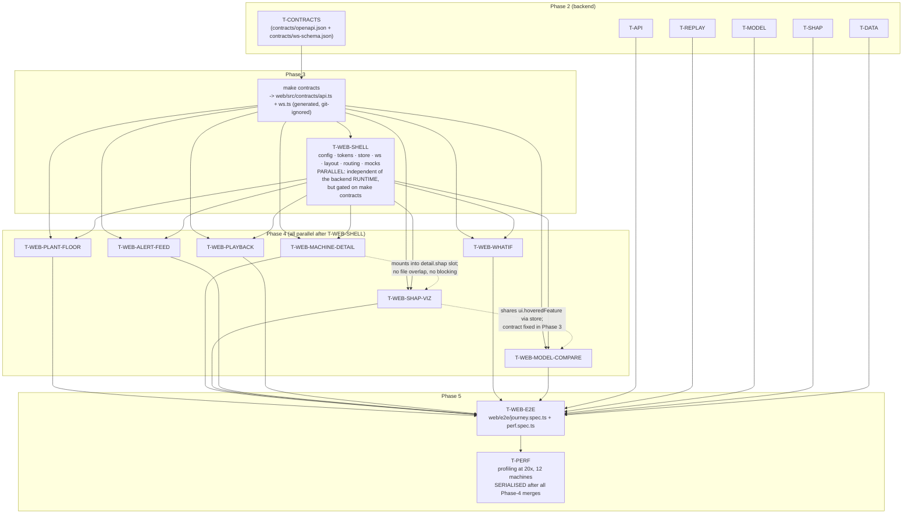

# Frontend + UX Build Plan

Area owner: frontend planner. Scope: everything under `web/`.
Sibling plan: `docs/plan/backend.md` (API, WebSocket, MQTT, models). Section 3
("Contract requirements") is written so the plan-reviewer can diff it line by
line against the backend plan.

**Naming authority.** Every field name, path, enum value and message `type` in
this document is the backend's. Where plan review 1 and orchestrator rulings
R1–R20 changed a name, this document uses the post-review name. If this file
and `docs/plan/backend.md` ever disagree again, the backend wins and this file
is wrong.

Binding rule for every builder in this area: **TypeScript types for anything
that crosses the network are generated, never hand-written.** `make contracts`
emits `web/src/contracts/api.ts` (from `contracts/openapi.json` via
`openapi-typescript`) and `web/src/contracts/ws.ts` (from
`contracts/ws-schema.json` via `json-schema-to-typescript`). Both are generated
output owned by T-CONTRACTS, git-ignored, and never hand-edited (R7, R15).
Components import from `@/contracts`, which is the committed barrel
`web/src/contracts/index.ts` owned by T-WEB-SHELL. A hand-written
`interface AlertDTO` — including a hand-written WebSocket envelope — anywhere
in `web/src/` is a review failure. There is no exception.

---

## 1. Module / component list

### 1.1 Shell modules (task `T-WEB-SHELL`)

**`app/`** — Application root. Mounts the router, the theme (`tokens.css`), the
global error boundary, the connection-status banner and the two route shells. It
owns nothing domain-specific: its only job is that a cold load renders a
complete, correct chrome (top bar, main region, right rail) in under 1.5 s on a
mid-range laptop, with skeletons in every region before the first WS frame.

**`shell/layout/`** — The three-region chrome: `TopBar` (plant selector,
connection pill, `run_id` readout, playback controls slot, clock showing
*dataset time* (`dataset_ts`) not wall time), `MainRegion` (router outlet),
`RightRail` (alert-feed slot). The layout is a CSS grid with fixed rail width
(`--rail-w: 360px`) that collapses to an overlay drawer below 1440 px (R8) with
an unread-count badge, and is a togglable sheet at 1280 px. It never re-renders
on telemetry: it subscribes to nothing but `connection`, `selectedPlant` and
`playback.runId`.

**`shell/router/`** — React Router v7 in library (declarative) mode. Two routes:
`/` (plant floor) and `/machines/:machineId` (machine detail), plus a
`*` not-found. `:machineId` is a backend machine id (`ai4i-03`, `ims-01`).
Machine detail also reads an `?alert=<alert_id>` search param
(`alt_<16 hex>`) so every view — including a scrubbed-back explanation — is a
shareable URL. Route changes never tear down the WS connection or the store.

**`shell/ws/`** — The WebSocket client. Owns: URL construction
(`/ws?plant_id=<ai4i|ims>`), connect, exponential-backoff reconnect with jitter
(base 500 ms, factor 1.8, cap 15 s, full jitter), liveness, and
**backpressure**.

*Liveness and reconnect (R10, R11).* The server emits a `ping` frame every
`api.ws_ping_seconds` (default 10) regardless of replay state; the client
replies with a `pong` frame. There is **no client-initiated ping**, **no
`subscribe` frame** (the `plant_id` query parameter is the complete
subscription), and **no resume**: the client tracks only
`connection.lastMessageAt`, declares the socket dead after
`WS_SILENCE_TIMEOUT_MS` of silence (derived below), and reconnects. On every connect the server sends `hello` then `snapshot`, and the
client rebuilds state from that snapshot wholesale — ring buffers are reset,
not stitched. There is no `seq` gap detection and no replay ring anywhere in
this plan.

*Backpressure* is the load-bearing part: inbound frames are decoded and written
into a mutable staging buffer synchronously, and the store is only committed
from a single `requestAnimationFrame` callback. The server already coalesces
per `api.ws_flush_ms` (default 100 ms) into batched `telemetry`/`risk` frames,
so at 20x with 12 machines the socket delivers ~10 batched frames/s carrying 12
machine updates each; React is told about them ~60 times/s at most, coalesced
per machine (last value wins for scalars, append-with-drop for ring buffers).
If the tab is hidden, the rAF loop stops and the staging buffer coalesces
unboundedly-but-boundedly (ring buffers are fixed size, so memory is flat);
on `visibilitychange` back to visible it commits once and resumes. If the
server sends `error` with `code="backpressure_dropped"`, the connection pill
shows a "degraded" treatment rather than an error.

**`store/`** — The Zustand store (§3.3). Split into slices: `machines`,
`telemetry`, `risk`, `alerts`, `explanations`, `playback`, `whatif`, `ui`.
Telemetry and risk live in **pre-allocated typed-array ring buffers held outside
React state** (`Float64Array` + write cursor) with a per-machine integer
`revision` counter in the store; charts subscribe to the revision and read the
buffer imperatively. This is the single most important performance decision in
the plan: it means a telemetry frame never allocates, never produces a new array
identity, and never invalidates a memo other than the chart that owns it.

**`config.ts`** — `web/src/config.ts`, owned by T-WEB-SHELL (review
non-blocking 5). The single home for frontend-only constants that are not
backend config: ring-buffer `CAPACITY = 3600`, `ALERT_CAP = 500`,
`WS_SILENCE_FACTOR = 2.5`, reconnect backoff parameters,
`WHATIF_THROTTLE_MS = 60`, `WHATIF_SLOW_AFFORDANCE_MS = 400`,
`RAIL_BREAKPOINT_PX = 1440`, `BEESWARM_MAX_POINTS = 2000`,
`TELEMETRY_MAX_POINTS = 2000`. **No magic numbers in feature code.** Anything
the backend owns — allowed speeds, `top_k`, thresholds, sparkline length,
severity bands, channel units — is read from the API at runtime and is *not*
in this file. The `Speed` type is `ReplayCommand["speed"]` from the generated
contract, never a hand-written union.

*Derived, not constant (review 2 item 12).* `WS_SILENCE_TIMEOUT_MS` is **not** a
literal. It is computed at runtime as
`Math.round(WS_SILENCE_FACTOR * config.values["api.ws_ping_seconds"] * 1000)`
from `ConfigResponse.values`, which the backend guarantees carries
`api.ws_ping_seconds` (backend §3.4.2). `WS_SILENCE_FACTOR = 2.5` is the only
constant here: the client tolerates two missed heartbeats plus half a period of
jitter before declaring the socket dead. At the default
`api.ws_ping_seconds = 10` this is 25 000 ms. The other backend-owned values the
shell reads from the same map are `api.sparkline_points`, `api.ws_flush_ms`,
`api.max_series_points`, `replay.allowed_speeds`, `explanation.top_k`,
`explanation.top_k_whatif`, `explanation.top_k_preview` and
`alerting.severity_bands.*`. Boot order: `GET /api/config` resolves before the
WebSocket opens, and a `config` WS frame recomputes the timeout in place.

**`mock/`** — MSW handlers + a deterministic replay fixture generator, used by
Vitest, Playwright, and `pnpm -C web dev:mock`. **Ships in no production
bundle**: all mock code lives under `web/src/mock/` and is imported only from
`web/src/mock/browser.ts`, which is itself imported behind
`if (import.meta.env.VITE_USE_MOCKS === 'true')` in `main.tsx`. A Vitest test
(`web/src/mock/__tests__/no-mock-in-prod.test.ts`) greps the production build
output for the string `__MSW_MOCK_MARKER__` and fails if present; CI runs it
after `pnpm -C web build`. Review non-blocking 8: `web/src/mock/**` is excluded
from **coverage instrumentation only** (`coverage.exclude` in
`vitest.config.ts`), never from test *collection* (`test.exclude` is left at its
default); a CI assertion greps the Vitest JSON reporter output for the test name
`no-mock-in-prod` and fails if it did not run.

**`lib/`** — Shared primitives with no domain knowledge: `useRafSubscription`,
`useResizeObserver`, `useDebouncedCallback` / `useThrottledCallback`,
`formatters` (units, dataset-time, percentiles, signed contribution strings),
`keyboard` (roving-tabindex helper), `a11y` (live-region announcer).

*Units rule (review non-blocking 9):* `formatUnit(value, unit)` renders the
backend's `ChannelSpec.unit` / `ShapContribution.unit` string **verbatim** after
the number, with a non-breaking thin space. The frontend holds **no unit
lookup table** and performs **no unit conversion or re-mapping** — `"g²/Hz"`,
`"N·m"`, `"K"`, `"rpm"`, `"min"` are printed as received (illustrations of the
rule; the authoritative per-channel strings are BE §3.1's). `unit === null`
(`ShapContribution`'s value for dimensionless features) and `unit === ""`
(`ChannelSpec`'s value for a dimensionless channel) both print the bare number
with no trailing space. An ESLint
`no-restricted-syntax` rule forbids any object literal in `web/src/` whose keys
are unit strings.

**`components/ui/`** — Unstyled-logic primitives used by every feature:
`Button`, `IconButton`, `Select` (native `<select>` under the hood for
keyboard/a11y), `Slider` (built on `<input type="range">`), `Tooltip`
(portal + `aria-describedby`, follows the pointer, closes on Escape),
`Sparkline`, `HealthRing`, `Badge`, `Skeleton`, `EmptyState`, `ErrorState`.

### 1.2 Feature modules (Phase 4, parallel)

**`features/plant-floor/`** (`T-WEB-PLANT-FLOOR`) — The machine grid. The grid
is **`Plant.machine_count`-driven**, never hardcoded: 12 tiles for `ai4i`
(4×3), 4 tiles for `ims` (4×1 at ≥ 1440 px, 2×2 below). Each `MachineTile`
renders a health ring (SVG arc, `stroke-dashoffset` animated), a risk sparkline
drawn from `MachineSummary.risk_sparkline` (length read from the payload, which
is `api.sparkline_points`, currently 60 — **not** a frontend constant), the
`display_name` and `machine_id`, the current `probability` as a percentage, and
a `MachineStatus` treatment (healthy / watch / alert / **offline**).

*Null handling on the tile (review 3 blocking 1).* `risk_sparkline` is
`Array<number | null>`: the backend emits `null` for ticks the machine had not
yet been scored for and **never pads with `0.0`**. A `null` sample is a **gap in
the sparkline path** — the same `NaN`-gap treatment the telemetry ring buffer
uses (§3.3) — so the path is broken across it and resumes at the next non-null
sample. It is never drawn as `0`, never drawn on the baseline, and never
interpolated across: a leading run of `null`s means the path simply starts later
along the x-axis. The y-domain is fixed `[0, 1]` regardless of how many samples
are null, so tiles stay visually comparable. A sparkline that is entirely `null`
renders no path at all (the `Sparkline` component renders its empty state, not a
flat line at 0). The health ring does **not** read `risk_sparkline`; it reads
`MachineSummary.probability`, and when that is `null` it renders the designed
"not yet scored" state — the ring's empty track with no filled arc and `—` in
place of the percentage (§4.3, §6.3) — rather than a zero-length arc labelled
`0%`.

Tiles are `<button>`s in a roving-tabindex grid; Enter/Space opens the machine,
arrow keys move focus. A tile re-renders only when *its own* machine's risk bucket or
status changes — the sparkline redraws on rAF from the ring buffer without a
React render.

*Demo deep-link (R13, review non-blocking 10):* `settings.yaml` carries
`plants.<id>.demo_machine_id` (`ai4i-03`, `ims-01`), surfaced on `Plant` as
`demo_machine_id: str`. The plant floor renders a "Open demo machine" action in
the grid header (`testid` `floor-demo-link`) that navigates to
`/machines/{demo_machine_id}`, and the same id is what the README GIF script
drives. It is a real product affordance ("jump to the machine that fails"), not
a test hook, and it is keyboard-reachable.

**`features/machine-detail/`** (`T-WEB-MACHINE-DETAIL`) — The detail page frame
and the two streaming visualisations it owns: `TelemetryCharts` (a stacked
column of uPlot instances over `MachineDetail.channels`, grouped by the rule
below, sharing a cursor and an x-scale) and `RiskTimeline` (uPlot, `probability` 0–1
plus `RiskSeries.alerts[]` markers as a second series drawn via a custom
`drawHooks` path). It also owns the responsive slot layout into which
`T-WEB-SHAP-VIZ`, `T-WEB-WHATIF` and `T-WEB-MODEL-COMPARE` mount their panels;
those tasks export a single default component each and know nothing about
layout.

*Chart grouping rule (binding, review 2 item 13).* `TelemetryCharts` does **not**
render one chart per channel unconditionally. It partitions
`MachineDetail.channels` in canonical order into groups:

- Channels with `vibration_like === true` **and** an identical `unit` string
  share **one** chart, with one series per channel, a shared y-domain
  (`min(nominal_min)` … `max(nominal_max)` over the group) and a series legend.
  Group testid: `telemetry-chart-group-{unit-slug}`, where `unit-slug` is the
  slug of the unit string as it arrives on `Plant.channels[].unit` — that string
  lowercased, with every run of non-`[a-z0-9]` characters replaced by a single
  `-` and leading/trailing `-` trimmed (algorithm only: a channel whose `unit`
  were `"A/B²"` would group under `telemetry-chart-group-a-b`). The frontend
  never hardcodes a unit string or its slug anywhere: the unit strings are
  backend-owned and pinned per channel in BE §3.1, and `lib/formatters.unitSlug`
  is the single implementation of the transform.
- Every other channel gets its own chart, testid
  `telemetry-chart-{channel_name}` as before.
- Group position in the stack is the position of the group's **first** channel
  in canonical order; groups never reorder the stack.

This is a general rule read from `ChannelSpec`, not a special case for `ims`.
Applied to the per-channel `unit` / `vibration_like` values BE §3.1 pins, it
yields **7 charts** for `ai4i` (all seven channels `vibration_like === false`,
so all ungrouped) and **4 charts** for `ims` (the six band energies share one
`vibration_like` unit string and collapse into a single group chart, whose
testid is the slug of that unit string; the remaining three channels render
per-channel). Those two counts are a *consequence* of the BE table, not an
independent frontend assertion — if BE's table changes, the counts change with
it and §4.3's test, which derives its expectation from the fixture, follows
automatically.
A group of exactly one channel is rendered as an ungrouped per-channel chart, so
no `telemetry-chart-group-*` node ever holds a single series.

**`features/shap-viz/`** (`T-WEB-SHAP-VIZ`) — Five components.
`ShapWaterfall`: animated `base_value` → `contributions` → `output_value`
waterfall (SVG, ≤ `explanation.top_k` (default 8) bars + one "N other features"
roll-up), with a hover/focus tooltip giving the feature's raw `value` with
`unit`, its `percentile` for that machine, and that contribution's `sentence`.
`ForcePlot`: a single horizontal stacked bar, pushes-up (danger) to the right
of the base marker, pushes-down (healthy) to the left, labels on segments wider
than 48 px and in the tooltip otherwise. `Beeswarm`: `GlobalImportance` across
*all* alerts for this machine — canvas, one row per feature, x = `shap`,
colour = `value_percentile`, with dodge computed in a worker-free O(n log n)
pass. `ExplanationSentence`: `Explanation.sentence` rendered with each
`sentence_spans[]` entry as a `<button>` that focuses and pulses the
corresponding waterfall bar (and scrolls it into view). `ExplanationCaveat`
(R13, blocking): `Explanation.caveat` rendered as a persistent footnote
directly under the sentence, `testid` `explanation-caveat`, at `--t-sm` in
`--c-text-muted` with an `ⓘ` glyph, always visible (never behind a tooltip or
a disclosure), on the machine detail view, in the compare panel and in the
what-if panel. Colour is never the only signal: `direction === "up"` bars point
right and carry a `▲`, `direction === "down"` bars point left and carry `▼`.

**`features/alert-feed/`** (`T-WEB-ALERT-FEED`) — The right rail. A virtualised
(windowed, `@tanstack/react-virtual`) reverse-chronological list of alert cards;
each card shows `dataset_ts`, `machine_id`, an `AlertSeverity` chip
(medium / high / critical), `probability`, and `Alert.headline` clamped to two
lines. New alerts slide in from the right with a 220 ms spring and a one-shot
border flash; if `prefers-reduced-motion` is set they simply appear. Filters:
machine (multi-select over `machine_id`), severity (medium / high / critical),
and `top_feature` (populated from `Alert.top_feature` over the alerts actually
present). Clicking a card navigates to
`/machines/{machine_id}?alert={alert_id}`.

**`features/playback/`** (`T-WEB-PLAYBACK`) — Transport controls in the top bar:
play/pause, speed segmented control over `Plant`-independent
`replay.allowed_speeds` (0.5 / 1 / 5 / 20, typed from the generated
`ReplayCommand["speed"]`), a scrub bar over `[ReplayState.dataset_start,
ReplayState.dataset_end]`, and a `dataset_ts` readout. **All transport control
goes through REST `POST /api/replay/command`** (R11); the WebSocket is receive-
only for `replay_state`. Scrubbing is *local and optimistic while dragging*
(the store's `playback.scrubDatasetTsMs` moves, all views read historical
state),
and commits on pointer-up as
`{command: "seek", dataset_ts, request_id}`. Scrubbing back re-renders the
*historical* state — telemetry from the ring buffer when the target is
in-buffer, otherwise `GET /api/state_at?plant_id=&dataset_ts=` — including the
explanation that was active at that instant (§3.1).

**`features/whatif/`** (`T-WEB-WHATIF`) — Sliders for the top
`explanation.top_k_whatif` (default 5) features of the selected alert. Each
slider is labelled with `display_name`, `unit`, the current value, and the
original value (a tick mark you can snap back to). Input is throttled with a
60 ms leading+trailing throttle plus an in-flight-request guard (at most one
request outstanding; the latest pending input is sent when it returns — "last
write wins"). The UI is optimistic: the probability bar and the waterfall move
immediately using a **local linear SHAP approximation**
(Δp ≈ Σ `gradients[f]` · Δx_f, where `gradients` comes from the previous
`WhatIfResponse`, §3.1) and are reconciled with the authoritative response when
it lands. Requests are `AbortController`-cancelled on unmount and on alert
change. Budget: perceived response < 16 ms, and **client-measured** round trip
< 150 ms (GOAL definition-of-done — see §3.1 on
`whatif.lastLatencyMs` vs `compute_ms`), with a visible but non-blocking
"recomputing" affordance only if the round trip exceeds 400 ms. The what-if
sentence is rendered with an explicit "provisional" chip and the same
`explanation-caveat` footnote.

**`features/model-compare/`** (`T-WEB-MODEL-COMPARE`) — Side-by-side **LightGBM
(`lgbm`) vs Random Forest (`rf`)** for one alert, from
`GET /api/alerts/{alert_id}/compare` → `ModelComparison`: two probability dials
(`lgbm.probability`, `rf.probability`, plus `probability_delta`), two
mini-waterfalls sharing a *common feature ordering and a common x-domain* (so
bars are visually comparable), `rank_correlation` as a small readout, and
`commentary` rendered verbatim. A "diff" toggle overlays
`disagreements[]` (`FeatureDisagreement`) as a diverging bar.

### 1.3 Wireframes

Plant floor, `/` (1440 px):

```
┌──────────────────────────────────────────────────────────────┬────────────────┐
│ EPM ▸ [Plant: AI4I 2020 Milling ▾]  ⏮ ⏸ ▶ [0.5x|1x|5x|20x]   │  ALERTS        │
│ ●live  run_1a2b3c4d5e6f   ├─────scrub────────◆──────┤        │ [mach▾][sev▾]  │
│                     2026-01-02 10:45:00 (dataset time)       │ [feature▾]     │
├──────────────────────────────────────────────────────────────┤────────────────┤
│  MACHINES (12)                            [Open demo machine]│┌──────────────┐│
│  ┌────────┐ ┌────────┐ ┌────────┐ ┌────────┐                 ││10:45 ai4i-07 ││
│  │ ◜◝ 12% │ │ ◜◝ 61% │ │ ◜◝ 88% │ │ ◜◝  — │                  ││▲ HIGH p=0.88 ││
│  │ai4i-01 │ │ai4i-02 │ │ai4i-03!│ │ai4i-04 │                 ││vibration_3khz││
│  │ ‾‾╱╲‾  │ │ ‾╱‾╲╱  │ │ ╱╱╱╱╱  │ │ ······ │                 ││ p95 4 h …    ││
│  │●HEALTHY│ │◆WATCH  │ │▲ALERT  │ │○OFFLINE│                 │└──────────────┘│
│  └────────┘ └────────┘ └────────┘ └────────┘                 │┌──────────────┐│
│  ┌────────┐ ┌────────┐ ┌────────┐ ┌────────┐                 ││10:40 ai4i-03 ││
│  │  …     │ │  …     │ │  …     │ │  …     │   (machine_count││▲▲ CRITICAL   ││
│  └────────┘ └────────┘ └────────┘ └────────┘    tiles; 4×3   │└──────────────┘│
│  ┌────────┐ ┌────────┐ ┌────────┐ ┌────────┐    here, 4×1    │      ⋮         │
│  └────────┘ └────────┘ └────────┘ └────────┘    for ims)     │                │
└──────────────────────────────────────────────────────────────┴────────────────┘
```

Machine detail, `/machines/ai4i-03?alert=alt_9f2c71ab40d3e155` (1440 px):

```
┌──────────────────────────────────────────────────────────────┬────────────────┐
│ ← EPM ▸ AI4I ▸ Mill 03 (ai4i-03)  ⏮ ⏸ ▶ [0.5x|1x|5x|20x]     │  ALERTS        │
├──────────────────────────────────────────────────────────────┤────────────────┤
│ ┌─ TELEMETRY ───────────────────────┐ ┌─ WHY WAS THIS ─────┐ │┌──────────────┐│
│ │ torque    ╱╲__╱╲___╱╲_            │ │  FLAGGED?          │ ││10:45 ai4i-07 ││
│ │ rot_speed ‾‾‾‾╲___╱‾‾             │ │ "Mill 03 was       │ │└──────────────┘│
│ │ tool_wear ___╱‾‾‾‾‾‾              │ │  flagged at 74%    │ │┌──────────────┐│
│ │ temp_diff ___╱╲╱╲╱╲╱              │ │  risk because      │ ││10:40 ai4i-03 ││
│ └───────────────────────────────────┘ │  torque stayed     │ │└──────────────┘│
│ ┌─ RISK ────────────────────────────┐ │  above its 95th    │ │      ⋮         │
│ │ 1.0                    ▲      ▲   │ │  percentile for 4  │ │                │
│ │      ______╱‾‾‾╲___╱‾‾‾‾‾‾‾‾‾     │ │  consecutive hrs." │ │                │
│ │ 0.0 ──────────────────────────────│ │ ⓘ SHAP describes   │ │                │
│ └───────────────────────────────────┘ │  association, not  │ │                │
│ ┌─ WHAT IF ──────────── provisional ┐ │  physical cause.   │ │                │
│ │ torque_p95_4h    ──●───── 48.1 N·m│ ├────────────────────┤ │                │
│ │ temp_diff_slope  ────●─── 0.31 K/h│ │ WATERFALL          │ │                │
│ │ tool_wear_max_24h ─●──── 204 min  │ │ base       0.08 ├──│ │                │
│ │ p 0.08 ▸▸▸▸▸▸▸▸ 0.74   round trip │ │ torque_p95 ├███+.31│ │                │
│ │                        41 ms      │ │ temp_diff  ├██ +.19│ │                │
│ └───────────────────────────────────┘ │ rot_speed ██┤  −.06│ │                │
│ ┌─ FORCE ───────────────────────────┐ │ 146 others ├█  +.04│ │                │
│ │ ◀── ▼down │base│ ████ ▲up ──▶     │ │ output     0.74    │ │                │
│ └───────────────────────────────────┘ ├────────────────────┤ │                │
│ ┌─ lgbm vs rf  [compare ▾] ─────────┐ │ BEESWARM (all      │ │                │
│ │ lgbm 0.74 │ rf 0.61 │ "rf weights │ │  alerts, this      │ │                │
│ │ tool wear more; both agree torque │ │  machine)          │ │                │
│ │ is the dominant driver."          │ │ torque   ·· ·••●•  │ │                │
│ └───────────────────────────────────┘ └────────────────────┘ │                │
└──────────────────────────────────────────────────────────────┴────────────────┘
```

At 1280 px the right rail becomes an overlay toggled from the top bar (with an
unread badge, R8), and the detail page's two columns stay side by side at a
60/40 split with the telemetry charts reducing to 160 px tall each.

---

## 2. File ownership map

No two tasks own the same file. Directories are exclusive to their task. Task
ids are the canonical `T-WEB-*` forms from R9.

### `T-WEB-SHELL` (Phase 3) — everything outside `web/src/features/`

```
web/package.json
web/pnpm-lock.yaml
web/vite.config.ts
web/tsconfig.json
web/tsconfig.node.json
web/eslint.config.js
web/.prettierrc.json
web/vitest.config.ts             # incl. the enforced coverage.thresholds (§4.1)
web/vitest.setup.ts
web/playwright.config.ts
web/index.html
web/Dockerfile                   # FE owns the web container (review item 33)
web/nginx.conf
web/.dockerignore
web/src/main.tsx
web/src/App.tsx
web/src/config.ts                # FE-only UI constants (review non-blocking 5)
web/src/vite-env.d.ts
web/src/styles/tokens.css
web/src/styles/base.css
web/src/styles/utilities.css
web/src/shell/layout/AppLayout.tsx
web/src/shell/layout/TopBar.tsx
web/src/shell/layout/RightRail.tsx
web/src/shell/layout/*.module.css
web/src/shell/layout/__tests__/*
web/src/shell/router/routes.tsx
web/src/shell/router/__tests__/*
web/src/shell/slots.ts
web/src/shell/ws/client.ts
web/src/shell/ws/backpressure.ts
web/src/shell/ws/reconnect.ts
web/src/shell/ws/useWsConnection.ts
web/src/shell/ws/__tests__/*
web/src/shell/errors/ErrorBoundary.tsx
web/src/shell/errors/__tests__/*
web/src/store/index.ts
web/src/store/slices/machines.ts
web/src/store/slices/telemetry.ts
web/src/store/slices/risk.ts
web/src/store/slices/alerts.ts
web/src/store/slices/explanations.ts
web/src/store/slices/playback.ts
web/src/store/slices/whatif.ts
web/src/store/slices/ui.ts
web/src/store/ringBuffer.ts
web/src/store/selectors.ts
web/src/store/__tests__/*
web/src/contracts/index.ts       # committed barrel: re-exports api.ts + ws.ts
web/src/contracts/.gitignore     # ignores api.ts and ws.ts
web/src/api/client.ts            # typed fetch wrapper over the generated types
web/src/api/queries.ts
web/src/api/__tests__/*
web/src/features/registry.ts     # side-effect imports for all seven features
web/src/lib/**                   # useRafSubscription, formatters, keyboard, a11y
web/src/components/ui/**         # Button, Slider, Tooltip, Sparkline, HealthRing, …
web/src/mock/**                  # MSW handlers, fixture generator, browser.ts
web/e2e/smoke.spec.ts            # the Phase-3 shell smoke only
web/e2e/fixtures/*.ts
```

**Generated, never committed, owned by T-CONTRACTS** (R15, review item 32):
`web/src/contracts/api.ts` and `web/src/contracts/ws.ts`. `make contracts`
produces both; `make contracts-check` regenerates into a temp dir and fails CI
on drift. `web/openapi-ts.config.ts` **does not exist** — the CLI invocation
lives in the backend's Makefile and nowhere else.

**Dependency pre-declaration (review item 36, R18).** `web/package.json` is
written **once**, by `T-WEB-SHELL` in Phase 3, and no later task edits it. It
therefore pre-declares every tool any later task invokes, in `devDependencies`:

| Package | Range | Invoked by | For |
|---|---|---|---|
| `openapi-typescript` | `^7` | `T-CONTRACTS` via `make contracts` | `web/src/contracts/api.ts` |
| `json-schema-to-typescript` | `^15` | `T-CONTRACTS` via `make contracts` | `web/src/contracts/ws.ts` |
| `tsx` | `^4` | `T-DOCS` via `make media` (R18) | `pnpm -C web exec tsx ../scripts/capture_media.ts` |
| `@playwright/test` | `^1.5x` | `T-WEB-SHELL`, Phase-4 tasks, `T-WEB-E2E` | all `web/e2e/*.spec.ts` |

`T-CONTRACTS` and `T-DOCS` only *invoke* these via `pnpm -C web exec`; neither
ever edits `web/package.json`. `make media` stays a `tsx` script rather than a
Playwright spec, because it drives a scripted capture with its own timing and is
not a test (R18 picks this fork explicitly).

`docker/web.Dockerfile` is deleted from T-INFRA (review item 33);
`docker-compose.yml` (T-INFRA's spelling, used everywhere in both plans)
references `web/Dockerfile` with build context `web/`.

### Phase 4 tasks — one directory each

| Task | Owns |
|---|---|
| `T-WEB-PLANT-FLOOR` | `web/src/features/plant-floor/**` (incl. `__tests__/`), `web/e2e/t-web-plant-floor.spec.ts` |
| `T-WEB-MACHINE-DETAIL` | `web/src/features/machine-detail/**`, `web/e2e/t-web-machine-detail.spec.ts` |
| `T-WEB-SHAP-VIZ` | `web/src/features/shap-viz/**`, `web/e2e/t-web-shap-viz.spec.ts` |
| `T-WEB-ALERT-FEED` | `web/src/features/alert-feed/**`, `web/e2e/t-web-alert-feed.spec.ts` |
| `T-WEB-PLAYBACK` | `web/src/features/playback/**`, `web/e2e/t-web-playback.spec.ts` |
| `T-WEB-WHATIF` | `web/src/features/whatif/**`, `web/e2e/t-web-whatif.spec.ts` |
| `T-WEB-MODEL-COMPARE` | `web/src/features/model-compare/**`, `web/e2e/t-web-model-compare.spec.ts` |

Each Phase-4 task's one `web/e2e/<task-id-lowercased>.spec.ts` file is listed
here explicitly (review 2 non-blocking 7) so the ownership table is complete;
the naming rule is restated in the cross-task section below.

Each feature directory has the same shape:

```
web/src/features/<name>/
  index.ts                 # single public export, the mount-point component
  <Component>.tsx
  <Component>.module.css
  hooks/use*.ts
  __tests__/<Component>.test.tsx
```

### Phase 5 tasks

| Task | Owns |
|---|---|
| `T-WEB-E2E` (R14, review item 35) | `web/e2e/journey.spec.ts`, `web/e2e/perf.spec.ts` |
| `T-PERF` (R14) | **no exclusive files**; see below |

`T-WEB-E2E` is a frontend-builder task in Phase 5. It owns exactly the two
Phase-5 spec files and nothing else; if a product bug surfaces it files it back
to the owning Phase-4 task rather than editing that task's files.

`T-PERF` (R14) is the profiling pass: run the plant floor at 20x with 12
machines against the real stack, measure against the §4.5 budgets, and fix what
misses. **It is the one task permitted to touch files across
`web/src/features/*` by exception**, and it is therefore **serialised after
every Phase-4 merge and after `T-WEB-E2E`**. It may not add features, change
contracts, or alter testids; its diffs are memoisation, draw-call batching,
decimation and lazy-chunk boundaries only. Every `T-PERF` commit cites the
measured before/after number from `web/e2e/perf.spec.ts` in its body. If
`T-PERF` needs no change, it lands only the recorded numbers in its report and
the task closes empty — that is a pass, not a gap.

### Cross-task integration points (resolved, not left to chance)

Three integration seams would otherwise cause file collisions. They are resolved
by **`T-WEB-SHELL` shipping named empty slots in Phase 3**, which Phase-4 tasks
fill via a tiny registry rather than by editing shell files:

- `web/src/shell/slots.ts` (owned by `T-WEB-SHELL`) exports
  `registerSlot(name, Component)` and `<Slot name=… />`. Slot names, fixed in
  Phase 3: `topbar.playback`, `rail.feed`, `detail.shap`, `detail.whatif`,
  `detail.compare`, `floor.grid`, `detail.charts`.
- Each Phase-4 task registers from its own `index.ts` via a side-effect import
  listed in `web/src/features/registry.ts` — **owned by `T-WEB-SHELL`**, written
  once in Phase 3 with all seven imports already present, so no Phase-4 task
  edits it. Phase-4 tasks that are not yet built export a designed
  `EmptyState`, which is also the production empty state. This means the shell
  is runnable and e2e-smokeable from day one with no stubs left behind at the
  end.
- Playwright specs: `web/e2e/smoke.spec.ts` is the shell's; each Phase-4 task
  may add **only** `web/e2e/<task-id-lowercased>.spec.ts` (e.g.
  `web/e2e/t-web-whatif.spec.ts`). `web/e2e/journey.spec.ts` and
  `web/e2e/perf.spec.ts` belong to `T-WEB-E2E`.

---

## 3. Contract requirements

Every name below is the backend's. This section is a statement of what the
frontend consumes, not a proposal.

Conventions, fixed:

- `plant_id` ∈ `{"ai4i", "ims"}` (closed enum). `machine_id` is
  `"{plant_id}-{nn}"`, zero-padded, 1-based: `ai4i-01` … `ai4i-12`,
  `ims-01` … `ims-04`. `alert_id` is `alt_` + 16 lowercase hex
  (`alt_9f2c71ab40d3e155`). `explanation_id` is `exp_` + 16 hex. `run_id` is
  `run_` + 12 hex. `model_id` is `"{kind}@{semver}"` (`lgbm@1.0.0`).
- **Two clocks, both ISO-8601 UTC strings with milliseconds, on every frame and
  every row.** `dataset_ts` is dataset time — the replay clock; `ts` is
  wall-clock emit time. **`dataset_ts` is what the UI displays, plots, filters,
  scrubs and sorts on** (R8). `ts` appears only inside a "received at" tooltip
  on the connection pill. There is no field named `t` anywhere in this plan.
  The frontend parses `dataset_ts` **once**, at decode time in
  `shell/ws/backpressure.ts` and in `api/client.ts`, into epoch-milliseconds
  stored in the `Float64Array` ring buffer and in store scalars named
  `*DatasetTsMs`. Nothing downstream re-parses a string.
- Probabilities are floats in `[0, 1]`, never percentages. Formatting to `%` is
  a render-time concern.
- **SHAP is in probability space** (R3). Responses carry
  `shap_space: "probability"` as a `Literal`, and `base_value`,
  `contributions[].shap`, `other_contributions_shap` and `output_value` are all
  in that space, with `output_value == probability`. The waterfall therefore
  sums from `base_value` to the probability shown on screen, which is what makes
  the GOAL's "sentence matches the numbers on screen" true. The frontend renders
  `shap_space` as a label ("contributions to probability") and treats any value
  other than `"probability"` as an error state rather than guessing.
- `MachineStatus` = `"healthy" | "watch" | "alert" | "offline"` — a *machine's*
  live condition (review item 3). `AlertSeverity` =
  `"medium" | "high" | "critical"` — an *alert's* graded seriousness. They are
  different enums, they never mix, and no component takes a parameter that could
  be either.
- Paging envelope `{items, next_cursor}` exists **only** on `AlertPage`
  (`GET /api/alerts`). `GET /api/plants`, `GET /api/machines` and
  `GET /api/models` return bare JSON arrays (review item 14).
- `null` means "not yet computable" and gets a designed empty state, never `0`
  (backend §3.1). Every nullable field named below has a designed null state.

### 3.1 REST endpoints the frontend calls

| Method + path | When called | Response |
|---|---|---|
| `GET /api/health` | connection pill, e2e readiness gate | `HealthResponse = {status: "ok"\|"degraded", model_id: string, run_id: string \| null, replay: ReplayState \| null, plants_available: string[]}` — `run_id` is null before the first replay tick and `replay` is null until the publisher announces itself, so the e2e readiness gate polls until `status === "ok"` **and** `run_id !== null`; the pill shows `model_id` in its tooltip and renders the `run-id` readout as `—` while `run_id` is null |
| `GET /api/plants` | app boot | `Plant[]` (bare array) |
| `GET /api/machines?plant_id=` | on plant select | `MachineSummary[]` (bare array) |
| `GET /api/machines/{machine_id}` | detail mount | `MachineDetail` |
| `GET /api/telemetry?machine_id=&since=&until=&channels=&max_points=` | detail mount, scrub outside ring buffer | `TelemetrySeries` (columnar, §below) |
| `GET /api/risk?machine_id=&since=&until=&max_points=` | detail mount, scrub | `RiskSeries` |
| `GET /api/alerts?plant_id=&machine_id=&since=&until=&severity=&feature=&limit=50&cursor=` | rail backfill (first 50) | `AlertPage = {items: Alert[], next_cursor: string \| null}` |
| `GET /api/alerts/{alert_id}` | deep-link with `?alert=` when the alert is not in the store | `Alert` |
| `GET /api/alerts/{alert_id}/explanation?model=lgbm\|rf` | alert selected | `Explanation` (§3.1.1) |
| `GET /api/alerts/{alert_id}/compare` | model-compare panel | `ModelComparison` |
| `GET /api/machines/{machine_id}/importance?since=&until=&limit=20` | beeswarm | `GlobalImportance` |
| `GET /api/state_at?plant_id=&dataset_ts=` | scrub commit, and any scrub target outside the ring buffer | `PlantSnapshot` |
| `POST /api/whatif` | every throttled slider commit | `WhatIfRequest` → `WhatIfResponse`. **Must answer in < 150 ms locally** (GOAL) |
| `GET /api/config` | boot (before the socket opens) and the settings drawer | `ConfigResponse`. `values` is the full flattened settings tree; the frontend reads `explanation.top_k`, `explanation.top_k_whatif`, `explanation.top_k_preview`, `alerting.severity_bands.*`, `replay.allowed_speeds`, `api.sparkline_points`, `api.ws_ping_seconds` (→ `WS_SILENCE_TIMEOUT_MS`, §1.1), `api.ws_flush_ms`, `api.max_series_points` |
| `PUT /api/config` | settings drawer commit | `ConfigPatch` → `ConfigResponse`. **`ConfigPatch` cannot mutate `replay.speed`** (R12); the speed control posts a replay command instead |
| `GET /api/replay` | boot, before the socket opens | `ReplayState` |
| `POST /api/replay/command` | every transport control (R11) | `ReplayCommand = {command: "play"\|"pause"\|"set_speed"\|"seek"\|"restart", speed?: 0.5\|1.0\|5.0\|20.0, dataset_ts?: string, request_id: string}` → `ReplayState` |
| `GET /api/models` | compare panel header | `ModelInfo[]`; the frontend reads `model_id`, `family` and `n_features` as model metadata. It is **not** the source of the waterfall roll-up label — that is `Explanation.other_contributions_count` (R17) — so no view blocks on this call |

Response models the frontend depends on, as the backend defines them:

```ts
// Plant — drives the plant selector, the grid size and the ring-buffer sizing.
type Plant = {
  plant_id: "ai4i" | "ims";
  display_name: string;            // "AI4I 2020 Milling Plant"
  machine_count: number;           // 12 | 4 — the grid is driven by this
  available: boolean;              // false if the IMS data is genuinely absent
  unavailable_reason: string | null;
  channels: ChannelSpec[];         // canonical, fixed order (§3.2 item 1)
  dataset_start: string;           // ISO dataset time
  dataset_end: string;
  row_interval_seconds: number;    // 300 | 600 — drives x-axis tick density
  demo_machine_id: string;         // R13
};

type ChannelSpec = {
  name: string;                    // "vibration_3khz"
  display_name: string;            // "Vibration @ 3 kHz"
  unit: string;                    // rendered verbatim; "" = dimensionless,
                                   // prints bare. Exact per-channel strings are
                                   // backend-owned (BE §3.1)
  vibration_like: boolean;
  nominal_min: number;             // fixed uPlot y-domain lower bound
  nominal_max: number;             // fixed uPlot y-domain upper bound
};

type MachineSummary = {
  machine_id: string;
  plant_id: "ai4i" | "ims";
  display_name: string;            // "Mill 03" | "Bearing 1"
  status: MachineStatus;
  probability: number | null;      // null before the first scored row → "—"
  dataset_ts: string | null;
  open_alert_id: string | null;
  risk_sparkline: Array<number | null>;   // oldest first; LENGTH READ FROM
                                   // PAYLOAD; null = not yet scored at that tick
};

type MachineDetail = MachineSummary & {
  channels: ChannelSpec[];         // identical order to Plant.channels
  alert_count: number;
  variant_mix: Record<string, number> | null;  // ai4i only
  bearing: number | null;                      // ims only
};

// Columnar by contract — a row-of-objects shape would cost an O(n) transpose
// on every scrub. Arrays are equal length; the server has already LTTB-
// downsampled to max_points.
type TelemetrySeries = {
  machine_id: string;
  dataset_ts: string[];
  channels: Record<string, Array<number | null>>;
};

type RiskSeries = {
  machine_id: string;
  dataset_ts: string[];
  probability: number[];
  alerts: AlertMarker[];
};

type AlertMarker = {
  alert_id: string;
  dataset_ts: string;
  severity: AlertSeverity;
  probability: number;
};

type Alert = {
  alert_id: string;
  run_id: string;
  plant_id: "ai4i" | "ims";
  machine_id: string;
  machine_display_name: string;    // "Mill 03" — what the live region announces (§6.6)
  ts: string;
  dataset_ts: string;
  model_id: string;
  probability: number;
  severity: AlertSeverity;
  headline: string;                // the one-liner the rail renders verbatim
  top_feature: string;             // drives the rail's feature filter
  explanation_id: string;
  closed_dataset_ts: string | null;  // null while open; drives the rail's "resolved" chip
};

// Precomputed server-side for the beeswarm. The frontend never fetches N
// explanations and aggregates.
type GlobalImportance = {
  machine_id: string;
  n_alerts: number;
  features: Array<{
    feature: string;
    display_name: string;
    mean_abs_shap: number;
    points: Array<{ shap: number; value_percentile: number; alert_id: string }>;
  }>;
};

type ModelComparison = {
  alert_id: string;
  lgbm: Explanation;
  rf: Explanation;
  probability_delta: number;       // lgbm - rf
  rank_correlation: number;
  disagreements: FeatureDisagreement[];
  commentary: string;              // rendered verbatim; the FE composes no prose
};

type FeatureDisagreement = {
  feature: string;
  display_name: string;
  lgbm_shap: number;
  rf_shap: number;
  delta: number;                   // lgbm_shap - rf_shap
};

type ModelInfo = {
  model_id: string;                // "lgbm@1.0.0"
  family: "lgbm" | "rf";           // backend field name is `family`, not `kind`
  n_features: number;              // 154 — metadata only; NOT the roll-up label source (R17)
  trained_at: string;
  metrics: Record<string, number>;
};
// `ModelInfo.family` and `Explanation.model_kind` are different fields on
// different models and are deliberately not unified.

// GET /api/state_at — the whole reason historical scrubbing is implementable.
type PlantSnapshot = {
  plant_id: "ai4i" | "ims";
  dataset_ts: string;              // the RESOLVED row boundary, may differ from the request
  machines: MachineSummary[];
  active_alerts: Alert[];
  active_explanations: Explanation[];   // read from storage, never recomputed
};
```

**Deriving the per-machine historical explanation** (review item 19). There is
no `active_explanation_ids` map and none is needed. At most one alert per
machine is open at a time (backend §3.4), so the frontend builds
`Record<machine_id, explanation_id | null>` client-side in a selector:

```ts
// web/src/store/selectors.ts (T-WEB-SHELL)
const byAlert = new Map(snap.active_explanations.map((e) => [e.alert_id, e]));
const historical = new Map<string, Explanation | null>(
  snap.active_alerts.map((a) => [a.machine_id, byAlert.get(a.alert_id) ?? null]),
);
```

Machines absent from `active_alerts` have no active explanation; the detail view
renders the designed "no explanation active at this time" empty state, which is
a correct historical answer, not a failure.

**What-if latency, precisely** (review item 18). `WhatIfResponse.compute_ms` is
the **server's** compute time and is displayed as a secondary readout
("server 11 ms"). The **GOAL definition-of-done number is measured
client-side**: `performance.now()` immediately before `fetch()` to immediately
after the response body is parsed, stored as `whatif.lastLatencyMs`, rendered in
`whatif-latency` as "round trip 41 ms", and that is the number `§4.4` step 5
asserts is < 150 ms.

#### 3.1.1 `Explanation` — the single most important shape

```ts
type Explanation = {
  explanation_id: string;
  alert_id: string;
  machine_id: string;
  model_id: string;                // "lgbm@1.0.0"
  model_kind: "lgbm" | "rf";
  dataset_ts: string;              // dataset time this explanation was computed for
  shap_space: "probability";       // R3; any other value is an error state
  base_value: number;              // in probability space
  output_value: number;            // == probability, by backend contract
  probability: number;             // [0,1]
  contributions: ShapContribution[];
  // ^ the top `explanation.top_k` (default 8) features by |shap| descending.
  //   NOT all features: the remainder is folded into other_contributions_shap.
  other_contributions_shap: number;   // summed tail, so the waterfall closes exactly
  other_contributions_count: number;  // e.g. 146 → "146 other features" (R17)
  n_features: number;                 // total features in the model vector
  sentence: string;                // full generated explanation, plain text
  sentence_spans: SentenceSpan[];
  caveat: string;                  // rendered under the sentence; testid explanation-caveat
};

type SentenceSpan = {
  start: number;                   // char offset into `sentence`
  end: number;
  feature: string;                 // links the span to a contribution / waterfall bar
};
// Character offsets, not string matching. String matching breaks the moment one
// display name is a substring of another ("Torque" ⊂ "Torque, std over 1 h").

type ShapContribution = {
  feature: string;                 // "vibration_3khz_p95_4h"
  display_name: string;            // "Vibration @ 3 kHz — 95th pct over 4 h"
  shap: number;                    // signed, in probability space
  value: number | null;            // raw feature value at alert time; null → "—"
  unit: string | null;             // "g²/Hz" | null; rendered verbatim
  percentile: number | null;       // 0-100 within this machine's own history
  window_hours: number | null;     // 1 | 4 | 24 | null for a raw channel
  stat: string | null;             // "p95" | "mean" | "slope" | "std" | …
  framing: "percentile" | "threshold" | "trend" | "consecutive";
  consecutive_hours: number | null;
  threshold: number | null;
  direction: "up" | "down";        // drives the ▲/▼ glyph and the bar's side
  sentence: string;                // the rendered clause for this feature (review item 11)
};
```

Frontend-side derivations, stated so no builder invents a second one:

- **Window label.** The backend sends `window_hours: number | null`; the
  frontend formats it: `1 → "1 h"`, `4 → "4 h"`, `24 → "24 h"`, `null → ""`
  (no window chip rendered). `lib/formatters.formatWindow` is the only place
  this mapping exists.
- **Roll-up label** (R17, review 2 item 4). The "other features" bar reads
  `` `${other_contributions_count} other features` `` — read straight off the
  `Explanation` (or `WhatIfResponse`) being rendered. With 154 model features and
  `top_k = 8` the backend sends `other_contributions_count: 146` and the bar
  renders "146 other features". There is **no `ModelInfo` lookup**, no model
  cache dependency, no `n_features - contributions.length` arithmetic and **no
  "unavailable" degradation branch**: the count is always present on the payload
  the bar is already drawing from, so `ShapWaterfall` never issues a network
  request and never renders an uncounted label. `Explanation.n_features` is
  carried for the tooltip line ("8 of 154 features shown") only.
  The bar is drawn whenever `|other_contributions_shap| > 0`; singular/plural is
  handled by `lib/formatters.formatOtherFeatures` (`1 → "1 other feature"`).
- **Null states.** `value === null` → the bar renders, the tooltip shows
  "value unavailable at this timestamp", and the number slot shows `—` in
  `--c-text-faint`. `percentile === null` → the percentile row is omitted from
  the tooltip entirely (not shown as "0th"). `unit === null` → bare number.

**Invariant the frontend asserts in tests and surfaces as an error state:**
`|base_value + Σ contributions[].shap + other_contributions_shap - output_value|
< 1e-6`, and `|output_value - probability| < 1e-9`. A waterfall that does not
close is a bug, and the UI says so (`error-shap-waterfall`) rather than drawing
a misleading chart.

### 3.2 WebSocket

- Path: `/ws?plant_id=<ai4i|ims>` (same origin; dev goes through the Vite proxy
  and prod through `nginx.conf`, so there is no CORS or `ws://` mixed-content
  story). The query parameter **is** the complete subscription (R11); there is
  no `subscribe` frame.
- Payload: JSON text frames, one object per frame, discriminated on `"type"`.
- **No resume, no per-frame `seq`, no replay ring** (R10). On every connect the
  server sends `hello` then `snapshot`. The client rebuilds from that snapshot
  and keeps only `connection.lastMessageAt` for liveness.
- **Unknown `type` values are ignored silently** — no error state, no console
  noise, one `debug`-level log. This is what lets the backend add a frame type
  without a lockstep frontend release. Unknown *fields* on a known type are
  likewise ignored.

Server → client frames the frontend handles (shapes are the backend's; the
generated `ws.ts` is the source of truth):

| `type` | Payload | Frontend action |
|---|---|---|
| `hello` | `{type, protocol_version: 1, run_id, server_time, plant: Plant}` — always the first frame | Store `run_id` (shown in the top bar, testid `run-id`) and the `Plant` descriptor; size the ring buffers from `plant.channels.length` and `plant.machine_count` |
| `snapshot` | `{type, plant_id, run_id, dataset_ts, machines: MachineSnapshot[], active_alerts: Alert[], replay_state: ReplayState}` where `MachineSnapshot = MachineSummary & {values: Array<number \| null>}` — always the second frame, and re-sent after any `seek`. There is **no** top-level `values` array; the current positional channel values are embedded per machine | Wholesale state rebuild: `machines` (metadata + live scalars), rail backfill from `active_alerts`, transport state from `replay_state`, `run_id` into `playback.runId`, and one seed sample per machine written into that machine's telemetry ring buffer from `machines[].values` positionally against `Plant.channels`. **The dashboard must be fully populated from `hello` + `snapshot` alone.** |
| `telemetry` | `{type, plant_id, dataset_ts, ts, updates: Array<{machine_id, dataset_ts, seq, values: Array<number \| null>}>}` — batched, coalesced per `api.ws_flush_ms` | Append each `values[]` positionally into that machine's ring buffer; bump `telemetry.revision[machine_id]` once per rAF commit. `seq` is a per-machine publish counter used only for drop detection in the perf report — it is **not** a resume cursor |
| `risk` | `{type, plant_id, ts, updates: Array<{machine_id, dataset_ts, probability, status, alert_id, model_id, top_features}>}` — **no top-level `dataset_ts`**; the frame carries only the wall-clock `ts` and each update carries its own `dataset_ts` | Update `machines.live`, append `probability` at `updates[].dataset_ts` to the risk ring buffer, drive the tile status treatment; `top_features` (3 entries, `{feature, shap}`) feeds the tile tooltip with no extra fetch. The store's dataset clock is advanced from `updates[].dataset_ts`, never from a frame-level field |
| `alert` | `{type, ...Alert}` — the frame **is** the REST `Alert` model, spread | Prepend to the rail, announce via the live region, bump `alerts.unseenCount` |
| `explanation` | `{type, ...Explanation}` — spread; sent immediately after its `alert` | Store under `explanations.byAlertId[alert_id]` |
| `replay_state` | `{type, ...ReplayState}` — spread | Reconcile optimistic transport state; update `run_id` (R12: a loop increments it) |
| `config` | `{type, ...ConfigResponse}` — spread; pushed after a successful `PUT /api/config` | Refresh `top_k`, `top_k_whatif`, severity bands |
| `ping` | `{type, ts}` — server heartbeat every `api.ws_ping_seconds` (default 10), **regardless of replay state** (R11) | Reply `{"type": "pong", "ts": <client ISO>}`; update `lastMessageAt`. Pausing must never look like a dead socket |
| `error` | `{type, code, message, request_id: string \| null}` | `code === "backpressure_dropped"` → degraded pill; anything else → error banner with `message` |

Client → server frames: **`pong` only.** No `subscribe`, no client `ping`, no
`replay_command` over the socket. Authoritative transport control is REST
`POST /api/replay/command` (R11), and the socket merely broadcasts the resulting
`replay_state`.

Requirements on the backend that this design rests on, stated plainly:

1. **Channel order is canonical and fixed.** `Plant.channels[]` and
   `MachineDetail.channels[]` are the same list in the same order, and
   `telemetry.updates[].values[]` and `snapshot.machines[].values[]` are
   positional against it. Order changes only with a protocol version bump, so
   there is **no `channels_version` field** and the client never refetches on a
   reorder. Positional arrays, not `{name: value}` maps: at 20x this is 12
   machines × 9 channels per flush and key strings would dominate GC. (The MQTT
   `TelemetryMessage` deliberately keeps an object map, because Node-RED
   consumers need self-describing payloads; the WS divergence is intentional.)
2. An `explanation` frame follows its `alert` frame within the same second and
   references the same `alert_id`. The rail renders the alert immediately from
   `headline`; the detail view waits on the explanation. If explanations are
   expensive, send `alert` first — do not delay both.
3. `snapshot` is sent immediately after `hello` on every connect, and after any
   `seek`. It carries `run_id`, `replay_state` and per-machine current `values[]`
   (on each `machines[]` entry) so the charts have a seed sample and the
   transport controls are correct before the first `telemetry` frame.
4. The server must not buffer unboundedly for a slow client: drop-oldest
   `telemetry`/`risk` per machine is correct and expected;
   `alert`/`explanation`/`replay_state` are never dropped.

#### 3.2.1 How `ws.ts` is produced

`web/src/contracts/ws.ts` is **generated** by `make contracts` from the
committed artefact `contracts/ws-schema.json`, which T-CONTRACTS exports from
the backend's Pydantic frame models (R7, R15). Generation is
`json-schema-to-typescript`. `make contracts-check` regenerates into a temp dir
and fails CI on drift.

There is **no hand-written WebSocket type, no parity test, and no
`ws-parity.test-d.ts`** in this plan. There is no `GET /ws/schema` endpoint and
no file named `contracts/ws.schema.json` — the artefact is
`contracts/ws-schema.json`, committed, owned by T-CONTRACTS. The frontend's
only obligation is the exhaustiveness check: the `switch` on `message.type` in
`shell/ws/client.ts` ends in a `default` branch typed
`(_: never) => void` for the handled subset, with unhandled types routed to the
silent-ignore path described in §3.2.

### 3.3 Store schema

Local, non-network types only. Anything that crosses the wire (`Plant`,
`MachineSummary`, `Alert`, `Explanation`, `ReplayState`, …) is imported from
`@/contracts` and is never redeclared here.

```ts
type ConnStatus = "connecting" | "open" | "reconnecting" | "closed";

type Store = {
  connection: { status: ConnStatus; attempt: number;
                lastMessageAt: number;      // epoch-ms; the ONLY liveness signal (R10)
                degraded: boolean;          // set by error/backpressure_dropped
                error: string | null };

  plants: { byId: Record<string, Plant>; order: string[]; selected: string | null };

  machines: {
    byId: Record<string, MachineSummary>;   // static-ish metadata
    channels: ChannelSpec[];                // canonical order for the selected plant
    order: string[];                        // grid order, stable
    live: Record<string, {                  // hot, rAF-committed
      probability: number | null;
      status: MachineStatus;
      datasetTsMs: number;
      topFeatures: Array<{ feature: string; shap: number }>;
      revision: number }>;
  };

  // Ring buffers live OUTSIDE the store object graph, in a module-level Map.
  // The store holds only the integer revision that tells subscribers to redraw.
  telemetry: { revision: Record<string, number>; capacity: number /* 3600 */ };
  risk:      { revision: Record<string, number>; capacity: number /* 3600 */ };

  alerts: {
    byId: Record<string, Alert>;
    order: string[];                        // newest first, capped at ALERT_CAP (500)
    filters: { machineIds: string[]; severities: AlertSeverity[]; feature: string | null };
    unseenCount: number;
    nextCursor: string | null;
  };

  explanations: {
    byAlertId: Record<string, Explanation>;        // model_kind "lgbm", the served model
    compareByAlertId: Record<string, ModelComparison>;
    importanceByMachineId: Record<string, GlobalImportance>;
    loading: Record<string, boolean>;
    error: Record<string, string | null>;
  };

  playback: {
    runId: string | null;                   // from hello / replay_state (R12)
    playing: boolean;
    speed: Speed;                           // = ReplayCommand["speed"], generated
    datasetTsMs: number;
    spanMs: { start: number; end: number }; // from ReplayState.dataset_start/_end
    scrubbing: boolean;
    scrubDatasetTsMs: number | null;        // local, optimistic
    historical: null | {
      datasetTsMs: number;
      machines: Record<string, MachineSummary>;
      explanationByMachineId: Record<string, Explanation | null>;  // derived, §3.1
    };
  };

  whatif: {
    alertId: string | null;
    model: "lgbm" | "rf";
    overrides: Record<string, number>;
    optimistic: WhatIfResponse | null;      // local linear approximation
    authoritative: WhatIfResponse | null;
    gradients: Record<string, number>;      // from the last WhatIfResponse
    inFlight: boolean;
    lastLatencyMs: number | null;           // CLIENT-measured round trip (the DoD number)
    lastComputeMs: number | null;           // server-reported WhatIfResponse.compute_ms
    error: string | null;
  };

  ui: {
    selectedMachineId: string | null;
    selectedAlertId: string | null;
    hoveredFeature: string | null;          // shared by waterfall/force/sentence
    railOpen: boolean;
    compareOpen: boolean;
    reducedMotion: boolean;
  };
};
```

`WhatIfResponse` is its own contract type, **not** an `Explanation` (review
item 18):

```ts
type WhatIfResponse = {
  alert_id: string;
  model_id: string;
  model_kind: "lgbm" | "rf";           // which model answered; mirrors WhatIfRequest.model
  shap_space: "probability";
  baseline_probability: number;        // the stored alert's probability
  probability: number;
  base_value: number;
  output_value: number;                // == probability
  contributions: ShapContribution[];
  other_contributions_shap: number;
  other_contributions_count: number;   // roll-up label source, same rule as Explanation (R17)
  n_features: number;
  gradients: Record<string, number>;   // ∂p/∂x at the queried point (R7)
  sentence: string;                    // regenerated, rendered as provisional
  sentence_spans: SentenceSpan[];
  provisional: boolean;                // always true from the API; drives whatif-provisional
  caveat: string;                      // same string as Explanation.caveat (R13)
  compute_ms: number;                  // server compute only
};
```

The what-if panel therefore renders from a `WhatIfResponse`, not from an
`Explanation`, and `ShapWaterfall` accepts the structural subset
`{base_value, output_value, contributions, other_contributions_shap,
other_contributions_count, shap_space}` so both callers reuse one component
without either type widening. `other_contributions_count` is in the subset
because the roll-up label is read from the rendered payload and from nowhere else
(R17). `provisional` and `caveat` are read by the what-if panel itself, not by
`ShapWaterfall`: `provisional === true` renders the `whatif-provisional` chip and
`caveat` renders the `explanation-caveat` footnote verbatim, identically to the
machine-detail explanation.

Ring buffer (module-level, `web/src/store/ringBuffer.ts`):

```ts
type Ring = { datasetTsMs: Float64Array; series: Float64Array[]; cap: number;
              write: number; count: number };
```

`cap = 3600` samples per machine per channel, **allocated from
`plant.channels.length`**, not a hardcoded channel count (review item 41). Worst
case is AI4I's 12 machines — but IMS has the wider channel list (9 channels vs
AI4I's 7), so the sizing statement uses the maximum of each independently:
12 × 9 × 3600 × 8 B ≈ **3.1 MB**, plus the risk ring at
12 × 1 × 3600 × 8 B ≈ 0.35 MB. Flat, pre-allocated on `hello`, never grown.
A `null` telemetry value is written as `NaN` and charts render a gap, never a
zero.

**Why Zustand.** Chosen over Redux Toolkit and Jotai. The deciding requirement
is the 20x-replay path: I need (a) to write to a store from a rAF callback
outside React with no reducer/action ceremony, (b) fine-grained subscriptions so
a telemetry commit for `ai4i-03` does not re-render `ai4i-04`'s tile, and (c) the
ability to read state imperatively inside a canvas draw call. Zustand gives all
three with `subscribeWithSelector` and `store.getState()`, in ~1.2 kB, with no
Provider and no context re-render cascade. Redux Toolkit's action dispatch per
frame and its devtools serialisation are actively harmful at this rate (and
Immer over typed arrays is a non-starter). Jotai's atom-per-machine model is a
good fit for the tiles but awkward for the cross-cutting playback/what-if state
and for imperative reads from canvas. Version pinned: `zustand@5.0.8`,
middleware `subscribeWithSelector` only (no `immer`, no `persist`, no
`devtools` in production builds — devtools is enabled behind `import.meta.env.DEV`).

---

## 4. Test strategy

### 4.1 Tooling

`vitest@3` + `@testing-library/react@16` + `@testing-library/user-event@14` +
`@testing-library/jest-dom@6`, environment `jsdom`, globals off (explicit
imports). `msw@2` supplies both the REST handlers and the WS handlers
(`ws.link()` — MSW 2 has first-class WebSocket interception, which removes the
need for a hand-rolled fake socket). `@vitest/coverage-v8`.
`vitest-axe` for a11y assertions. `@playwright/test@1.5x`, Chromium only, trace
on first retry.

Coverage targets: **90% statements on `web/src/store/`, `web/src/shell/ws/`,
`web/src/lib/`** (pure logic, no excuse), **80% on `web/src/features/`**,
and *every interactive element has at least one behavioural test* — that
requirement is checked by review, not by a number.

These are **enforced, not aspirational** (review 2 non-blocking 10).
`web/vitest.config.ts` (owned by `T-WEB-SHELL`) sets
`coverage.thresholds` with the aggregate floor
`{statements: 85, branches: 78, functions: 85, lines: 85}` plus per-glob
overrides `"web/src/{store,shell/ws,lib}/**": {statements: 90, lines: 90}` and
`"web/src/features/**": {statements: 80, lines: 80}`, and
`coverage.thresholds.autoUpdate = false`. `pnpm -C web test:coverage` fails the
build when any floor is missed; CI runs exactly that command. Excluded from **coverage
instrumentation** (not from test collection): config files, `web/src/contracts/`
(generated), and `web/src/mock/`. See §1.1 for the CI assertion that the
`no-mock-in-prod` test still executes.

MSW fixtures are generated from the committed `contracts/openapi.json` and
`contracts/ws-schema.json` shapes and use real id forms (`ai4i-03`,
`alt_9f2c71ab40d3e155`, `run_1a2b3c4d5e6f`, `lgbm@1.0.0`). A fixture using
`M-03` or `gbm` is a review failure.

### 4.2 `data-testid` conventions (fixed now, Phase 3)

Kebab-case, `<area>-<thing>[-<id>]`. Ids are the domain id verbatim — so the
machine tile for `ai4i-03` is `machine-tile-ai4i-03` and the alert card is
`alert-card-alt_9f2c71ab40d3e155`.

```
app-shell, top-bar, right-rail, main-region, connection-pill, run-id
plant-select, plant-unavailable, machine-grid, floor-demo-link,
  machine-tile-{machine_id}, tile-ring-{machine_id},
  tile-sparkline-{machine_id}, tile-status-{machine_id}
playback-play, playback-pause, playback-speed-{0.5|1|5|20}, playback-scrub,
  playback-clock
alert-feed, alert-feed-empty, alert-card-{alert_id}, alert-filter-machine,
  alert-filter-severity, alert-filter-feature,
  alert-severity-{medium|high|critical}
machine-detail, telemetry-chart-{channel_name},
  telemetry-chart-group-{unit-slug}, telemetry-series-{channel_name},
  risk-timeline, risk-alert-marker-{alert_id}
shap-waterfall, shap-bar-{feature}, shap-bar-other, shap-tooltip, shap-force,
  shap-force-segment-{feature}, shap-beeswarm,
  explanation-sentence, explanation-link-{feature}, explanation-caveat
whatif-panel, whatif-slider-{feature}, whatif-reset-{feature},
  whatif-probability, whatif-latency, whatif-compute-ms, whatif-provisional
model-compare, compare-prob-lgbm, compare-prob-rf, compare-commentary,
  compare-delta-{feature}
skeleton-{area}, empty-{area}, error-{area}
```

`telemetry-chart-group-{unit-slug}` is the grouped-chart testid defined in
§1.2: `unit-slug` is the slug of the unit string from `Plant.channels[].unit` —
that string lowercased, with runs of non-`[a-z0-9]` characters collapsed to a
single `-` and trimmed. The concrete slugs are whatever BE §3.1's per-channel
unit strings produce under `lib/formatters.unitSlug`; no slug literal appears in
this plan, in `web/src/`, or in any selector.
Inside a group each series carries `telemetry-series-{channel_name}` so a single
channel is still addressable. Ungrouped channels keep
`telemetry-chart-{channel_name}` and have no `telemetry-series-*` node.

`playback-speed-*` suffixes are `String(speed)` over the values the backend
sends in `replay.allowed_speeds` — JSON `1.0` parses to JS `1`, so the testids
are `playback-speed-0.5`, `-1`, `-5`, `-20`.

`data-testid` is for tests only; **queries prefer role/name** and fall back to
testid only for canvas surfaces and chart internals that have no accessible
name of their own.

### 4.3 Component tests per feature

`T-WEB-SHELL`
- ring buffer: wrap-around correctness, `count` saturation, reading the last N
  across the wrap boundary, `null → NaN` gap handling, sizing from
  `plant.channels.length` (7 for `ai4i`, 9 for `ims`), zero-allocation
  assertion (push 10 000 samples, no array identity change).
- reconnect: backoff schedule with a seeded jitter, cap at 15 s; **no resume**
  — the client sends no cursor and no `subscribe` frame, and a reconnect that
  delivers `hello` + `snapshot` resets machines, alerts and ring buffers
  wholesale; `run_id` from the new `hello` replaces the old one.
- `snapshot` handling: a frame shaped
  `{type, plant_id, run_id, dataset_ts, machines, active_alerts, replay_state}`
  seeds each machine's telemetry ring buffer from **`machines[].values`**
  positionally against `Plant.channels` (one sample per machine, at
  `machines[].dataset_ts`), populates `machines.byId`/`machines.live`, backfills
  the rail from `active_alerts`, sets `playback.runId` from the frame's `run_id`
  and reconciles transport state from `replay_state`. A fixture whose
  `machines[].values` are permuted against a permuted `Plant.channels` proves the
  mapping is positional. The handler reads **no** top-level `values` array; a
  fixture containing one must still seed correctly from `machines[].values`.
- liveness: a server `ping` updates `lastMessageAt` and elicits exactly one
  `pong`; `WS_SILENCE_TIMEOUT_MS` of silence forces a reconnect, and a fixture
  with `api.ws_ping_seconds = 4` in `ConfigResponse.values` proves the timeout is
  10 000 ms (2.5×) rather than a hardcoded 25 000; `ping` arriving while
  `replay_state.playing === false` does **not** produce a dead-socket state.
- unknown frame type: a frame with `type: "future_thing"` is ignored — no throw,
  no error banner, no state change.
- backpressure: feed 500 telemetry updates inside one animation frame → exactly
  one store commit; per-machine coalescing keeps the last value; hidden tab
  stops rAF and one commit happens on `visibilitychange`;
  `error/backpressure_dropped` sets `degraded` without an error banner.
- store slices: alert cap at 500 evicts oldest, filters compose,
  `hoveredFeature` is shared, the `PlantSnapshot` → per-machine explanation
  selector (§3.1) returns `null` for machines with no open alert.
- layout: rail collapses below 1440 px into a drawer with an unread badge;
  toggling the rail is keyboard-operable.
- router: `/machines/ai4i-03?alert=alt_9f2c71ab40d3e155` selects both machine
  and alert; unknown machine → designed not-found; navigation does not close the
  socket (spy on `WebSocket#close`).
- formatters: `formatWindow` for `1|4|24|null`; `formatUnit` prints
  every unit string verbatim and both `null` and `""` as a bare number, and
  performs **no** conversion (property test over the unit list read from the
  `ChannelSpec[]` fixture, so no unit literal appears in the test).
- `no-mock-in-prod`: production bundle contains no MSW marker.

`T-WEB-PLANT-FLOOR` — tile renders healthy / watch / alert / **offline**
treatments (assert the non-colour signal: glyph + text label, not just a class);
`probability === null` renders `—`, not `0%`; a risk update for `ai4i-03` does
not re-render `ai4i-04` (render-count spy); Enter and Space open the machine;
arrow-key roving focus wraps correctly; **the grid renders `machine_count`
tiles — one case with `ai4i` (12, 4×3) and one with `ims` (4, 4×1)** and
neither asserts a hardcoded 12 (review item 41); sparkline length is taken from
`risk_sparkline.length`, proven by a fixture with 30 points rather than 60;
**a fixture whose `risk_sparkline` begins with leading `null`s renders a gap,
not a baseline at 0** — assert the drawn path's first plotted sample is at the
index of the first non-null entry and that no coordinate maps to `y = 0` for a
null index (canvas draw calls are captured through a stubbed 2-D context), and a
`null` *interior* to the series breaks the path into two subpaths rather than
interpolating; an all-`null` sparkline renders the `Sparkline` empty state and
no path; in every one of these cases the health ring still renders from
`probability`, showing the `—` "not yet scored" state when it is `null`;
`floor-demo-link` navigates to `plant.demo_machine_id`; loading skeleton and
"no machines in this plant" empty state; `plant.available === false` renders
`plant-unavailable` with `unavailable_reason` verbatim and no grid, and the
plant selector still lets you switch away (review item 16); axe clean.

`T-WEB-MACHINE-DETAIL` — chart instances are created once and `setData` on
update (spy on the uPlot constructor: exactly 1 call across 100 data pushes —
the "no chart remount" requirement made testable); channel y-domains come from
`ChannelSpec.nominal_min/nominal_max`; **chart grouping (§1.2) is asserted for
both plants, expectation-free** — the `ai4i` and `ims` `ChannelSpec[]` fixtures
are the `Plant.channels` examples taken verbatim from `contracts/openapi.json`
(so they carry BE §3.1's pinned `unit` strings and `vibration_like` flags), and
the test *computes* the expected chart set by applying the §1.2 rule to the
fixture — group ids via `unitSlug`, ungrouped names via `channel.name` — then
asserts the rendered `telemetry-chart-group-*` / `telemetry-chart-*` node sets
equal it exactly, in canonical channel order with each group at its first
member's index, and each group's y-domain equal to
`[min(nominal_min), max(nominal_max)]` over its members. No chart count and no
unit slug is written as a literal in the test, so the frontend cannot drift from
the backend table. Two guards keep that from degenerating into a tautology: the
`ims` case asserts the derived expectation contains **at least one** group of
**≥ 2** members (proving the fixture still exercises grouping) and the `ai4i`
case asserts it contains **zero** groups; a third, hand-built fixture where two
`vibration_like` channels have *different* units asserts they are **not**
grouped; `values[]` is mapped
positionally (a test permutes the channel list and asserts the series follow);
`TelemetrySeries` columnar arrays are consumed with no transpose (assert the
handler makes zero intermediate object allocations per point via a
call-count spy on the mapper); risk timeline renders one marker per
`RiskSeries.alerts[]` entry and clicking a marker selects that alert; resize
triggers `setSize`, not re-construction; loading/empty/error states.

`T-WEB-SHAP-VIZ` — waterfall sums `base_value + Σ shap +
other_contributions_shap` to `output_value` within 1e-6 and renders
`error-shap-waterfall` when it does not; `shap_space` other than
`"probability"` renders the error state rather than an unlabelled chart; bars
sorted by |shap| desc with the roll-up bar labelled from
`Explanation.other_contributions_count` verbatim — a fixture with
`other_contributions_count: 146` renders "146 other features", a fixture with
`1` renders "1 other feature", and a test asserts the component performs **no**
`GET /api/models` request (MSW `onUnhandledRequest` spy) and has no
`ModelInfo`-unavailable branch to exercise; the same assertions run against a
`WhatIfResponse` fixture through the shared structural subset; hover
*and keyboard focus* both open the tooltip with raw `value` + `unit` +
`percentile` + that contribution's `sentence`; `value === null` renders `—` and
an "unavailable" tooltip line; `percentile === null` omits the percentile row;
`sentence_spans` produce exactly one link per span and clicking one focuses the
matching bar (including the adversarial fixture where one `display_name` is a
substring of another, which is precisely what offsets exist to survive);
`explanation-caveat` renders `Explanation.caveat` verbatim, is present in the
accessibility tree, and is **not** inside a tooltip or a collapsed disclosure
(R13); force plot places `direction: "up"` right and `"down"` left with ▲/▼
glyphs; beeswarm draws `Σ features[].points.length` points (assert via a canvas
draw-call spy, not pixels); reduced-motion renders the final frame with no
transition.
Review non-blocking 6: **slope rendering fallback** — a `framing: "trend"`
contribution whose window mean is `0` must not render `Infinity%` or `NaN`; the
formatter falls back to the absolute rate with units ("+0.31 K/h") and the test
covers mean `0`, mean `null`, and a negative mean.

`T-WEB-ALERT-FEED` — new alert prepends and announces
"`{severity}` on `{machine_display_name}`: `{headline}`" via a polite live region
(`critical` uses assertive), asserted against `Alert.machine_display_name` and
never against `machine_id`; an alert with a non-null `closed_dataset_ts` renders
the "resolved" chip with that dataset time and is excluded from
`alerts.unseenCount`; filters by `machine_id`, `AlertSeverity`
(medium/high/critical — a test asserts the filter offers exactly those three and
never `healthy`/`watch`) and `top_feature`, and composes all three; empty state
when filters exclude everything is distinct from "no alerts yet"; card click
navigates to `/machines/{machine_id}?alert={alert_id}`; list is virtualised
(only ~15 DOM nodes for 500 alerts); reduced-motion disables the slide-in.

`T-WEB-PLAYBACK` — each speed button issues exactly one
`POST /api/replay/command` with `{command: "set_speed", speed, request_id}` and
no `PUT /api/config` (R12); play/pause posts `{command: "play"|"pause"}` and is
optimistic, reconciling from the WS `replay_state` frame (including the case
where the server rejects and the UI snaps back); scrub drag updates
`scrubDatasetTsMs` with no network call and commits on pointer-up as
`{command: "seek", dataset_ts}` with an ISO string, and the UI accepts the
server's *resolved* `dataset_ts` even when it differs from the requested one;
keyboard: Space toggles play, ←/→ step, Home/End jump; the clock shows
`dataset_ts`, and the wall-clock `ts` appears only in the connection-pill
tooltip; a `replay_state` carrying a new `run_id` (a loop, R12) updates the
`run-id` readout without tearing down the socket.

`T-WEB-WHATIF` — throttle emits leading + trailing and at most one in-flight
request; a superseded response is discarded (out-of-order guard by request id);
optimistic probability moves on the same tick as the input event using
`gradients` (assert synchronously, before any await), and a fixture with an
empty `gradients` map degrades to "no optimistic move, authoritative only"
without breaking; reconciliation replaces optimistic with authoritative;
`lastLatencyMs` is measured around the fetch with a faked clock and rendered in
`whatif-latency`, while `compute_ms` renders separately in `whatif-compute-ms`
(the two are asserted to be different numbers from the same response); reset
restores the original value; the slider is keyboard-operable with correct
`aria-valuetext` including the backend's `unit` string; abort on unmount; error
state when the API fails, with the last good value retained;
`whatif-provisional` renders whenever `WhatIfResponse.provisional === true` and
`explanation-caveat` renders `WhatIfResponse.caveat` verbatim, asserted equal to
the `Explanation.caveat` string in the same fixture set.

`T-WEB-MODEL-COMPARE` — both waterfalls share one feature ordering and one
x-domain; `compare-prob-lgbm` and `compare-prob-rf` render
`lgbm.probability` / `rf.probability` and `probability_delta`; `commentary`
renders verbatim from the API (assert the string is not transformed);
`rank_correlation` renders with two decimals; the delta toggle shows signed
`disagreements[].delta`; the panel handles "rf explanation unavailable" (a 404
on `/compare`) without breaking the lgbm side.

### 4.4 End-to-end

Phase 3, `web/e2e/smoke.spec.ts` (runs against MSW-backed `vite preview`, owned
by `T-WEB-SHELL`): app loads, top bar and rail render, `machine_count` tiles
appear from `hello` + `snapshot`, clicking a tile routes to the detail view, no
console errors.

Per-Phase-4-task: one focused spec each (`web/e2e/<task-id>.spec.ts`), against
the mock server.

Phase 5, `web/e2e/journey.spec.ts`, owned by **`T-WEB-E2E`**, against the
**real** stack (`docker compose up`, gated on polling `GET /api/health` until
`status === "ok"` **and** `run_id !== null` — `run_id` is null until the first
replay tick, so waiting on `status` alone races the publisher; 120 s budget). The e2e compose profile sets `replay.loop=false` via
environment override (R12) so the run cannot silently restart mid-journey.

1. Read `run_id` from the `hello` frame (equivalently from the non-null
   `GET /api/health`.`run_id` the readiness gate already waited for) and
   **pin it**: every subsequent step asserts the
   `run-id` readout is unchanged. Start replay at 20x from the top bar
   (`playback-speed-20`), which issues `POST /api/replay/command`.
2. Wait for an alert to fire (poll the rail for `alert-card-alt_*`, 90 s
   budget).
3. Open that machine from the alert card; assert the URL is
   `/machines/{machine_id}?alert={alert_id}` with backend id forms.
4. Assert `shap-waterfall` renders; read every `shap-bar-*` value plus
   `shap-bar-other` and assert they sum with `base_value` to the stated
   `output_value` within 1e-6, and that `output_value` equals the probability
   printed on screen; assert every `explanation-link-*` label appears as a
   `shap-bar-*` label; assert `explanation-caveat` is visible.
5. Move `whatif-slider-*` for the top feature; assert `whatif-probability`
   changes and that **`whatif-latency` (the client-measured round trip)** reports
   < 150 ms. `whatif-compute-ms` is recorded in the report but is not the gate.
6. Scrub back to a dataset time before the alert. Call
   `GET /api/state_at?plant_id=&dataset_ts=` for the *resolved* scrub time,
   derive the expected per-machine explanation via
   `active_alerts[].machine_id → alert_id → active_explanations[].alert_id`
   (§3.1), and assert the `explanation_id` and `sentence` on screen match the
   historical one, not the latest. A machine with no entry in `active_alerts`
   must show the "no explanation active" empty state.
7. Assert `run-id` still equals the value pinned in step 1 (no loop, no config
   mutation started a new run).

### 4.5 Performance measurement (how the 60 fps claim is verified, not asserted)

`web/e2e/perf.spec.ts`, owned by `T-WEB-E2E`, runs the plant floor at 20x with
12 machines (`ai4i`) for 30 s and collects frame timings via
`performance.measure` marks emitted by the rAF commit loop (`epm:commit` mark,
DEV + `VITE_PERF=1` only, tree-shaken otherwise). It asserts:

- p95 frame interval ≤ 20 ms, p99 ≤ 33 ms (i.e. no sustained drop below 50 fps
  and no single hitch beyond two frames).
- long tasks (> 50 ms) via `PerformanceObserver`: **zero** during steady state.
- JS heap after 30 s within 15% of heap at t=5 s (no leak from ring buffers or
  chart instances).
- zero `telemetry.updates[].seq` gaps per machine during steady state (if the
  server dropped frames under backpressure, the report says so rather than the
  test silently passing).

`T-PERF` (R14) is the task that *acts* on this spec's output. Its deliverable is
the recorded before/after table in **its own final report**, and that report is
the only place `T-PERF` writes numbers — it owns no doc files (§2).
Per **R20**, `T-DOCS` transcribes those numbers into `README.md` and
`docs/FINAL_REVIEW.md`, citing the run they came from. They never go into
`docs/EVALUATION.md`, which is machine-written by `scripts/evaluate.py` and owned
by `T-MODEL`. The numbers transcribed are the p95/p99 frame interval at 20× with
12 machines, the long-task count, the heap delta and the bundle size, all from a
real run of `web/e2e/perf.spec.ts` and nowhere else.

Per-component budgets, measured in the same harness:

| Component | Budget |
|---|---|
| rAF commit (all 12 machines, one frame) | ≤ 4 ms |
| One `MachineTile` React render | ≤ 0.4 ms; ≤ 2 renders/s in steady state |
| Tile sparkline canvas draw (×12) | ≤ 3 ms total per frame |
| uPlot `setData` per chart | ≤ 1.5 ms; at most 7 charts (AI4I) or 4 (IMS, grouped) per §1.2, so ≤ 10.5 ms |
| Risk timeline redraw | ≤ 2 ms |
| SHAP waterfall enter animation | ≤ 8 ms/frame for 600 ms, then static |
| Beeswarm initial draw (≤ 2000 points) | ≤ 30 ms, off the critical path (idle callback) |
| What-if optimistic update | ≤ 4 ms, same tick as input |
| Alert card slide-in | compositor-only (`transform`/`opacity`), 0 layout |
| Route transition to detail | ≤ 120 ms to first paint of charts |
| Initial JS bundle (gzip) | ≤ 220 kB; uPlot ≤ 25 kB, D3 subset ≤ 20 kB |

Lazy-loading: `features/shap-viz`, `features/model-compare` and
`features/machine-detail` are `React.lazy` route-level chunks; the plant floor
and the rail are in the initial bundle.

---

## 5. Dependency graph

Backend task ids are canonical (R9); frontend tasks are `T-WEB-*`.



Parallelisability notes, per task:

- **`T-CONTRACTS` → `make contracts`**: not a frontend task, but the frontend's
  hard gate. `web/src/contracts/api.ts` and `ws.ts` are generated output; there
  is **no hand-checked-in snapshot escape hatch** (review item 38). If
  T-CONTRACTS is late, Phase-4 frontend tasks wait — this is deliberate, because
  a hand-written snapshot of a network type is exactly what R7 forbids, and a
  drift-check-at-integration-time strategy trades a 1-day delay for a 3-day
  integration bug hunt.
- **`T-WEB-SHELL` is the only serialising task in this area.** It must land
  before any Phase-4 task starts, because it defines tokens, the store schema,
  `config.ts`, the slot registry, `web/package.json` (including all four
  pre-declared tool dependencies, §2) and the testid conventions. Budget it
  generously. It is **independent of the backend *runtime*** — it builds and
  tests entirely against MSW using fixtures shaped by §3.1/§3.2, needing no API
  container, no MQTT broker and no trained model — **but it is gated on
  `make contracts`** (edge `GEN --> SHELL`, review 2 item 14), because it owns
  `web/src/contracts/index.ts`, `web/src/api/client.ts`, `web/src/shell/ws/*`
  and `web/src/store/slices/*`, none of which typecheck before the generated
  `api.ts` / `ws.ts` exist. Practically: `T-WEB-SHELL` can be *started* against
  §3's field lists the moment planning closes, but it cannot go green until
  `T-CONTRACTS` has landed and `make contracts` has run. This is a build-time
  gate on an artefact, not a runtime dependency on a service, and the backend
  plan's §5 parallelisability row for `T-WEB-*` says the same.
- **The seven Phase-4 tasks are genuinely parallel**: disjoint directories, no
  shared files, communication only through the store and the slot registry. The
  two dotted edges are *semantic* couplings resolved by Phase-3 contracts, not
  build-order dependencies. Each can be picked up by a different builder the
  moment `T-WEB-SHELL` and `make contracts` are both green.
- **`T-WEB-E2E` is not parallelisable with anything**: it needs all seven
  frontend features *and* a running real stack, hence the edges from `T-API`,
  `T-REPLAY`, `T-MODEL`, `T-SHAP` and `T-DATA` (review item 39). It owns only
  two files, so it cannot conflict with `T-DOCS` running concurrently in
  Phase 5.
- **`T-PERF` is strictly serialised last** and is the sole holder of the
  cross-`features/*` write exception (R14). Nothing may merge into
  `web/src/features/` while it is open.

---

## 6. Design system spec

### 6.1 Principles

Dark industrial instrument panel. The screen is a machine-hall control desk at
night: near-black ground, cool grey instrument chrome, and light used the way a
real panel uses it — sparingly, and only where something is happening. Colour
carries exactly three meanings (healthy, watch, danger) and nothing else is
allowed to be saturated. Data ink dominates; chrome recedes.

### 6.2 Tokens — `web/src/styles/tokens.css`

```css
:root {
  color-scheme: dark;

  /* ── Ground & surfaces ───────────────────────────── */
  --c-bg:            #0A0C10;   /* app ground */
  --c-surface-1:     #12151C;   /* panels, tiles */
  --c-surface-2:     #181C25;   /* raised: cards, menus, tooltips */
  --c-surface-3:     #212734;   /* hover / pressed */
  --c-border:        #262C39;   /* 1px hairlines */
  --c-border-strong: #39424F;

  /* ── Text ────────────────────────────────────────── */
  --c-text:          #E6EAF2;   /* 14.8:1 on bg */
  --c-text-muted:    #9BA6B8;   /*  7.1:1 on bg */
  --c-text-faint:    #6B7688;   /*  4.6:1 on bg — never for body copy */

  /* ── Semantic state (the only saturated colours) ──── */
  --c-healthy:       #2DD4A7;   /* teal-green; 9.2:1 on --c-bg  */
  --c-healthy-dim:   #14806A;
  --c-healthy-glow:  rgb(45 212 167 / 0.22);

  --c-watch:         #F5B944;   /* amber;      11.4:1 on --c-bg */
  --c-watch-dim:     #8A6414;
  --c-watch-glow:    rgb(245 185 68 / 0.24);

  --c-danger:        #FF5C5C;   /* the one danger accent; 6.4:1 */
  --c-danger-dim:    #8C2323;
  --c-danger-glow:   rgb(255 92 92 / 0.28);

  --c-offline:       #6B7688;   /* desaturated; offline is an ABSENCE of signal */
  --c-offline-dim:   #3A414D;

  /* ── Data / chart neutrals (channel series) ───────── */
  /* IMS has 9 channels, so the ramp must have 9 distinguishable entries. */
  --c-series-1: #7FB2FF;  --c-series-2: #B79CFF;  --c-series-3: #62D4E8;
  --c-series-4: #E8A0C8;  --c-series-5: #9BD17C;  --c-series-6: #D9C27A;
  --c-series-7: #8FD3B6;  --c-series-8: #C9A3E0;  --c-series-9: #A8B6CC;
  --c-grid:      #1E2430;
  --c-axis:      #4A5464;
  --c-cursor:    #8FA0B8;

  /* SHAP direction: direction:"up" = danger, "down" = healthy.
     Direction is ALSO encoded by side-of-baseline and a ▲/▼ glyph. */
  --c-shap-pos:  #FF5C5C;
  --c-shap-neg:  #2DD4A7;

  /* ── Type ────────────────────────────────────────── */
  --font-sans: "Inter var", Inter, ui-sans-serif, system-ui, -apple-system, sans-serif;
  --font-mono: "JetBrains Mono", ui-monospace, SFMono-Regular, Menlo, monospace;

  /* 1.200 minor-third scale, 14px base */
  --t-xs:   0.694rem;  /* 11.1px  labels, axis ticks   */
  --t-sm:   0.833rem;  /* 13.3px  secondary, caveat    */
  --t-base: 1rem;      /* 14px    html{font-size:14px}; body copy */
  --t-md:   1.200rem;  /* 16.8px  card titles          */
  --t-lg:   1.440rem;  /* 20.2px  section headings     */
  --t-xl:   1.728rem;  /* 24.2px  view titles          */
  --t-2xl:  2.074rem;  /* 29.0px  the explanation sentence */
  --t-3xl:  2.488rem;  /* 34.8px  big numerics         */

  --lh-tight: 1.15; --lh-snug: 1.35; --lh-normal: 1.55;
  --fw-regular: 400; --fw-medium: 500; --fw-semibold: 600;
  --tracking-caps: 0.08em;   /* all-caps micro-labels only */

  /* Numerics are always tabular so streaming digits don't jitter. */
  --numeric: "tnum" 1, "zero" 1;

  /* ── Spacing: 4px base, 1-2-3-4-6-8-12-16-24 ─────── */
  --s-1: 4px;  --s-2: 8px;  --s-3: 12px; --s-4: 16px;
  --s-5: 24px; --s-6: 32px; --s-7: 48px; --s-8: 64px;

  --radius-sm: 4px; --radius-md: 8px; --radius-lg: 12px; --radius-full: 999px;

  --rail-w: 360px;
  --topbar-h: 56px;

  /* ── Elevation (no coloured shadows except state glow) ── */
  --shadow-1: 0 1px 2px rgb(0 0 0 / 0.40);
  --shadow-2: 0 4px 12px rgb(0 0 0 / 0.45);
  --shadow-3: 0 12px 32px rgb(0 0 0 / 0.55);

  /* ── Motion ──────────────────────────────────────── */
  --dur-instant: 80ms;   /* hover, focus ring            */
  --dur-fast:    140ms;  /* button press, tooltip        */
  --dur-base:    220ms;  /* slide-in, panel change       */
  --dur-slow:    380ms;  /* state-change glow, ring fill */
  --dur-narrative: 900ms;/* SHAP waterfall build-in ONLY */

  --ease-out:   cubic-bezier(0.16, 1, 0.30, 1);   /* entrances */
  --ease-in-out:cubic-bezier(0.65, 0, 0.35, 1);   /* moves     */
  --ease-spring-stiff: 400; --ease-spring-damp: 32; /* Framer springs */

  --focus-ring: 0 0 0 2px var(--c-bg), 0 0 0 4px #7FB2FF;
}

@media (prefers-reduced-motion: reduce) {
  :root {
    --dur-instant: 0ms; --dur-fast: 0ms; --dur-base: 0ms;
    --dur-slow: 0ms; --dur-narrative: 0ms;
  }
}
```

Reduced motion is handled in **three** places, not one: the CSS durations above
(covers transitions), a `useReducedMotion()` read into `ui.reducedMotion` that
makes Framer Motion render final states directly, and an explicit branch in the
waterfall/beeswarm canvas code that draws the terminal frame. Pulsing glows
become a static border treatment. Nothing that conveys information is
motion-only.

`html { font-size: 14px }` so the rem scale above lands on a 14 px body — an
instrument-panel density. Body copy is `--t-base`/`--lh-normal`; all numerics
use `font-variant-numeric: tabular-nums` via `--numeric`.

### 6.3 State treatments

Two different enums, six states (review items 3 and 4). Each is encoded **four**
ways — colour, border, text label and glyph. Colour alone is never the signal.

`MachineStatus` — the tile / ring / detail-header treatment:

| `MachineStatus` | Ring / accent | Tile border | Glow | Glyph + label |
|---|---|---|---|---|
| `healthy` | `--c-healthy` | `1px --c-border` | none | `●` "HEALTHY" |
| `watch` | `--c-watch` | `1px --c-watch-dim` | `inset 0 0 0 1px --c-watch-dim` | `◆` "WATCH" |
| `alert` | `--c-danger` | `1px --c-danger` | `0 0 0 1px --c-danger, 0 0 24px --c-danger-glow` | `▲` "ALERT" |
| `offline` | `--c-offline` | `1px dashed --c-offline-dim` | none; tile content drops to 55 % opacity and the sparkline renders as a dotted baseline | `○` "OFFLINE" |

`offline` is the backend's definition, not a frontend heuristic (review 2
non-blocking 6): the machine has published no telemetry for
`api.offline_after_seconds` (default 30 s of **wall-clock** time), so the status
arrives on the wire as `MachineSummary.status === "offline"` /
`RiskUpdate.status === "offline"` and the frontend only renders it. The frontend
never synthesises `offline` from a missed replay tick and never starts its own
timer. It is deliberately the
*quietest* treatment in the system: an absent signal must not read as a healthy
one, but it must not compete with an alert either. `probability` is `null` in
this state and renders `—`.

`AlertSeverity` — the rail chip, the alert marker and the detail-page alert
banner:

| `AlertSeverity` | Chip fill | Chip text | Glyph + label | Motion |
|---|---|---|---|---|
| `medium` | `--c-watch-dim` | `--c-text` | `◆` "MEDIUM" | none |
| `high` | `--c-danger-dim` | `--c-text` | `▲` "HIGH" | one-shot border flash on arrival |
| `critical` | `--c-danger` | `--c-bg` | `▲▲` "CRITICAL" | 2 s breathing pulse (opacity 0.55↔1), the only sustained motion in the app |

`medium` and `watch` share a hue on purpose — they are the same "pay attention"
register — but they are never rendered in the same component, they carry
different glyphs, and no prop in the codebase accepts both types.

State **changes** get a one-shot transition, not a permanent animation: on
entering `alert`, the tile scales `1 → 1.02 → 1` over `--dur-slow` with
`--ease-out`, the border colour crossfades, and the glow fades in. It then
holds still. Only `critical` keeps a slow pulse, and only because a machine
about to fail should be the one thing in the room that moves. All of this is
`transform`/`opacity`/`box-shadow` — compositor work, no layout.

### 6.4 Chart style rules

- Grid: `--c-grid`, 1 px, horizontal only, at most 4 lines. No vertical grid on
  streaming charts (it crawls as data scrolls and reads as jitter).
- Axes: `--c-axis` hairline, ticks `--t-xs` in `--c-text-faint`, the
  `ChannelSpec.unit` string in the axis label, never repeated per tick, never
  re-mapped.
- X axis is `dataset_ts` in every chart; tick density is derived from
  `Plant.row_interval_seconds` (300 s for `ai4i`, 600 s for `ims`).
- Series: 1.5 px stroke, no points above 200 samples, no area fill on telemetry
  (fills stack visually and lie about magnitude). Risk gets a subtle gradient
  fill to `transparent` because it is a single bounded 0–1 series.
- **Fixed y-domains from `ChannelSpec.nominal_min` / `nominal_max`.**
  Auto-scaling on a streaming chart is the single biggest source of perceived
  flicker. A sample outside the nominal band is clipped to the axis edge and
  marked with a small caret at the boundary rather than rescaling the chart.
- `null` telemetry values are gaps (`NaN` in the ring buffer), never zeros and
  never interpolated across.
- Cursor: shared across all charts on the detail page; a single vertical
  `--c-cursor` line at 1 px with the value readout in the series label row, not
  in a floating tooltip (floating tooltips over 9 stacked charts are unusable).
- Alert markers on the risk timeline: a `▲` glyph at y = `probability`, in
  `--c-danger`, with a 24 px hit target and a visible focus ring; they are real
  focusable elements overlaid on the canvas, not painted pixels, so they are
  keyboard-reachable, and their accessible name is
  `"{severity} alert at {dataset_ts}, probability {p}"`.
- Waterfall: bars 20 px tall, 6 px gap, connector hairlines in
  `--c-border-strong`, `base_value` and `output_value` rendered as full-height
  reference rules. Max `explanation.top_k` bars plus one "N other features"
  roll-up. Bar labels left, values right in mono tabular, signed with an
  explicit `+`/`−`, and the axis labelled "contribution to probability"
  (from `shap_space`).
- Beeswarm: 3 px dots at 0.72 alpha, colour interpolated on a
  **perceptually uniform diverging ramp** from `--c-healthy` through
  `--c-text-faint` to `--c-danger` by `value_percentile`, with a legend.
- Empty state for any chart: the axes and grid still render, with a centred
  `--t-sm` `--c-text-muted` line ("Waiting for telemetry…" / "No alerts yet for
  this machine" / "No explanation active at this time"). Charts never collapse
  to zero height — layout must not jump when data arrives.
- Loading: skeletons match the final geometry exactly (same heights, same
  gutters). A skeleton that is a different size than the content it replaces is
  worse than a spinner.

### 6.5 Library choices (pinned, justified)

| Concern | Choice | Version | Why this, not the alternative |
|---|---|---|---|
| Build | Vite | `7.x` | Required by brief; Node 26 + pnpm supported |
| UI | React | `19.x` | Required by brief |
| Language | TypeScript `strict` + `noUncheckedIndexedAccess` + `exactOptionalPropertyTypes` | `5.9.x` | Typed-array/ring-buffer code is exactly where unchecked index access bites |
| Router | React Router (declarative/library mode) | `7.x` | Two routes, no SSR, no data-loader needs; framework mode would impose a build model we do not want. TanStack Router's type-safety is nice but the extra concept cost buys nothing at two routes |
| State | Zustand + `subscribeWithSelector` | `5.0.8` | See §3.3 justification |
| Streaming charts | **uPlot** | `1.6.32` | ~25 kB, canvas, built for exactly this: `setData` on an existing instance with no re-instantiation, millions of points, synchronised cursors across stacked charts out of the box. Lightweight Charts is excellent but is a *financial* chart — its axis/series model fights a 9-channel sensor panel, and it is ~45 kB. Custom canvas was considered and rejected: axes, ticks, cursors and DPR handling are a week of work uPlot already did. Recharts/Chart.js are disqualified outright — SVG-per-point and full redraw per update |
| SHAP waterfall + force | **D3 scales + React-controlled SVG** (`d3-scale`, `d3-array`, `d3-interpolate`, `d3-scale-chromatic`; **no `d3-selection`**) | `d3-scale@4`, `d3-array@3` | ≤ 9 bars. SVG gives free hit-testing, real focusable elements, accessible names, and crisp text — all required for keyboard-navigable bars and hyperlinked feature names driven by `sentence_spans`. Canvas would force hand-rolled hit-testing and an invisible DOM shadow for a11y. React owns the DOM; D3 is used only as a maths library |
| Beeswarm | **Canvas 2D** (own draw, D3 scales for maths) | — | Up to a few thousand points × up to 20 feature rows. SVG would be 20 000 nodes. Hit-testing is a `d3-quadtree` over the laid-out positions |
| Motion | **Framer Motion** (`motion` package) | `12.x` | Required by brief; `LayoutGroup`/`AnimatePresence` for alert-card slide-in and waterfall stagger; `useReducedMotion` built in. Used **only** for React-tree animations — never for per-frame chart animation, which is rAF + canvas |
| Virtualisation | `@tanstack/react-virtual` | `3.x` | 500-alert rail, 2 kB, headless |
| Mocking | `msw` | `2.x` | REST + WebSocket in one tool, same handlers in Vitest, Playwright and `pnpm -C web dev:mock` |
| Unit/component test | `vitest` + Testing Library | `3.x` / `16.x` | Shares the Vite config; no second build pipeline |
| e2e | `@playwright/test` | `1.5x` | Required by brief; also records the README GIF (driven from `demo_machine_id`) |
| REST contract types | `openapi-typescript` | `^7` | Types only, zero runtime — no generated client to keep in sync. Declared in `web/package.json` by T-WEB-SHELL, invoked by T-CONTRACTS (review item 36) |
| WS contract types | `json-schema-to-typescript` | `^15` | Generates `web/src/contracts/ws.ts` from `contracts/ws-schema.json` (R7/R15). Same ownership split |
| Lint | ESLint flat config + `typescript-eslint` + `eslint-plugin-react-hooks` + `eslint-plugin-jsx-a11y` + `eslint-plugin-import-x` | `9.x` | Flat config is the only supported form on ESLint 9. An `import-x/no-restricted-paths` rule forbids importing from `web/src/mock/` outside `web/src/mock/` and the test setup |
| Styling | CSS Modules + the token custom properties | — | No runtime CSS-in-JS (per-frame style recalcs are exactly what we are avoiding); no Tailwind, because the design here is a small bespoke instrument system, not a utility-composition problem |

Fonts are **self-hosted** (`Inter var`, `JetBrains Mono` woff2, subset latin) —
no Google Fonts request, because `make dev` must work on a fresh clone and the
demo must not depend on the network.

### 6.6 Accessibility commitments

- Every interactive element is a real element with an accessible name; canvas
  surfaces get an adjacent visually-hidden table of the same data (the risk
  timeline exposes `dataset_ts` / `probability` / alert rows; the waterfall's
  bars *are* DOM).
- Focus is always visible (`--focus-ring`), never removed.
- The alert feed is an `aria-live="polite"` region announcing
  "`{severity}` on `{machine_display_name}`: `{headline}`", using
  `Alert.machine_display_name` ("Mill 03") — never `Alert.machine_id`
  ("ai4i-03"), which is an identifier and reads badly aloud; `critical` uses
  `aria-live="assertive"`.
- `explanation-caveat` is a `<p>` in the accessibility tree immediately after
  the sentence, associated with it via `aria-describedby` — never a tooltip,
  never `aria-hidden` (R13).
- Keyboard map, documented in an in-app `?` dialog: `Space` play/pause,
  `←`/`→` step, `Home`/`End` jump, `1-4` speed, `g` then `f` plant floor,
  `/` focus rail filter, `Esc` close overlay, arrow keys roam the tile grid.
- Contrast: all text pairs ≥ 4.5:1, all state colours ≥ 4.5:1 against their
  surface (values chosen in §6.2 against `--c-bg`; components using
  `--c-surface-2` must re-verify — an axe check in CI does this per component).
- `vitest-axe` assertion in every feature's test file; zero violations is a
  merge gate.

### 6.7 Docker and how the app is run

**`make dev` means exactly one thing: `docker compose up --build`** (review item
34, R1). It is the graded one-command path and it serves the production nginx
build of the frontend. `make dev PULL=1` pulls prebuilt GHCR images instead of
building (R1).

The Vite dev server is **not** a Make target. Frontend builders run
`pnpm -C web dev` (real backend via the proxy) or `pnpm -C web dev:mock`
(`VITE_USE_MOCKS=true`, MSW, no backend needed). Documented in this plan and in
the README's contributor section; no Makefile target shadows it.

`web/Dockerfile` (owned by T-WEB-SHELL, review item 33) is multi-stage:
`node:22-alpine` → `pnpm install --frozen-lockfile` → `pnpm build` →
`nginx:1.27-alpine` serving `dist/` with `try_files $uri /index.html`, gzip +
brotli on, immutable cache headers on hashed assets and `no-store` on
`index.html`. `web/nginx.conf` proxies `/api` and `/ws` (with
`proxy_set_header Upgrade`/`Connection`, `proxy_read_timeout 3600s`) to the API
service so the browser sees one origin and there is no CORS or `ws://`
configuration to get wrong. `vite.config.ts` configures the identical proxy, so
dev and prod have identical URL shapes. `VITE_USE_MOCKS` is unset in both the
Docker build and `pnpm -C web dev`; only `pnpm -C web dev:mock` sets it.
`docker/web.Dockerfile` does not exist.

---

## 7. Closed decisions and owned risks

**There are no open questions in this plan.** Every contract question this
section once raised has been answered — by R3, R7, R10–R15, plan review 1, and
finally by R17 and plan review 2, which closed the last two (items 17 and 18
below). They are recorded here as closed decisions so the next reviewer checks
them off rather than re-litigating them, and so no builder re-opens them.

**Closed (R3, R7, R10–R15 + plan review 1):**

1. **SHAP space.** Closed: probability space,
   `TreeExplainer(..., model_output="probability",
   feature_perturbation="interventional")`, 256-row seeded background (R3).
   `shap_space: "probability"` is on `Explanation` and `WhatIfResponse`. The
   waterfall closes from `base_value` to the on-screen probability.
2. **`sentence_spans` character offsets.** Closed: the backend emits them (R7).
   No string matching anywhere in the frontend.
3. **`GET /api/state_at`.** Closed: implemented, returns `PlantSnapshot` with
   `active_alerts` and `active_explanations`; the frontend derives the
   per-machine map (§3.1). At most one alert per machine is open at a time.
4. **Fixed chart y-domains.** Closed: `ChannelSpec.nominal_min` /
   `nominal_max` (R7).
5. **Positional `values[]`.** Closed: `Plant.channels` is canonical fixed order;
   `values[]` is positional against it; order changes only with a protocol
   version bump, so there is no `channels_version` (R7, review item 24).
6. **`gradients` in the what-if response.** Closed: emitted (R7). The
   finite-difference fallback is deleted from this plan.
7. **WS JSON Schema.** Closed: `contracts/ws-schema.json` is committed and owned
   by T-CONTRACTS; `web/src/contracts/ws.ts` is generated (R7, R15). No
   hand-written network type survives in this plan.
8. **WebSocket resume.** Closed: none. `hello` + `snapshot` on every connect
   (R10).
9. **Heartbeat.** Closed: server-initiated `ping` every `api.ws_ping_seconds`;
   client replies `pong` (R11).
10. **Transport control path.** Closed: REST `POST /api/replay/command` only;
    `ConfigPatch` may not mutate `replay.speed` (R11, R12).

**Risks I own and how I am mitigating them:**

11. *Beeswarm cost on the critical path.* Mitigated: computed server-side
    (`GET /api/machines/{id}/importance` → `GlobalImportance`), drawn in an idle
    callback, budgeted off the 60 fps path, capped at
    `BEESWARM_MAX_POINTS = 2000` with the cap surfaced in the legend
    ("showing 2 000 of 3 412 points") rather than silently truncating.
12. *uPlot + React 19 StrictMode double-effect creating two chart instances.*
    Mitigated: instances created in a ref-guarded effect with an explicit
    `destroy()` cleanup, and the "constructed exactly once" test in §4.3 is
    precisely this bug's regression test.
13. *IMS plant unavailable* (GOAL allows AI4I-only; R2 makes it unlikely since
    the processed parquet is committed). Mitigated: the plant selector is
    data-driven from `GET /api/plants`; `available === false` renders the
    `plant-unavailable` state with `unavailable_reason` verbatim, and a
    single-available-plant response renders as a static label rather than a
    broken dropdown. Both are tested states, not accidents.
14. *20x with 12 machines could still exceed budget on a genuinely mid-range
    machine.* Mitigated by the ring-buffer/rAF architecture and measured by
    `web/e2e/perf.spec.ts`; `T-PERF` is the task that acts on the measurement.
    Escape hatch if it misses: adaptive decimation — at speeds ≥ 5x, tile
    sparklines draw every 2nd rAF and telemetry charts render at 30 fps while
    the risk timeline stays at 60. This degrades smoothly and invisibly; it is
    designed now so it is not panic-engineered later.
15. *Right rail at 1280 px.* Decided (R8): rail becomes an overlay drawer below
    1440 px, with an unread-count badge on its toggle so live alerts are never
    silently missed.
16. *IMS's 9 channels vs AI4I's 7.* Nine stacked telemetry charts at 160 px is a
    tall page. **Resolved, not merely mitigated** (review 2 item 13): the
    grouping rule — `vibration_like === true` **and** identical `unit` share one
    chart — is binding behaviour specified in **§1.2**, with the
    `telemetry-chart-group-{unit-slug}` testid in §4.2 — whose slug is derived
    from the backend's `unit` string, never hardcoded — and the fixture-derived
    grouping assertions in §4.3, which under BE §3.1's pinned channel table come
    out at 7 charts for `ai4i` and 4 for `ims`. It is read from `ChannelSpec`, so it
    generalises rather than special-casing IMS by name, and §1.2 is the single
    source — this entry is a pointer, not a second specification.

**Closed by R17 and plan review 2:**

17. **Roll-up label source.** Closed by **R17**, which overrules this plan's
    earlier proposal. The label comes from
    `Explanation.other_contributions_count` (and
    `WhatIfResponse.other_contributions_count`), read off the payload the
    waterfall is already rendering. `ModelInfo.n_features` exists in backend
    §3.4.2 and `Explanation.n_features` exists in backend §3.4.3, but **neither
    is the label source**: `Explanation.n_features` backs only the "8 of 154
    features shown" tooltip line, and `ModelInfo` is fetched for the compare
    panel header alone. There is therefore no `GET /api/models` dependency in
    `ShapWaterfall` and no "count unavailable" degradation branch anywhere
    (§3.1, §3.1.1, §4.3).
18. **`Plant.demo_machine_id`.** Confirmed by plan review 2 against backend
    §3.4.1 (`Plant.demo_machine_id: str`) and backend §3.6
    (`plants.<id>.demo_machine_id` in `settings.yaml`). The plant floor
    deep-links `Plant.demo_machine_id` from the `GET /api/plants` response and
    from the `hello` frame's embedded `Plant`, and **never** reads
    `GET /api/config` for it (§1.2, §3.1, §4.3 `floor-demo-link`).

**Assumptions I made where the brief was silent** (stated so the reviewer can
overrule cheaply): dataset time (`dataset_ts`) is displayed everywhere and
wall-clock `ts` appears only in the connection-pill tooltip (R8); the served
model for all default views is `lgbm` and `rf` appears only in the compare
panel; alerts are capped at 500 in memory with older ones reachable only by
cursor paging; the app is single-plant-at-a-time and switching plants tears down
and re-establishes the WS connection with a new `plant_id` query parameter (R8).

---

## 8. Changelog vs plan review 1

Every blocking item naming FE, plus the promoted and adopted non-blocking
suggestions. Backend-only items (6, 7, 11, 12 BE half, 15, 28, 29, 30, 35 BE
half, 37) are not listed.

| Review item | What changed here | Sections |
|---|---|---|
| 1 | Adopted BE id forms: `plant_id ∈ {ai4i, ims}`, `machine_id = {plant_id}-{nn}`, `alert_id = alt_<16 hex>`, `run_id`, `explanation_id`, `model_id` | §1.1, §1.2, §1.3 (both wireframes), §3 conventions, §4.2, §4.3, §4.4 |
| 2 | `gbm` → `lgbm` everywhere, incl. `compare-prob-lgbm`, `model_kind`, `WhatIfRequest.model`, store `whatif.model` | §1.2, §3.1, §3.1.1, §3.3, §4.2, §4.3, §7 |
| 3 | `MachineStatus` (healthy/watch/alert/offline) and `AlertSeverity` (medium/high/critical) split as two enums that never mix; rail filter and testids follow | §3 conventions, §3.3, §4.2, §4.3, §6.3 |
| 4 | §6.3 rebuilt as two tables, seven rows total, each with a non-colour glyph; `offline` treatment and `--c-offline` tokens added | §6.2, §6.3 |
| 5 | `t` deleted; `dataset_ts` / `ts` used throughout, both ISO-8601; parsed once at decode into `*DatasetTsMs` and the `Float64Array` ring | §3 conventions, §3.1, §3.1.1, §3.2, §3.3, §6.4 |
| 8 | `final_value` → `output_value`, `other_contributions_sum` → `other_contributions_shap`; invariant restated | §3.1.1, §4.3, §4.4 |
| 9 | `sentence_refs` → `sentence_spans` (+ `SentenceSpan` type) | §3.1.1, §4.3, §7 item 2 |
| 10 | `ShapContribution` adopts BE fields: `feature`, `window_hours`, `unit: string\|null`, `value: number\|null` with a designed null state, plus `stat`, `framing`, `threshold`, `consecutive_hours`, `direction`, `sentence`; FE-side window/roll-up/null formatting rules stated | §3.1.1, §4.3, §6.4 |
| 12 | `Explanation` gains `machine_id` and `model_kind`; `severity` and `top_k` dropped | §3.1.1 |
| 13 | "ALL features present" replaced by top-`top_k` (default 8) by \|shap\| desc, remainder in `other_contributions_shap` | §3.1.1 |
| 14 | REST paths adopt BE forms (`/api/machines?plant_id=`, `/api/telemetry`, `/api/risk`, `/api/replay/command`, `/api/state_at`); bare arrays for plants/machines/models, `{items,next_cursor}` only on `AlertPage`; playback test rewritten around `ReplayCommand` | §3 conventions, §3.1, §4.3 |
| 16 | `Plant` adopts BE shape (`dataset_start/_end`, `available`, `unavailable_reason`, `channels`, `row_interval_seconds`); `Channel` → `ChannelSpec` with `nominal_min/nominal_max`; tested `plant-unavailable` state added | §3.1, §4.2, §4.3, §6.4, §7 item 13 |
| 17 | `Machine` → `MachineSummary` / `MachineDetail`: `probability: number\|null`, `dataset_ts`, `open_alert_id`, `risk_sparkline` (length from payload); `machine_type` dropped | §1.2, §3.1, §3.3, §4.3 |
| 18 | `WhatIfResponse` is its own type with `gradients` and `sentence_spans`; `latency_ms` → `compute_ms` (server) vs client-measured `whatif.lastLatencyMs` (the DoD number); store slice and testids split | §1.2, §3.1, §3.3, §4.2, §4.3, §4.4 step 5 |
| 19 | Per-machine historical explanation derived client-side from `active_alerts` → `active_explanations`; selector code given | §3.1, §3.3, §4.3, §4.4 step 6 |
| 20 | WS path → `/ws?plant_id=` | §1.1, §3.2, §6.7 |
| 21 (R10) | Resume deleted: no `seq` cursor, no `since_seq`, no replay ring; `lastSeq` → `lastMessageAt`; `hello` + `snapshot` on every connect; reconnect test and wireframe updated | §1.1, §1.3, §3.2, §3.3, §4.3 |
| 22 | `hello` handled (stores `run_id` + `Plant`; `run-id` testid in the top bar); `playback` → `replay_state`; server `ping` / client `pong` (R11); unknown types ignored silently, stated and tested | §1.1, §1.3, §3.2, §4.2, §4.3 |
| 23 | `telemetry` and `risk` are batched positional frames with the BE field names (`updates[]`, `probability`, `status`, `alert_id`, `model_id`, `top_features`); MQTT object-map divergence noted | §1.1, §3.2, §3.3, §4.3 |
| 24 | `Plant.channels` declared canonical fixed order, `values[]` positional against it, `channels_version` removed | §3.2 requirement 1, §7 item 5 |
| 25 | `alert` / `explanation` / `replay_state` / `config` frames are BE spread form; `snapshot` carries `replay_state` and per-machine `values[]` | §3.2 |
| 26 | Client→server reduced to `pong`; `subscribe` and client `ping` deleted; REST `POST /api/replay/command` named as the authoritative transport control | §1.1, §3.2, §4.3 |
| 27 (R7) | `ws.ts` is generated from `contracts/ws-schema.json`; §3.2.1 rewritten as "How `ws.ts` is produced"; parity machinery, `ws-parity.test-d.ts`, `GET /ws/schema` and `contracts/ws.schema.json` all deleted; the §3.2 TS block became a requirements table | header, §2, §3.2, §3.2.1, §6.5, §7 item 7 |
| 31 (R9) | All task ids are `T-WEB-*`; Phase-5 ids named | §1.1, §1.2, §2, §4.3, §4.4, §5 |
| 32 | T-WEB-SHELL owns only `web/src/contracts/index.ts` and `.gitignore`; `api.ts` / `ws.ts` are generated, git-ignored, T-CONTRACTS-owned; `web/openapi-ts.config.ts` deleted | §2 |
| 33 | FE owns `web/Dockerfile`, `web/nginx.conf`, `web/.dockerignore`; `docker/web.Dockerfile` deleted; compose references `web/Dockerfile` | §2, §6.7 |
| 34 | `make dev` = `docker compose up --build`; Vite dev is `pnpm -C web dev` / `dev:mock`, not a Make target | §6.7 |
| 35 (R14) | `T-WEB-E2E` defined and owns `web/e2e/journey.spec.ts` + `web/e2e/perf.spec.ts`; `T-PERF` defined with its cross-`features/*` exception and strict serialisation | §2, §4.4, §4.5, §5 |
| 36 | T-WEB-SHELL pre-declares `openapi-typescript@^7` and `json-schema-to-typescript@^15` in `web/package.json`; T-CONTRACTS only invokes them | §2, §6.5 |
| 38 | Graph root renamed to `T-CONTRACTS (contracts/openapi.json + contracts/ws-schema.json)`; the hand-checked-in `api.d.ts` escape hatch deleted | §5 |
| 39 | Edges added from `T-API`, `T-REPLAY`, `T-MODEL`, `T-SHAP`, `T-DATA` to `T-WEB-E2E` | §5 |
| 40 (R12) | Journey step 5 asserts the client-side round trip; step 6 uses the derived historical map; steps 1 and 7 pin `run_id` from `hello`, with `replay.loop=false` in the e2e profile | §4.4 |
| 41 | Grid is `machine_count`-driven with an explicit 4-machine (`ims`) test case; ring buffers sized from `plant.channels.length`; 12 × 9 × 3600 × 8 B ≈ 3.1 MB | §1.2, §3.3, §4.3 |
| nb 2 (R13) | `ExplanationCaveat` component, `explanation-caveat` testid, persistent footnote under the sentence, `aria-describedby`, tested and present in detail/compare/what-if | §1.2, §4.2, §4.3, §6.6 |
| nb 5 | `web/src/config.ts` added to T-WEB-SHELL with the FE-only constants; `Speed` type comes from the generated `ReplayCommand["speed"]` | §1.1, §2, §3.3 |
| nb 6 | Slope/trend rendering fallback when the window mean is zero is a named test case | §4.3 |
| nb 7 | `n_features` wired via `ModelInfo` so the roll-up reads "146 other features"; degradation stated; flagged to the reviewer as open question 17. **Superseded by R17 — see §9 item 4** | §3.1, §3.1.1, §4.3, §7 |
| nb 8 | `web/src/mock/**` excluded from coverage instrumentation only, with a CI assertion that `no-mock-in-prod` actually ran | §1.1, §4.1 |
| nb 9 | Units are rendered verbatim from the backend; no FE unit table, no conversion, enforced by an ESLint rule and a formatter test | §1.1, §4.3, §6.4 |
| nb 10 (R13) | `plants.<id>.demo_machine_id` surfaced on `Plant`; `floor-demo-link` deep-links it and drives the README GIF; flagged as open question 18. **Confirmed by review 2 — see §9 item 17** | §1.2, §1.3, §3.1, §4.2, §4.3, §7 |

---

## 9. Changelog vs review 2

Every blocking item in `docs/plan/reviews/plan-review-2.md` that names FE, plus
the four non-blocking suggestions adopted. Backend-only blocking items (1, 2, 3,
11) and backend-only non-blocking items (1, 2, 4, 5, 8, 9) are not listed;
item 12 has a backend half (the `ConfigResponse.values` key guarantee) and an FE
half (the 2.5× derivation), and only the FE half is this file's to fix.

| Review 2 item | What changed here | Sections |
|---|---|---|
| 4 (R17) | `Explanation` gains `other_contributions_count: number` and `n_features: number`. The roll-up label is now `` `${other_contributions_count} other features` `` read off the rendered payload: the `ModelInfo` lookup, the `n_features - contributions.length` arithmetic and the "Other features with no count" degradation branch are all deleted. The `GET /api/models` row no longer claims the roll-up label. §4.3 asserts the count comes from the explanation and that `ShapWaterfall` issues no `GET /api/models`. §7 item 17 rewritten as closed by R17 | §3.1, §3.1.1, §4.3, §7 |
| 5 | `ModelInfo.kind` → `ModelInfo.family: "lgbm" \| "rf"` in the §3.1 table row and the type block, with an explicit note that `ModelInfo.family` and `Explanation.model_kind` are different fields and stay unnormalised | §3.1 |
| 6 | `snapshot` frame adopts the backend shape verbatim: `{type, plant_id, run_id, dataset_ts, machines: MachineSnapshot[], active_alerts, replay_state}` with `MachineSnapshot = MachineSummary & {values}`. The invented top-level `values[]` array is deleted and `run_id` added. §3.2 requirement 1 and 3 follow. New §4.3 shell test seeds ring buffers from `machines[].values` positionally and ignores any top-level `values` | §3.2, §4.3 |
| 7 | `risk` frame → `{type, plant_id, ts, updates}` with **no** top-level `dataset_ts`; the dataset clock and ring-buffer writes take `updates[].dataset_ts`. `plant_id` added to the `telemetry` row for symmetry | §3.2 |
| 8 | `WhatIfResponse` gains `model_kind`, `other_contributions_count`, `n_features`, `provisional`, `caveat`, and `baseline_probability` / `output_value` are annotated. The `ShapWaterfall` structural subset gains `other_contributions_count`; `provisional` / `caveat` are named as panel-level, not waterfall-level, reads. The what-if test rewritten to assert both against the fields | §3.3, §4.3 |
| 9 | `Alert` gains `machine_display_name: string` and `closed_dataset_ts: string \| null`. §6.6's live-region announcement is explicitly `machine_display_name`, never `machine_id`; the alert-feed test asserts it and covers the resolved chip | §3.1, §4.3, §6.6 |
| 10 | `HealthResponse.run_id: string \| null` and `replay: ReplayState \| null`; the `run-id` readout renders `—` while null; the e2e readiness gate polls until `status === "ok"` **and** `run_id !== null`, and journey step 1 reads the already-non-null `run_id` | §3.1, §4.4 |
| 12 (FE half) | `WS_SILENCE_TIMEOUT_MS` is no longer a literal in `config.ts`. It is derived at runtime as `2.5 × api.ws_ping_seconds × 1000` from `ConfigResponse.values`; `WS_SILENCE_FACTOR = 2.5` is the only constant. The full list of backend-owned keys the shell reads is named, boot order is stated, and a `config` frame recomputes it. §4.3 adds a fixture with `api.ws_ping_seconds = 4` proving a 10 000 ms timeout | §1.1, §3.1, §4.3 |
| 13 | The grouped-chart rule is promoted out of §7 into §1.2 as binding behaviour: `vibration_like === true` **and** identical `unit` share one chart. Testid `telemetry-chart-group-{unit-slug}` (with `unit-slug` defined and `lib/formatters.unitSlug` named as its only home) plus per-series `telemetry-series-{channel_name}`; ungrouped channels keep `telemetry-chart-{channel_name}`; a single-member group renders ungrouped. §4.3 asserts 7 charts for `ai4i` and 4 for `ims`, plus a same-`vibration_like`/different-`unit` negative case. §7 item 16 is now a pointer to §1.2 | §1.2, §4.2, §4.3, §7 |
| 14 | `GEN --> SHELL` added to the §5 Mermaid graph; the SHELL node label and its parallelisability note reworded to "independent of the backend *runtime*, but gated on `make contracts`", with the reason (it owns `contracts/index.ts`, `api/client.ts`, `shell/ws/*`, `store/slices/*`) spelled out | §5 |
| 15 (R18) | `web/package.json` is written once by `T-WEB-SHELL` and pre-declares four tools in a table: `openapi-typescript@^7`, `json-schema-to-typescript@^15`, `tsx@^4` (for `make media`, R18) and `@playwright/test@^1.5x`. The R18 fork is recorded: `make media` stays a `tsx` script, not a Playwright spec | §2 |
| 16 (R20) | §4.5 rewritten: `T-PERF`'s numbers land in its own report and are transcribed by **T-DOCS** into `README.md` and `docs/FINAL_REVIEW.md`; the `docs/EVALUATION.md` reference is deleted and the file named as `T-MODEL`'s machine-written output. The exact quantities transcribed are enumerated | §4.5 |
| 17 | §7 retitled "Closed decisions and owned risks" with an opening line stating there are no open questions. Item 17 closed by R17 (label source is `Explanation.other_contributions_count`; `ModelInfo.n_features` and `Explanation.n_features` exist but are not the source); item 18 closed as confirmed (`Plant.demo_machine_id` exists in BE §3.4.1 and §3.6; the plant floor never reads `GET /api/config` for it). §8's `nb 7` / `nb 10` rows cross-reference these | §7, §8 |
| nb 3 | One spelling: `docker-compose.yml` (T-INFRA's), with a note that it is the spelling used in both plans | §2 |
| nb 6 | `offline` realigned to the backend definition: no telemetry for `api.offline_after_seconds` (30 s wall-clock), delivered on the wire as `status: "offline"`; the frontend synthesises nothing and runs no timer | §6.3 |
| nb 7 | Each Phase-4 task's `web/e2e/<task-id-lowercased>.spec.ts` is listed in the §2 ownership table by name, not only in the cross-task prose | §2 |
| nb 10 | Coverage thresholds are enforced in `web/vitest.config.ts` (`coverage.thresholds`, aggregate 85/78/85/85 plus per-glob 90 for `store`/`shell/ws`/`lib` and 80 for `features`, `autoUpdate: false`), run by `pnpm -C web test:coverage` in CI | §2, §4.1 |

Also corrected in passing: the header's naming-authority sentence now reads
"R1–R20" rather than "R1–R15", since R16–R20 are equally binding on this file.

---

## 10. Changelog vs review 3

`docs/plan/reviews/plan-review-3.md`. Blocking 2 is backend-only (BE pins the
per-channel `unit` strings and `vibration_like` flags in BE §3.1); this file's
job there was to stop restating those backend values as literals so the two
plans cannot diverge again.

| Review 3 item | What changed here | Sections |
|---|---|---|
| blocking 1 | `MachineSummary.risk_sparkline` is `Array<number \| null>` (the backend never pads with `0.0`). §1.2 gains the tile null rule: a `null` sample is a **gap** in the sparkline path — the same `NaN`-gap treatment as the telemetry ring buffer — never a zero, never a baseline point, never interpolated; the y-domain stays `[0, 1]`; an all-`null` series renders the `Sparkline` empty state. The health ring is stated to read `probability`, not `risk_sparkline`, and to render the designed "not yet scored" state (empty track, `—` for the percentage) when it is `null`. §4.3 adds the `T-WEB-PLANT-FLOOR` case: a fixture with leading `null`s renders a gap, not a baseline at 0, asserted on captured canvas draw calls, plus interior-null and all-null cases | §1.2, §3.1, §4.3 |
| blocking 2 (FE side) | No FE contract change is needed, but every restatement of a backend unit value is now derived rather than literal. §1.2 defines `unit-slug` as "the slug of the unit string from `Plant.channels[].unit`" with an abstract algorithm example (`"A/B²"` → `a-b`) instead of `"g²/Hz"` → `g-hz`; the 7 / 4 chart counts are labelled a consequence of BE §3.1's pinned table rather than an independent assertion. §4.2 drops the `telemetry-chart-group-g-hz` literal and states that no slug literal appears in the plan, in `web/src/`, or in any selector. §4.3's grouping test now *computes* the expected chart set by applying the §1.2 rule to the `Plant.channels` fixture taken verbatim from `contracts/openapi.json`, asserts set equality against the rendered nodes, and guards against tautology (`ims` must yield ≥ 1 group of ≥ 2 members; `ai4i` must yield zero groups). §7 item 16 and the `formatUnit` test were de-literalised the same way, and `ChannelSpec.unit === ""` is now stated to print a bare number alongside `ShapContribution.unit === null` | §1.1, §1.2, §3.1, §4.2, §4.3, §7 |
| non-blocking 2 | §2's dependency pre-declaration table now reads `pnpm -C web exec tsx ../scripts/capture_media.ts`, matching BE §2.1/§2.2 (with `-C web` the cwd is `web/` and the script lives at the repo root) | §2 |
| non-blocking 4 | One spelling for the optimistic scrub field: **`scrubDatasetTsMs`**, as defined in the §3.3 store schema. §1.2's playback paragraph no longer says `scrubDatasetTs` | §1.2 |

Review 3's remaining non-blocking items are not this file's: 1 and 3 are
backend-owned, and 5, 6 and 7 were not in this round's brief.
